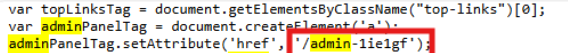
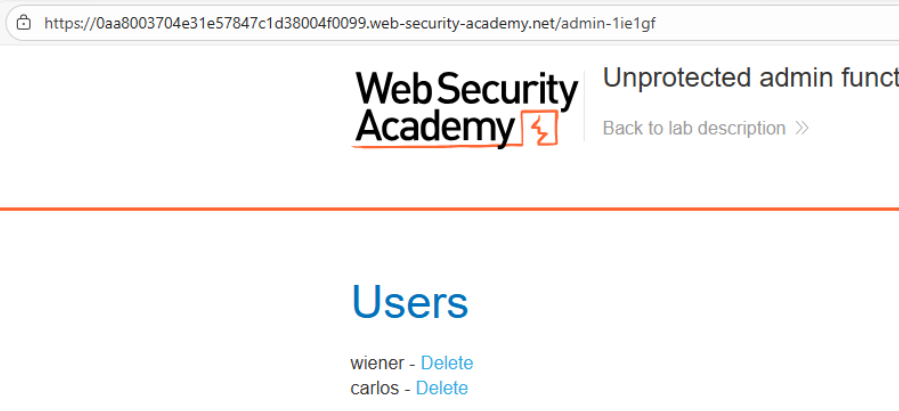
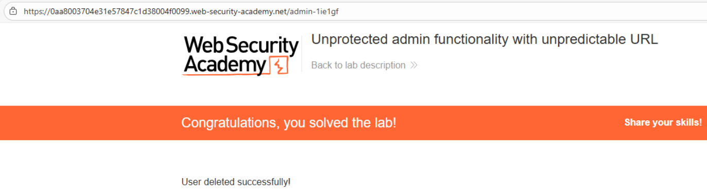

# 🎯 Funcionalidad admin con URL impredecible

## 📄 Descripción del laboratorio

Este laboratorio expone un **panel de administración sin protección**, accesible mediante una **URL aparentemente impredecible**.

Aunque la ruta no es un endpoint típico como `/admin` o `/administrator`, su ubicación se **filtra accidentalmente en el frontend** de la aplicación.

El objetivo es:

* Descubrir la ruta del **panel administrativo oculto**.
* Acceder a él sin autenticación.
* Eliminar al usuario **carlos**.

 

## 📚 Teoría

En este escenario, la aplicación intenta proteger el panel administrativo utilizando una **URL no estándar**, confiando en que los usuarios no la descubrirán.

Este enfoque se conoce como **security through obscurity**, una práctica insegura porque:

* La URL sigue siendo accesible públicamente.
* Cualquier fuga de información puede revelar su ubicación.

### 📌 Information disclosure en el frontend

El fallo clave es que la ruta administrativa aparece **directamente en el código JavaScript del cliente**.

El código del lado cliente:

* Es **visible para cualquier usuario**.
* Puede inspeccionarse fácilmente mediante **DevTools o el código fuente de la página**.

Por tanto, cualquier endpoint sensible incluido en el frontend debe considerarse **público**.

### 📌 Problemas de seguridad presentes

La vulnerabilidad resulta de la combinación de:

* Exposición accidental de endpoints sensibles en **JavaScript del cliente**
* Ausencia total de **autenticación**
* Falta de **validación de permisos**
* Acciones administrativas ejecutables sin credenciales

Este patrón aparece con frecuencia en aplicaciones que confían erróneamente en la **ocultación de URLs**.

 

## 📝 Práctica

### 🎯 Objetivo

Eliminar al usuario **carlos** desde el panel administrativo.

 

### 1️⃣ Análisis del frontend

Abrimos la página principal y revisamos el código fuente.

Esto puede hacerse mediante:

* **Ctrl + U** (ver código fuente)
* **DevTools → Sources**

Buscamos palabras clave habituales como:

```
admin
administrator
panel
manage
```

En el código JavaScript encontramos una **ruta administrativa expuesta**, por ejemplo:

```
/admin-<random-string>
```




 

### 2️⃣ Acceso al panel oculto

Copiamos la ruta descubierta y la abrimos directamente en el navegador.

<br>

Resultado:

* El panel administrativo carga correctamente.
* No se solicita autenticación.
* No existen tokens ni validaciones adicionales.

Esto confirma que el **panel administrativo está expuesto públicamente**.

 

### 3️⃣ Eliminación del usuario

Dentro del panel:

1. Localizamos al usuario **carlos**.
2. Pulsamos el botón **Delete**.

La acción se ejecuta inmediatamente sin verificaciones adicionales.

 

### 4️⃣ Resultado final

El usuario **carlos** es eliminado correctamente.

El laboratorio se marca como **resuelto**.


