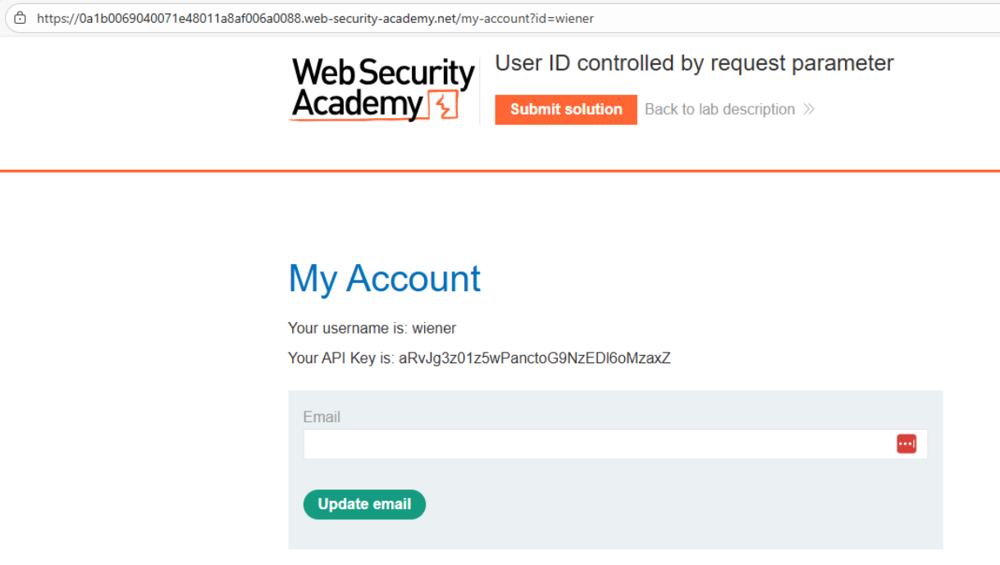
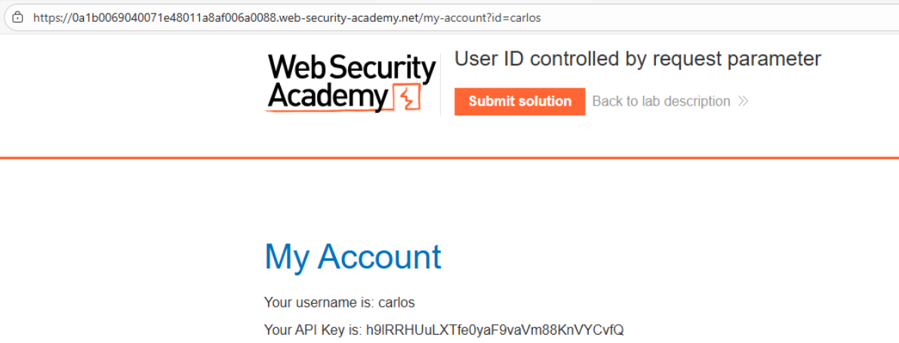
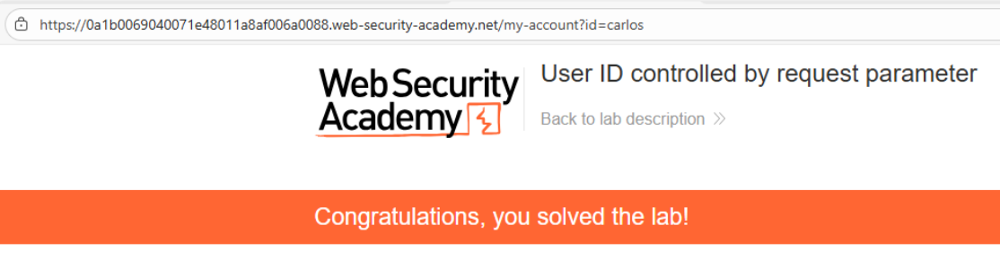

# 🎯 ID de usuario controlado por parámetro

## 📄 Descripción del laboratorio

Este laboratorio presenta una vulnerabilidad de **escalada de privilegios horizontal** en la página de cuenta de usuario.

La aplicación muestra información sensible del usuario, incluida su **API key**, en la sección **My account**.

El objetivo es:

* Acceder a la cuenta de otro usuario.
* Obtener la **API key del usuario carlos**.
* Enviarla como solución para completar el laboratorio.

Credenciales proporcionadas:

```
wiener:peter
```

 

## 📚 Teoría

En este laboratorio, la aplicación obtiene la información del usuario a partir de un **parámetro controlado por el cliente**.

Por ejemplo, la página de cuenta utiliza una URL similar a:

```
/my-account?id=wiener
```

El servidor utiliza el valor de `id` para decidir **qué cuenta mostrar**, pero **no verifica si el usuario autenticado es realmente el propietario de ese identificador**.

Esto permite que cualquier usuario autenticado pueda acceder a la información de otros usuarios simplemente modificando el parámetro.

 ### 📌 Vulnerabilidad

Este comportamiento corresponde a un caso clásico de:

**IDOR (Insecure Direct Object Reference)**

también conocido como **Horizontal Privilege Escalation**.

Los problemas de seguridad presentes son:

* Falta de validación de **ownership**.
* Uso directo de identificadores controlados por el cliente.
* Exposición de información sensible (como **API keys**).

Esta vulnerabilidad pertenece a la categoría **Broken Access Control**, una de las más críticas y frecuentes en aplicaciones web.

 

## 📝 Práctica

 ### 🎯 Objetivo

Obtener la **API key del usuario carlos**.

 

 ### 1️⃣ Autenticación inicial

Iniciamos sesión con las credenciales:

```
Usuario: wiener
Contraseña: peter
```

Una vez autenticados, accedemos a la sección **My account**.

 

 ### 2️⃣ Identificación del parámetro vulnerable

En la página de cuenta observamos:

* Información personal del usuario.
* La **API key asociada a nuestra cuenta**.

<br>

Al revisar la URL se observa algo similar a:

```
/my-account?id=wiener
```

Esto indica que el backend utiliza el parámetro `id` para identificar al usuario.

 

 ### 3️⃣ Manipulación del identificador

Modificamos manualmente el parámetro de la URL:

```
/my-account?id=carlos
```

También se podría realizar esta prueba mediante **Burp Suite** interceptando la petición.

 

 ### 4️⃣ Acceso no autorizado

Tras enviar la petición modificada, el servidor devuelve:

* La información del usuario **carlos**.
* Su **API key**.

<br>

Esto confirma que el servidor **no verifica si el usuario autenticado tiene permiso para acceder a esa cuenta**.

 

 ### 5️⃣ Resolución del laboratorio

Copiamos la **API key de carlos** y la introducimos en el formulario de solución del laboratorio.

El laboratorio se marca como completado.

 

 ### 6️⃣ Resultado final

Se consigue:

* Acceder a la cuenta de otro usuario.
* Obtener información privada sin autorización.
* Recuperar la **API key de carlos**.

El laboratorio queda resuelto correctamente.

<br>
