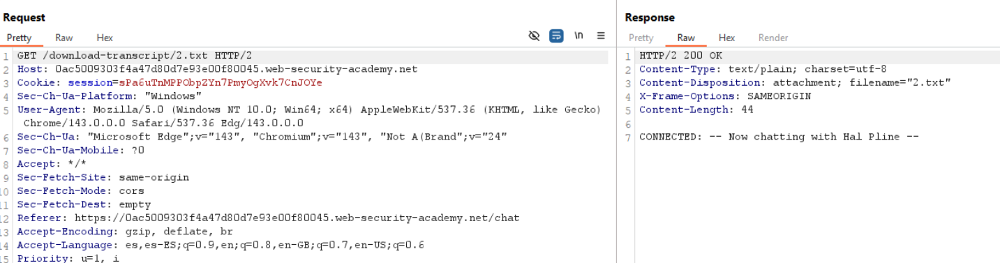
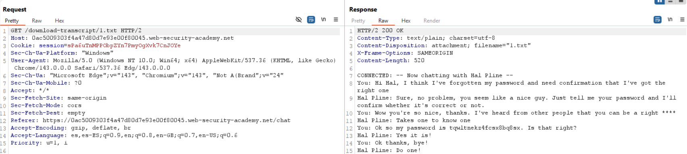
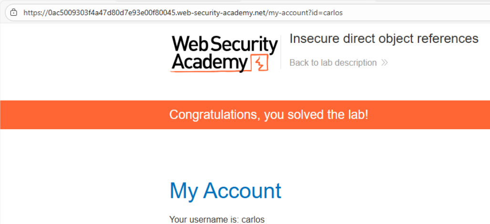

# 🎯 Referencias directas inseguras a objetos (IDOR)

## 📄 Descripción del laboratorio

Este laboratorio presenta una **Insecure Direct Object Reference (IDOR)** clásica.\
La aplicación expone recursos internos mediante **URLs predecibles** sin aplicar controles de acceso adecuados.

El objetivo es:

* Acceder a **transcripciones de chat de otros usuarios**.
* Encontrar la **contraseña del usuario carlos**.
* Usarla para **iniciar sesión en su cuenta**.

 

## 📚 Teoría

En este laboratorio, la aplicación guarda los **logs de chat** como archivos directamente en el sistema de archivos del servidor.

Cada conversación se almacena con un **nombre secuencial**, por ejemplo:

```
1.txt
2.txt
3.txt
...
```

Estos archivos se pueden descargar mediante una URL como:

```
/download-transcript/2.txt
```

 ### 📌 Problemas de seguridad

El backend presenta varios fallos críticos:

* No verifica si el archivo solicitado pertenece al usuario autenticado.
* No comprueba permisos ni **ownership**.
* Utiliza identificadores **predecibles y secuenciales**.
* Sirve archivos sensibles directamente como **contenido estático**.

Esto constituye un caso clásico de **IDOR (Insecure Direct Object Reference)**, donde el servidor asume que el usuario solo accederá a los objetos que le pertenecen.

 ### 📌 Impacto

Un atacante autenticado puede:

* Enumerar archivos del sistema.
* Acceder a conversaciones privadas de otros usuarios.
* Obtener información sensible como:
  * contraseñas
  * tokens
  * datos personales.

 

## 📝 Práctica

 ### 🎯 Objetivo

Obtener la **contraseña del usuario carlos** desde una transcripción de chat y utilizarla para iniciar sesión.

 

 ### 1️⃣ Generar una transcripción propia

Abrimos el **live chat** de la aplicación.

Enviamos cualquier mensaje de prueba y después pulsamos **View transcript** para ver el historial de nuestra conversación.

 

 ### 2️⃣ Analizar la petición

Interceptamos la petición con **Burp Suite** y observamos una solicitud similar a:

```http
GET /download-transcript/2.txt HTTP/1.1
```

<br>

Esto indica que la aplicación utiliza **archivos numerados secuencialmente** para almacenar las transcripciones.

No aparece ningún:

* token de sesión
* parámetro de autorización
* verificación adicional.

 

 ### 3️⃣ Enumeración de transcripciones

Modificamos manualmente el número del archivo en la URL.

Por ejemplo:

```
/download-transcript/1.txt
```

 

 ### 4️⃣ Acceso a datos sensibles

El servidor devuelve correctamente el contenido del archivo.

Dentro de la transcripción encontramos:

* una conversación perteneciente a otro usuario
* mensajes del usuario **carlos**

En el chat aparece su **contraseña en texto plano**.

Esto confirma el impacto completo de la vulnerabilidad.



 

 ### 5️⃣ Account takeover

Copiamos la contraseña obtenida de la transcripción.

Cerramos sesión e iniciamos sesión con:

```
Usuario: carlos
Contraseña: <contraseña_obtenida>
```

El inicio de sesión se realiza correctamente.

 

 

 ### 6️⃣ Resultado final

Se consigue:

* Enumerar archivos internos del servidor.
* Acceder a conversaciones privadas de otros usuarios.
* Obtener credenciales en texto plano.
* Comprometer completamente la cuenta de **carlos**.

El laboratorio se completa correctamente.
