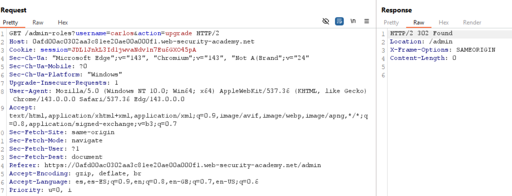
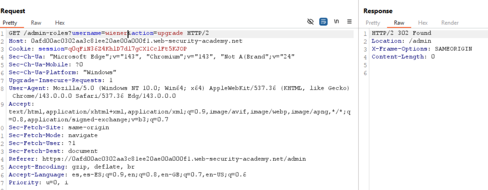
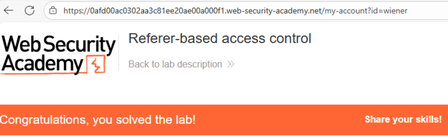

# 🎯 Control de acceso basado en Referer

## 📄 Descripción del laboratorio

Este laboratorio intenta proteger funcionalidades administrativas utilizando el encabezado HTTP **Referer** como mecanismo de control de acceso.

Sin embargo, esta protección es incorrecta y puede ser fácilmente evadida por un usuario autenticado sin privilegios.

El objetivo es:

* Iniciar sesión como **wiener:peter**.
* Escalar privilegios hasta administrador.
* Acceder al panel `/admin`.
* Eliminar al usuario **carlos**.

 

## 📚 Teoría

La aplicación intenta proteger la funcionalidad de **promoción de usuarios a administrador** verificando únicamente el encabezado HTTP **Referer**.

El flujo esperado por el sistema es:

* El usuario administrador accede al panel `/admin`.
* Desde esa página se envía una petición para promocionar a otro usuario.
* El servidor comprueba que el encabezado `Referer` provenga del panel administrativo.

Ejemplo de encabezado esperado:

```
Referer: https://lab-id.web-security-academy.net/admin
```

Si el `Referer` coincide con una URL interna del panel, la acción se permite.\
Si el encabezado es diferente o no está presente, la petición se bloquea.

 

### 📌 Problema de seguridad

Este mecanismo es inseguro porque el encabezado **Referer es completamente controlable por el cliente**.

Un atacante puede modificarlo fácilmente mediante herramientas como:

* Burp Suite
* Proxy interceptores
* Scripts personalizados

El backend presenta varios fallos:

* No valida el **rol real del usuario**.
* Confía únicamente en el **contexto de origen aparente**.
* No utiliza mecanismos de autorización robustos.

### 📌 Vulnerabilidad

Este comportamiento introduce un caso de **Broken Access Control** causado por:

* Confianza ciega en el encabezado `Referer`.
* Falta de verificación de privilegios en el endpoint.
* Uso de información controlada por el cliente para tomar decisiones de seguridad.

Un atacante puede falsificar el encabezado y ejecutar acciones administrativas.

 

## 📝 Práctica

### 🎯 Objetivo

Promocionar al usuario **wiener** a administrador y eliminar al usuario **carlos**.

 

### 1️⃣ Analizar el flujo legítimo

Iniciamos sesión con una cuenta administradora:

```
administrator:admin
```

Accedemos al panel administrativo y realizamos la acción **Upgrade user**, interceptando la petición con **Burp Suite**.

<br>

Observamos que:

* La petición utiliza el método **GET**.
* Incluye un encabezado **Referer** que apunta al panel administrativo.

Ejemplo:

```http
GET /admin/upgrade?username=carlos HTTP/1.1
Referer: https://lab-id.web-security-academy.net/admin
```

 

### 2️⃣ Reutilizar la petición con un usuario normal

Cerramos sesión e iniciamos sesión con:

```
wiener:peter
```

Copiamos la **cookie de sesión** de este usuario y la utilizamos en la petición interceptada.

Modificamos el parámetro:

```
username=wiener
```

Enviamos la petición **sin un Referer válido**.

<br>

Resultado:

```
Unauthorized
```

El servidor bloquea la solicitud.

 

### 3️⃣ Falsificar el encabezado Referer

Añadimos el encabezado:

```http
Referer: https://lab-id.web-security-academy.net/admin
```

La petición ahora contiene:

* Cookie de sesión del usuario **wiener**
* Parámetro `username=wiener`
* Referer apuntando al panel admin

Enviamos la petición.

Resultado:

* El servidor acepta la solicitud.
* La promoción se ejecuta correctamente.
* No se valida el rol real del usuario.

El usuario **wiener** ahora tiene privilegios de administrador.

 

### 4️⃣ Eliminación del usuario carlos

Refrescamos la aplicación y accedemos al panel:

```
/admin
```

Dentro del panel administrativo:

1. Buscamos al usuario **carlos**.
2. Pulsamos **Delete**.

El usuario se elimina correctamente.

 

### 5️⃣ Resultado final

Se consigue:

* Escalar privilegios desde usuario normal a administrador.
* Acceder al panel administrativo.
* Eliminar al usuario **carlos**.

El laboratorio se completa correctamente.


