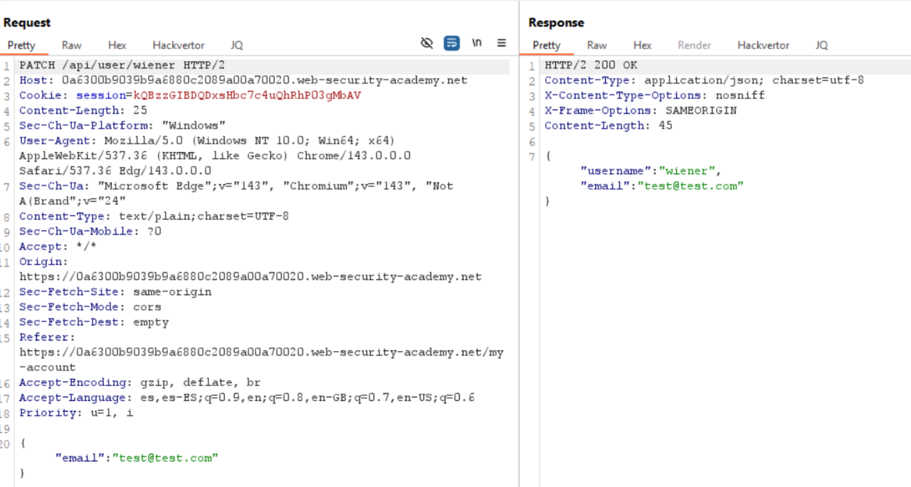
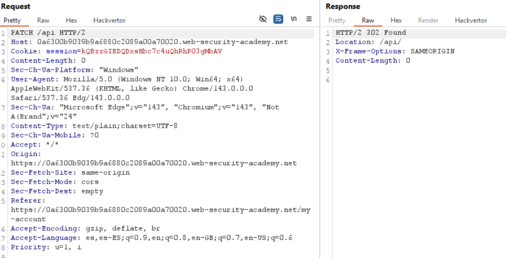
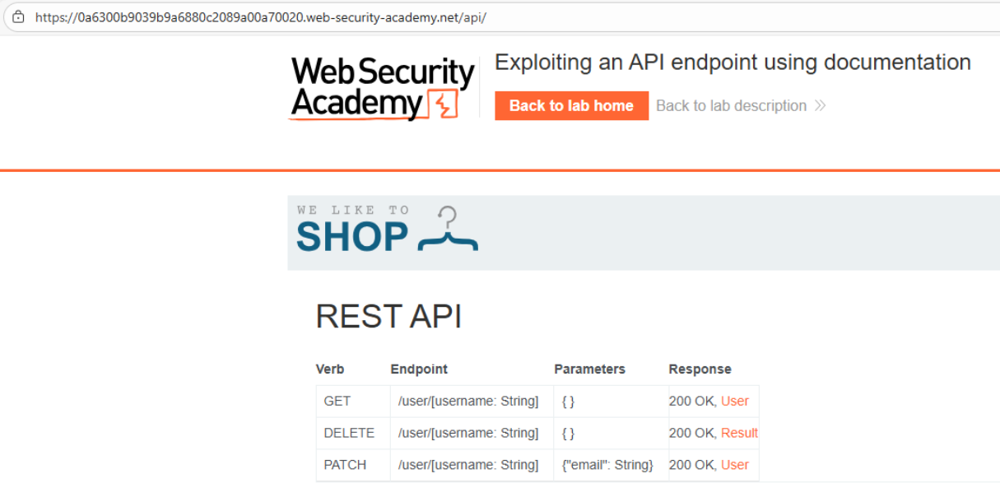
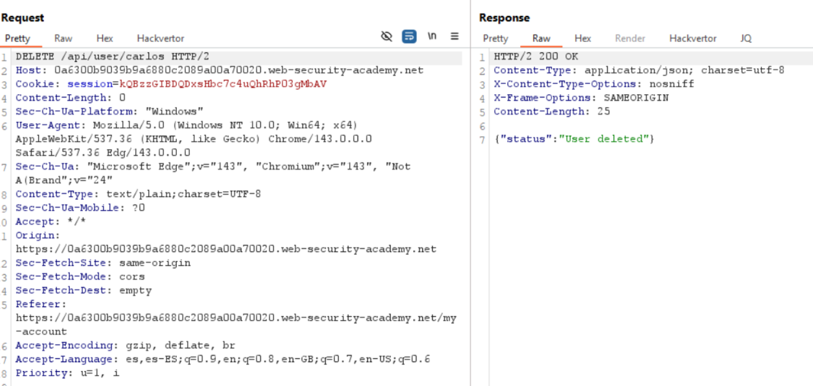
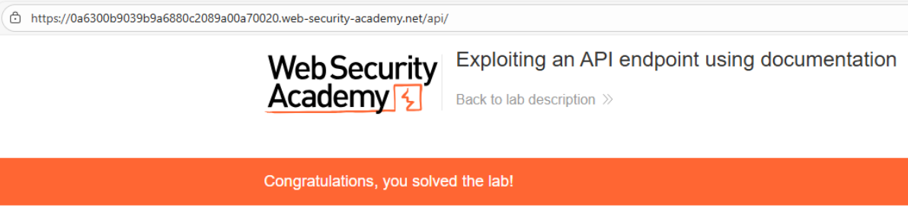

# 🌐 Explotación de un endpoint usando la documentación expuesta

## 📄 Descripción del laboratorio

La aplicación expone una **documentación interactiva de la API** (tipo Swagger / OpenAPI) accesible sin autenticación ni restricciones.

Esta documentación revela:

* **Endpoints internos**
* **Métodos HTTP permitidos**
* **Parámetros sensibles**
* **Operaciones críticas**, incluyendo la eliminación de usuarios

El objetivo es:

* Identificar un **endpoint sensible** desde la documentación.
* Abusar de él para **eliminar la cuenta del usuario carlos**.

Credenciales de prueba:

* **wiener : peter**

 

## 📚 Teoría

Muchas aplicaciones modernas generan automáticamente documentación de API mediante herramientas como **Swagger UI** o **Redoc**.

Si esta documentación:

* Se deja accesible en **producción**
* No está protegida por **autenticación**
* No filtra **operaciones críticas**

se convierte en un **mapa completo para atacantes**.

### 📌 Riesgos de una documentación de API expuesta

Una documentación pública puede revelar:

* Todos los **endpoints disponibles**.
* Los **métodos HTTP soportados** (`GET`, `POST`, `DELETE`, etc.).
* La **estructura exacta de peticiones y respuestas**.
* La posibilidad de **ejecutar llamadas directamente desde el navegador**.

En este laboratorio, la documentación expone un endpoint crítico:

```
DELETE /api/user/{username}
```

No se observan controles de autorización adecuados, lo que permite **eliminar cuentas arbitrarias**.

 

## 📝 Práctica

### 🎯 Objetivo

Eliminar la cuenta del usuario **carlos** utilizando la documentación expuesta de la API.

 

### 1️⃣ Análisis inicial

Se inicia sesión con **wiener:peter** y se accede a **My account**.

Se utiliza la funcionalidad de **cambio de email** y se intercepta la petición con **Burp Suite**.




 

### 2️⃣ Descubrimiento de la API

Se observa que la petición interceptada se dirige a:

```
/api/user/wiener
```

Se prueban distintas variaciones y se accede directamente a:

```
/api
```
<br>

Resultado:

El servidor responde con **contenido HTML** que parece corresponder a un índice o documentación.

Se hace clic derecho y se selecciona **Show response in browser**, copiando la URL generada.



 

### 3️⃣  Exploración de la documentación

Al abrir la URL en el navegador se carga una **documentación interactiva de la API**, identificable como **Swagger UI**.

Se exploran las operaciones disponibles hasta localizar un endpoint crítico:

```http
DELETE /api/user/{username}
```

La descripción indica que este endpoint **elimina permanentemente un usuario** y no muestra restricciones claras de autorización.

 

### 4️⃣ Explotación del endpoint

Se prueba la operación directamente utilizando:

* **Método:** `DELETE`
* **Path:**

```
/api/user/carlos
```

<br>

Resultado:

La petición se ejecuta correctamente y el usuario **carlos** es eliminado.


 

### 5️⃣ Resultado final

La documentación expuesta revela un **endpoint crítico**.

El endpoint carece de **controles de autorización adecuados**, lo que permite eliminar cuentas arbitrarias.

Tras enviar la petición `DELETE /api/user/carlos`, la cuenta del usuario **carlos** es eliminada y el laboratorio se marca como completado.

<br>
