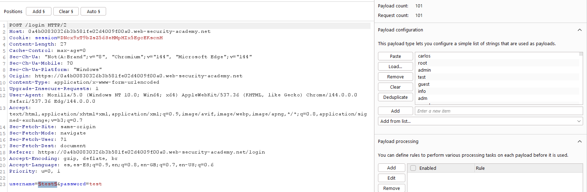
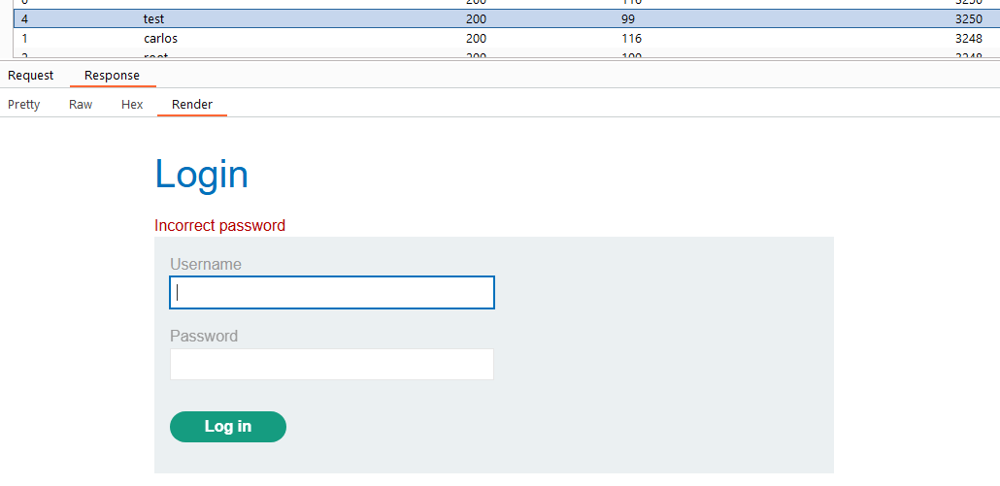
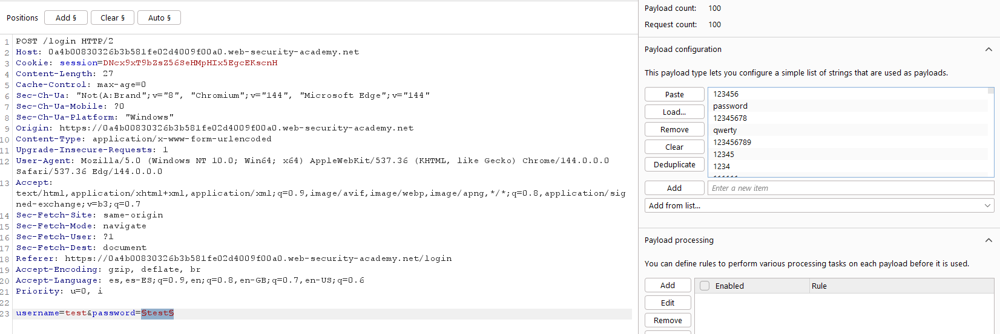
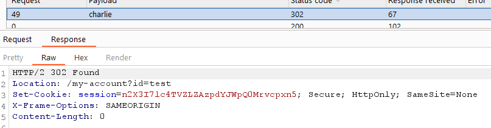
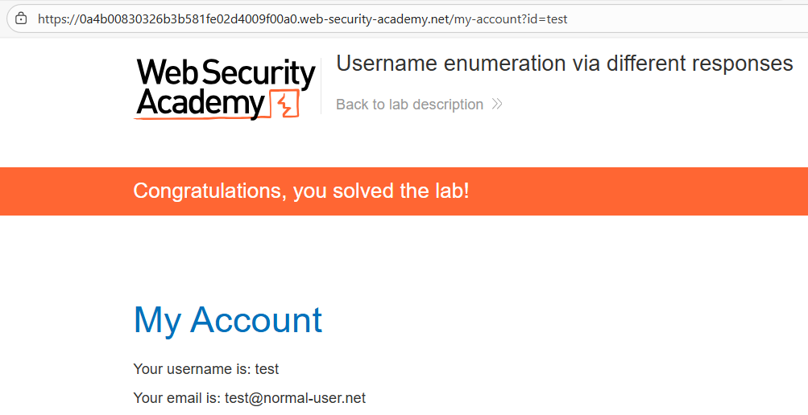

# 🔓 Enumeración de usuarios por respuestas distintas

## 📄 Descripción del laboratorio

El laboratorio es vulnerable a **enumeración de usuarios y fuerza bruta de contraseñas** debido a diferencias en las respuestas del servidor durante el proceso de autenticación.

Dependiendo de si el usuario existe o no, y de si la contraseña es incorrecta, el backend devuelve **mensajes y longitudes de respuesta distintas**.

🎯 **Objetivo del laboratorio:**

* Identificar un **nombre de usuario válido**
* Descubrir su **contraseña mediante fuerza bruta**
* Iniciar sesión en su cuenta


## 📚 Teoría

Este es uno de los fallos más comunes en sistemas de autenticación.

El problema ocurre cuando el backend revela **información distinta según el resultado del login**.

Un flujo vulnerable típico es:

* Si el usuario **no existe** → error **“Invalid username”**
* Si el usuario **existe pero la contraseña es incorrecta** → error **“Invalid password”**

Aunque parezca una diferencia menor, para un atacante es suficiente para **confirmar qué cuentas existen**.

Esto permite dividir el ataque en dos fases:

1. **Enumeración de usuarios**
2. **Fuerza bruta de contraseñas**

De esta forma se reduce el número de intentos necesarios y se aumenta la eficacia del ataque.


## 📝 Práctica

### 1️⃣ Interceptar la petición de login

Accedemos al formulario de login e interceptamos la petición con **Burp Suite**.

La petición típica tiene este formato:

```http
POST /login
username=USER&password=PASS
```

La enviamos a **Burp Intruder**.


### 2️⃣ Enumeración de usuarios

Primero atacamos el parámetro `username`.

Configuración en Intruder:

* Tipo de ataque: **Sniper**
* Payload: lista de **nombres de usuario candidatos**

Es importante **desactivar el URL encoding de payloads**.

Lanzamos el ataque y analizamos las respuestas.

<br>
No solo observamos el mensaje visible, sino también:

* **Longitud de respuesta**
* **Diferencias en el contenido**

Una de las respuestas devuelve:

```
Invalid password
```

Mientras que el resto muestran:

```
Invalid username
```

Esto confirma que ese **usuario existe en el sistema**.




### 3️⃣ Fuerza bruta de contraseña

Una vez identificado el usuario válido, fijamos el valor de `username` y atacamos el parámetro `password`.

Configuración en Intruder:

* Payload: lista de **contraseñas candidatas**

Lanzamos el ataque y observamos las respuestas.

<br>
Una petición devuelve una **respuesta distinta al resto**, normalmente:

* Un **código de estado diferente**
* O una **redirección a la página de cuenta**

Esto indica que la contraseña probada es **correcta**.




### 4️⃣ Resultado

Se consigue:

* Identificar un **usuario válido**
* Descubrir su **contraseña mediante fuerza bruta**
* Autenticarse correctamente en la aplicación

✅ **Laboratorio resuelto.**


