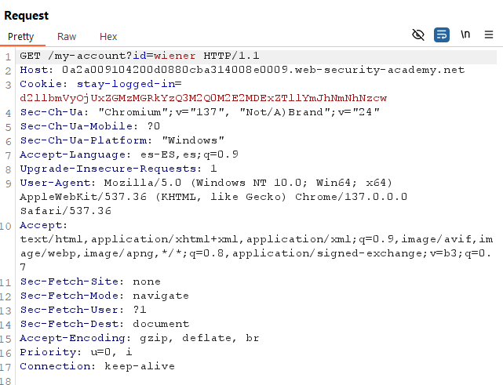
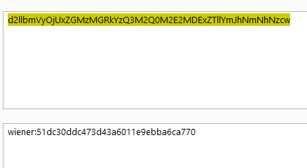
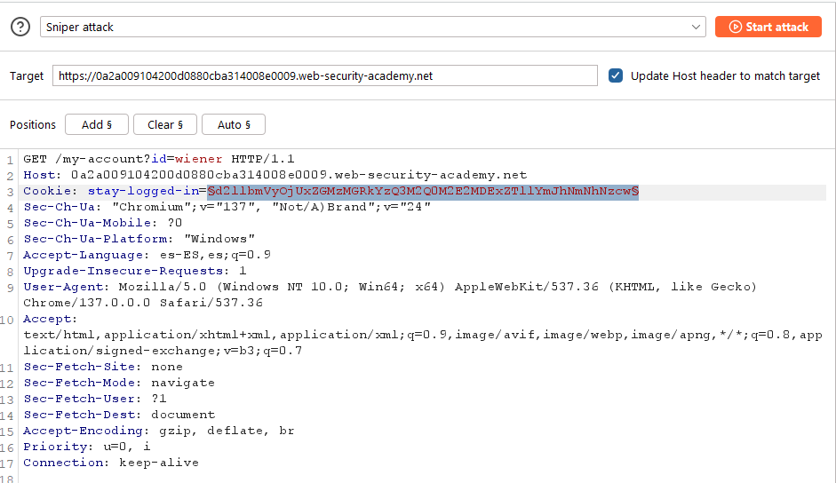
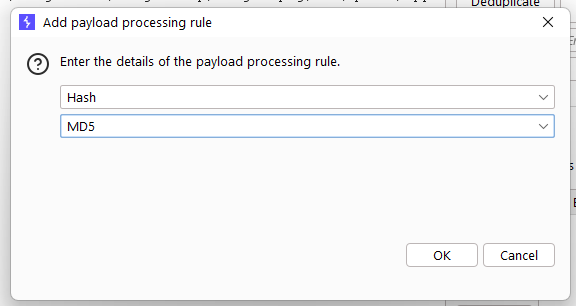
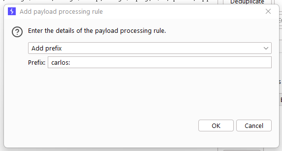
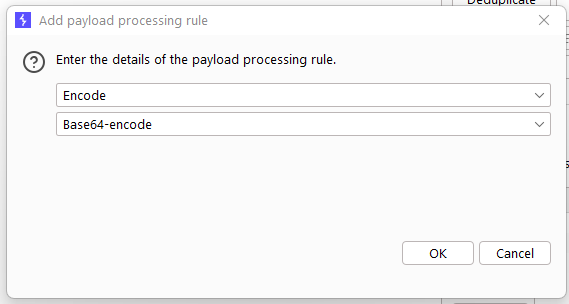
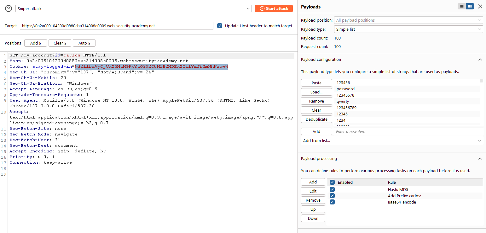
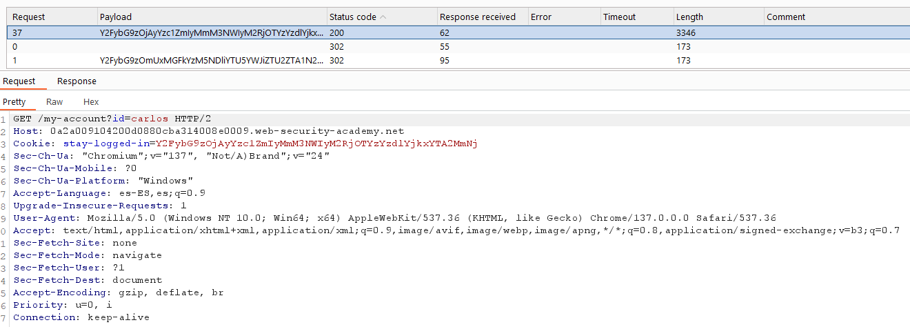
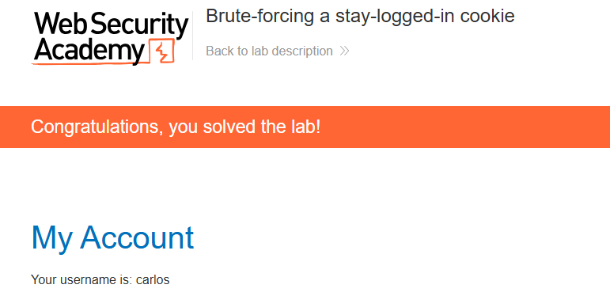

# 🔓 Fuerza bruta de cookie de sesión persistente

## 📄 Descripción del laboratorio

Este laboratorio permite a los usuarios permanecer autenticados incluso después de cerrar el navegador mediante una cookie persistente llamada `stay-logged-in`.

El problema es que esta cookie está construida de forma totalmente predecible, lo que permite realizar un ataque de fuerza bruta hasta obtener acceso a la cuenta de otro usuario.

🎯 **Objetivo del laboratorio:**

* Fuerza bruta de la cookie persistente del usuario `carlos`
* Acceder a su página **My account**

**Credenciales:**

* Usuario propio: `wiener:peter`
* Usuario víctima: `carlos`


## 📚 Teoría

La funcionalidad **Mantener sesión iniciada** debería implementarse con un token aleatorio y seguro.

En este laboratorio, la cookie `stay-logged-in` contiene:

```
username:md5(password)
```

Todo ello codificado en **Base64**.

Ejemplo:

```
wiener:MD5("peter") → Base64 → stay-logged-in
```

Esto permite un ataque directo:

* Tomamos una lista de contraseñas candidatas
* Calculamos su **MD5**
* Anteponemos `carlos:`
* Codificamos el resultado en **Base64**
* Enviamos la cookie a `/my-account`

Si la contraseña es correcta, el servidor nos autentica como `carlos`.


## 📝 Práctica

### 1️⃣ Análisis de la cookie persistente

Iniciamos sesión con:

```
wiener : peter
```

Accedemos a `/my-account` y observamos las cookies.

Encontramos una cookie como:

```
stay-logged-in=...
```

<br>
La decodificamos en **Burp Decoder** y obtenemos algo como:

```
wiener:51dc30ddc473d43a6011e9ebba6ca770
```

<br>
Comprobamos el hash de `peter`:

```bash
echo -n "peter" | md5sum
```

El valor coincide.

Queda confirmado que la cookie sigue el formato:

```
username:md5(password)
```

codificado en Base64.


### 2️⃣ Preparar el ataque en Intruder

Capturamos una petición `GET` a:

```
/my-account
```

La enviamos a **Intruder**.

En **Positions**:

* Limpiamos todas las marcas
* Marcamos solo el valor de la cookie:

```
Cookie: stay-logged-in=§valor_actual§
```




### 3️⃣ Configurar la generación automática de cookies

En **Payloads → Payload processing** añadimos, en este orden:

1. **Hash**
   * Tipo: `MD5`

<br>
2. **Add prefix**
   * Prefijo: `carlos:`

<br>
3. **Encode**
   * `Base64-encode`

<br>
En **Payload set**:

* Tipo: **Simple list**
* Cargamos la lista de contraseñas candidatas del laboratorio


### 4️⃣ Cerrar sesión antes del ataque

Cerramos sesión o borramos las cookies del navegador.

Esto evita que el servidor reutilice una sesión ya autenticada.




### 5️⃣ Fuerza bruta de la cookie

Lanzamos el ataque.

Intruder prueba automáticamente cada contraseña:

* Contraseña candidata
* MD5
* `carlos:hash`
* Base64
* Cookie `stay-logged-in`
* `GET /my-account`

Analizamos las respuestas.

La mayoría devuelven una respuesta corta o la página de login.

Una petición destaca porque contiene contenido como:

```
My account
Update email
Log out
```

<br>
Esa petición corresponde a la contraseña correcta de `carlos`.


### 6️⃣ Acceso final a la cuenta

Copiamos el valor completo de la cookie `stay-logged-in` de la petición exitosa.

En el navegador añadimos esa cookie y recargamos:

```
/my-account
```




### 7️⃣ Resultado

* Cookie persistente de `carlos` forzada
* Autenticación exitosa sin conocer su contraseña
* Acceso completo a su cuenta

✅ **Laboratorio resuelto.**
