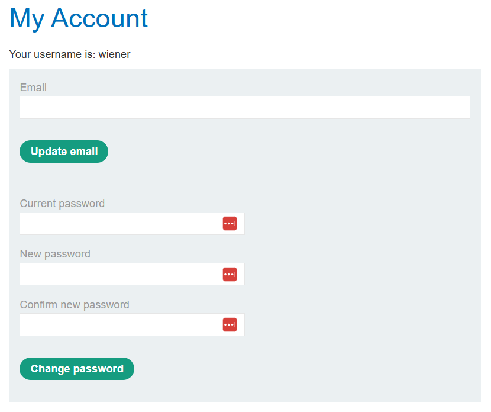
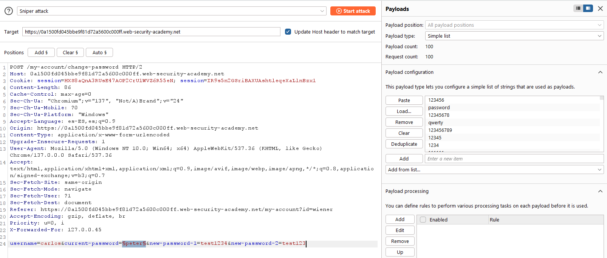
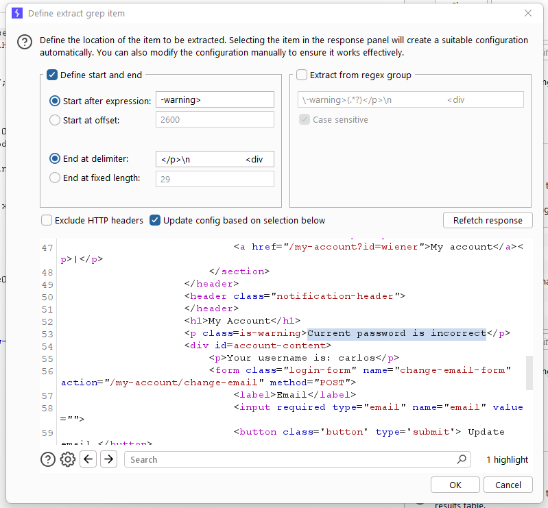
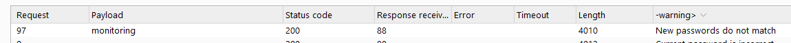
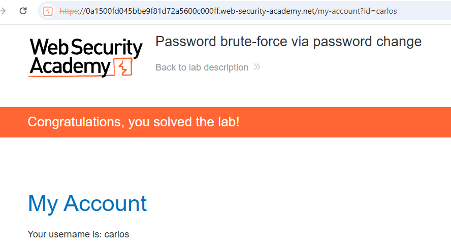

# 🔓 Fuerza bruta de contraseña en cambio de clave

## 📄 Descripción del laboratorio

La funcionalidad de **cambio de contraseña** de este laboratorio contiene un fallo lógico que permite usarla como **oráculo para descubrir la contraseña actual de otro usuario**.

Debido a mensajes de error diferenciados, es posible realizar **fuerza bruta sobre la contraseña de `carlos`** sin modificar realmente su contraseña.

🎯 **Objetivo del laboratorio:**

* Descubrir la contraseña actual de `carlos`
* Iniciar sesión en su cuenta
* Acceder a su página **My account**

Credenciales disponibles:

```
Usuario propio: wiener:peter
Usuario víctima: carlos
```


## 📚 Teoría

El formulario de cambio de contraseña solicita los siguientes campos:

```
Username
Current password
New password
Confirm new password
```

El backend valida estos valores en orden lógico:

1. Verifica si el usuario existe
2. Comprueba si la contraseña actual es correcta
3. Verifica si las nuevas contraseñas coinciden

El problema es que **cada error genera un mensaje distinto**.

Cuando la contraseña actual es incorrecta:

```
Current password is incorrect
```

Cuando la contraseña actual es correcta pero las nuevas no coinciden:

```
New passwords do not match
```

Esto permite crear un **oráculo de validación**.

Si fijamos las nuevas contraseñas como valores distintos, por ejemplo:

```
new-password-1 = aaa
new-password-2 = bbb
```

el servidor nunca cambiará la contraseña, pero nos indicará cuándo la contraseña actual es correcta basándose en el mensaje devuelto.


## 📝 Práctica

### 1️⃣ Exploración inicial

Iniciamos sesión con:

```
wiener : peter
```

Accedemos a:

```
/my-account
```

y localizamos el formulario de cambio de contraseña.

<br><br>
Probamos manualmente diferentes combinaciones.

Si las nuevas contraseñas son distintas aparece:

```
New passwords do not match
```

Si la contraseña actual es incorrecta aparece:

```
Current password is incorrect
```

<br><br>
Esto confirma que el backend revela información según el punto exacto donde falla la validación.


### 2️⃣ Capturar la petición vulnerable

Interceptamos la petición `POST` enviada al cambiar la contraseña.

Ejemplo de petición:

```
username=wiener
current-password=peter
new-password-1=aaa
new-password-2=bbb
```

La enviamos a **Burp Intruder**.


### 3️⃣ Preparar el ataque

En **Positions**:

* Limpiamos todas las posiciones
* Marcamos únicamente:

```
current-password=§peter§
```

Modificamos la petición base:

```
username=carlos
new-password-1=aaa
new-password-2=bbb
```

Las nuevas contraseñas permanecen distintas para evitar cualquier cambio real.

En **Payloads**:

* Tipo: **Simple list**
* Cargamos la lista de **contraseñas candidatas**

<br>


### 4️⃣ Configurar detección de errores

En **Settings → Grep – Match** añadimos el texto:

```
Current password is incorrect
```

Esto permite detectar fácilmente cuándo la respuesta **no contiene ese mensaje**.

<br>


### 5️⃣ Identificar la contraseña correcta

Ejecutamos el ataque.

Intruder probará cada contraseña candidata como `current-password`.

La mayoría de respuestas contienen:

```
Current password is incorrect
```

Una respuesta será distinta y mostrará:

```
New passwords do not match
```

Esto indica que la contraseña actual es correcta.

<br>


### 6️⃣ Login final

Iniciamos sesión con:

```
usuario: carlos
contraseña: <contraseña_descubierta>
```

Accedemos a:

```
/my-account
```


### 7️⃣ Resultado

Se consigue:

* Descubrir la **contraseña actual de `carlos`**
* Autenticarse correctamente en su cuenta
* Acceder a **My account**

✅ **Laboratorio resuelto.**

<br>
