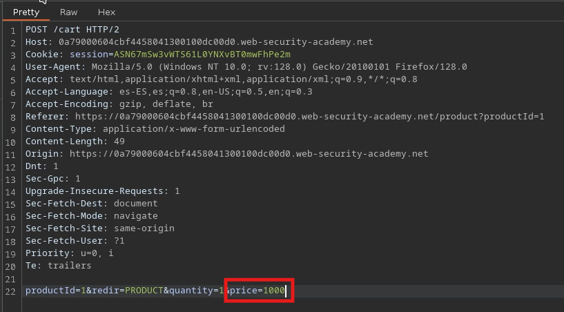
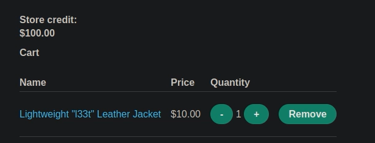

# 🧑‍💻 Confianza excesiva en el lado del cliente

## 📄 Descripción del laboratorio

Este laboratorio presenta una vulnerabilidad de **confianza excesiva en el cliente**, donde la lógica de negocio crítica no se valida correctamente en el servidor.

Durante el proceso de añadir un producto al carrito, el precio del artículo se envía desde el cliente en la petición HTTP.

El objetivo es:

* Manipular el precio del producto
* Comprar la **Lightweight l33t leather jacket** por un valor inferior al real


## 📚 Teoría

En aplicaciones web, el cliente (navegador) nunca debe considerarse una fuente confiable.

El problema ocurre cuando:

* El cliente envía datos críticos (como el precio)
* El servidor no valida ni recalcula esos valores

### 📌 El fallo

El servidor:

* Acepta el precio enviado por el cliente
* No comprueba si coincide con el valor real del producto

Esto permite:

* Modificar el precio manualmente
* Comprar productos por cantidades arbitrarias

### 📌 Impacto

Este tipo de vulnerabilidad puede provocar:

* Pérdidas económicas directas
* Manipulación de pedidos
* Compra de productos a coste reducido o nulo


## 📝 Práctica

### 1️⃣ Interceptar la petición

Interceptamos con Burp Proxy la petición de añadir producto al carrito.

Observamos que en la request se incluye el precio:

```http
POST /cart
...
price=1337
```


### 2️⃣ Modificar el precio

Enviamos la petición a Repeater y modificamos el valor del precio:

```
price=10
```


<br>

Enviamos la petición modificada.


### 3️⃣ Verificar el resultado

Accedemos al carrito y comprobamos que:

* El producto aparece con el precio modificado
* El valor es ahora **10$** en lugar del original



### 4️⃣ Completar la compra

Procedemos al checkout.

La compra se realiza con el precio manipulado.
