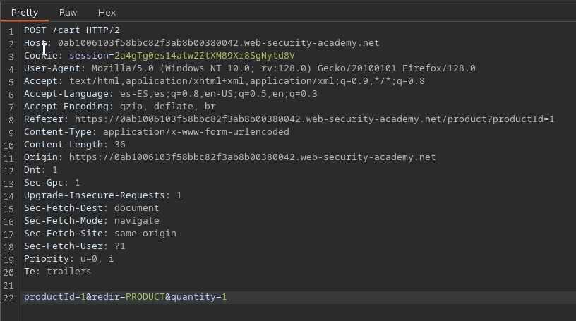
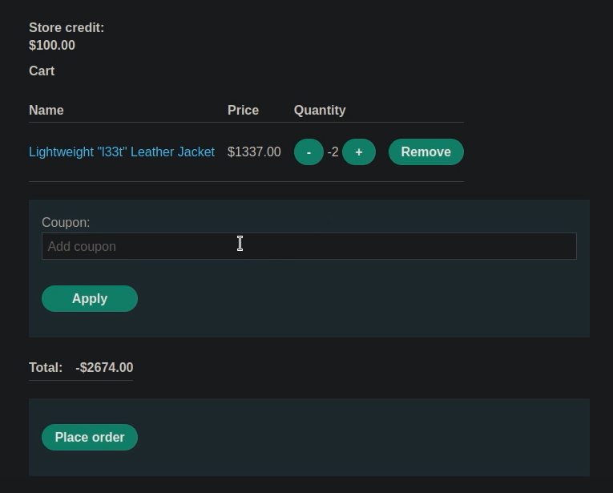
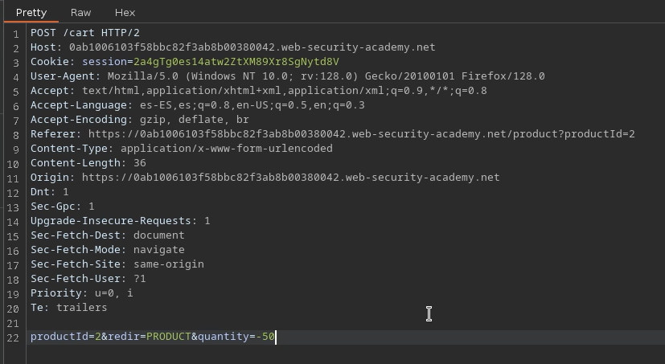
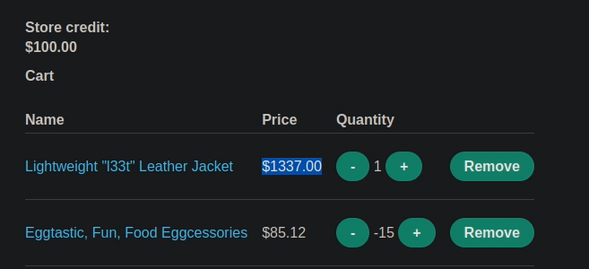

# 🧑‍💻 Vulnerabilidad lógica de alto nivel

## 📄 Descripción del laboratorio

Este laboratorio presenta una **vulnerabilidad lógica de negocio**, donde una validación deficiente permite manipular el cálculo del total del carrito.

El sistema no controla correctamente los valores enviados en la cantidad de productos, permitiendo introducir valores negativos.

El objetivo es:

* Manipular el total del carrito
* Comprar la **Lightweight l33t leather jacket** por debajo del crédito disponible


## 📚 Teoría

Las vulnerabilidades de lógica de negocio ocurren cuando la aplicación:

* No valida correctamente los datos de entrada
* Permite estados inconsistentes
* Confía en valores que no deberían ser posibles

### 📌 El fallo

El sistema permite:

* Enviar cantidades negativas en productos
* Restar valor al total del carrito

Esto provoca que:

* El total pueda volverse negativo
* Se puedan compensar productos caros con valores negativos

### 📌 Impacto

Esto permite:

* Manipular el precio final
* Comprar productos caros a bajo coste
* Romper completamente la lógica de pagos


## 📝 Práctica

### 1️⃣ Interceptar la petición

Nos logueamos en la aplicación.

Interceptamos con Burp Proxy la petición de añadir productos al carrito.

<br>

Observamos un parámetro de cantidad:

```
quantity=1
```


### 2️⃣ Probar valores negativos

Modificamos el valor:

```
quantity=-1
```

Enviamos la petición.

<br>

Observamos que:

* El carrito acepta el valor negativo
* El total se reduce


### 3️⃣ Entender la limitación

Intentamos comprar directamente la chaqueta.

El sistema responde que:

* El precio no puede ser menor que cero

Esto indica que:

* Existe una validación final del total
* No podemos completar la compra con total negativo


### 4️⃣ Construir el exploit

Añadimos productos baratos al carrito.

Modificamos sus cantidades a valores negativos hasta alcanzar aproximadamente:

```
-1337€
```

<br>

Luego añadimos:

* La **Lightweight l33t leather jacket**

Resultado:

* El total del carrito queda reducido
* El precio final de la chaqueta se vuelve asumible



### 5️⃣ Completar la compra

Procedemos al checkout.

El sistema acepta el total manipulado y permite completar la compra.
