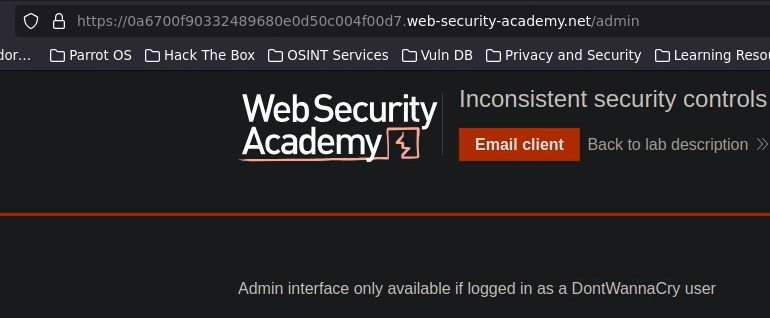
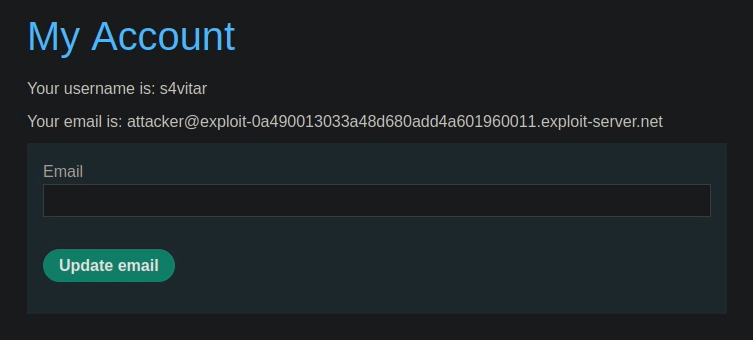
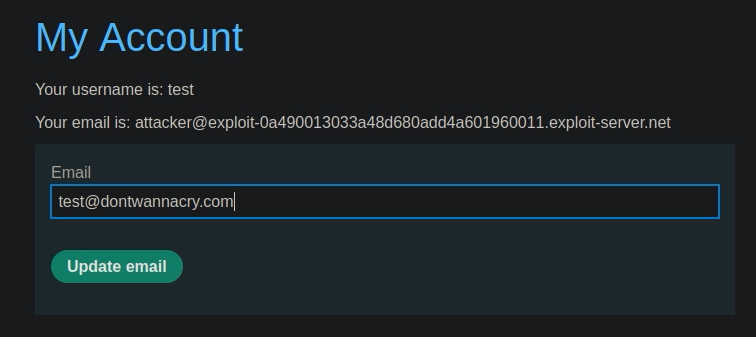
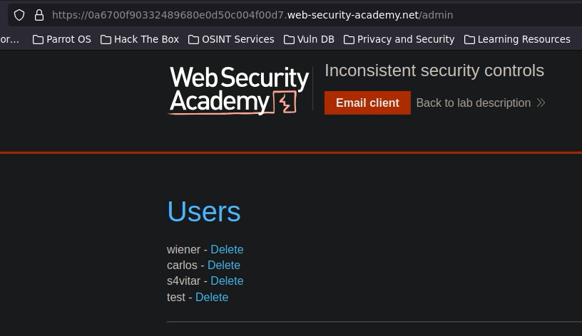

# 🧑‍💻 Controles de seguridad inconsistentes

## 📄 Descripción del laboratorio

Este laboratorio presenta una vulnerabilidad de **controles de seguridad inconsistentes**, donde las restricciones de acceso no se aplican de forma uniforme en toda la aplicación.

El panel de administración está restringido a usuarios con un dominio corporativo específico.

El objetivo es:

* Obtener acceso al panel `/admin`
* Eliminar al usuario **carlos**

 

## 📚 Teoría

Los controles de seguridad deben aplicarse de forma consistente en todos los puntos de la aplicación.

Cuando existen inconsistencias:

* Un flujo puede aplicar restricciones
* Otro flujo puede omitirlas

### 📌 El fallo

El sistema:

* Restringe el acceso al panel admin a emails con dominio:

```
@dontwannacry.com
```

* Pero no valida correctamente cambios posteriores de email

Esto permite:

* Registrarse con un email cualquiera
* Confirmar la cuenta
* Cambiar el email a uno corporativo

### 📌 Impacto

Esto provoca:

* Escalada de privilegios
* Acceso a funcionalidades restringidas
* Compromiso del panel de administración

 

## 📝 Práctica

### 1️⃣ Identificar la restricción

Accedemos a:

```
/admin
```

Observamos que:

* Solo está permitido para usuarios con dominio corporativo
* El dominio requerido es `@dontwannacry.com`


 

### 2️⃣ Crear una cuenta válida

Nos registramos en la aplicación.

El sistema:

* Envía un email de confirmación
* Podemos acceder al correo desde el **Email client del laboratorio**

Confirmamos el registro.

Ya tenemos una cuenta válida.


 

### 3️⃣ Modificar el email

Accedemos a la configuración de cuenta.

Observamos que:

* Podemos cambiar el email libremente

Modificamos el correo a:

```
usuario@dontwannacry.com
```

Guardamos los cambios.


 

### 4️⃣ Acceder al panel de administración

Accedemos de nuevo a:

```
/admin
```

<br>

Ahora:

* El sistema nos reconoce como usuario corporativo
* Se concede acceso al panel

 

### 5️⃣ Explotación final

Desde el panel de administración:

* Buscamos al usuario **carlos**
* Pulsamos **Delete**
