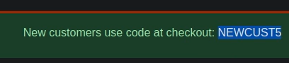
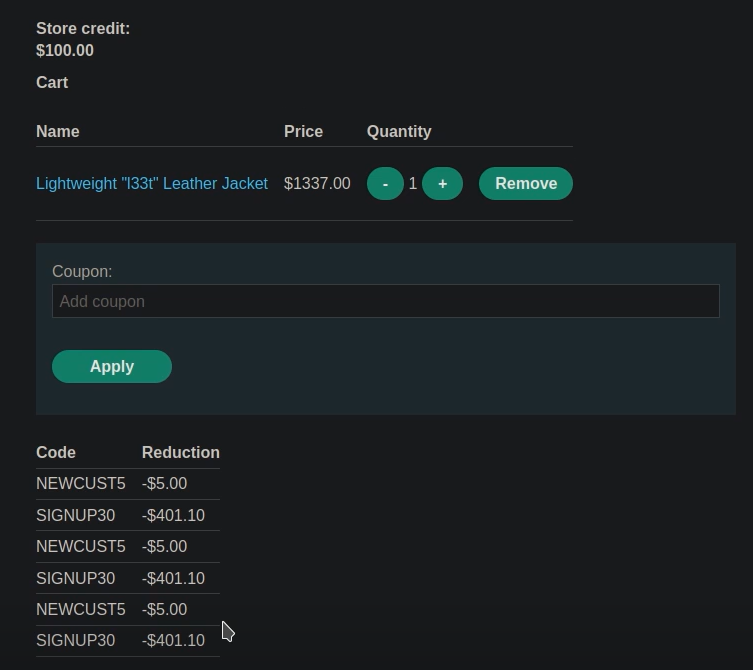

# 🧑‍💻 Reglas de negocio mal aplicadas

## 📄 Descripción del laboratorio

Este laboratorio presenta una vulnerabilidad en la lógica de aplicación de cupones, donde las reglas de negocio están mal implementadas.

El sistema permite aplicar descuentos, pero no controla correctamente el uso acumulativo de múltiples cupones.

El objetivo es:

* Aplicar descuentos múltiples sobre un mismo carrito
* Reducir el precio de la **Lightweight l33t leather jacket**
* Completar la compra por debajo del crédito disponible


## 📚 Teoría

Las reglas de negocio deben controlar correctamente:

* Cuántas veces puede usarse un cupón
* Cómo interactúan distintos cupones entre sí

### 📌 El fallo

El sistema:

* Impide usar el mismo cupón dos veces seguidas
* Pero no comprueba si un cupón ya fue usado anteriormente

Esto permite:

* Alternar entre distintos cupones
* Aplicarlos repetidamente

Ejemplo:

```
NEWCUST5 → SIGNUP30 → NEWCUST5 → SIGNUP30 → ...
```

Cada aplicación reduce el precio, sin límite real.

### 📌 Impacto

Esto permite:

* Acumular descuentos de forma ilimitada
* Reducir el precio total artificialmente
* Comprar productos caros a bajo coste


## 📝 Práctica

### 1️⃣ Identificar los cupones

Nos logueamos en la aplicación.

Observamos que existe un cupón disponible.

<br>

Navegando por la web, encontramos otro cupón asociado a la newsletter.

<br>

Obtenemos dos cupones:

```
NEWCUST5
SIGNUP30
```


### 2️⃣ Probar el comportamiento

Añadimos al carrito:

* Lightweight l33t leather jacket

Aplicamos un cupón.

Observamos que:

* No se puede aplicar el mismo cupón dos veces seguidas


### 3️⃣ Explotar la lógica

Alternamos entre los cupones:

```
NEWCUST5 → SIGNUP30 → NEWCUST5 → SIGNUP30
```

Observamos que:

* Ambos cupones se aplican repetidamente
* El sistema no detecta reutilización

El precio comienza a disminuir progresivamente.



### 4️⃣ Reducir el precio

Repetimos el proceso varias veces hasta:

* Reducir el precio por debajo de nuestro crédito disponible


### 5️⃣ Completar la compra

Procedemos al checkout.

La compra se realiza correctamente con el precio reducido.
