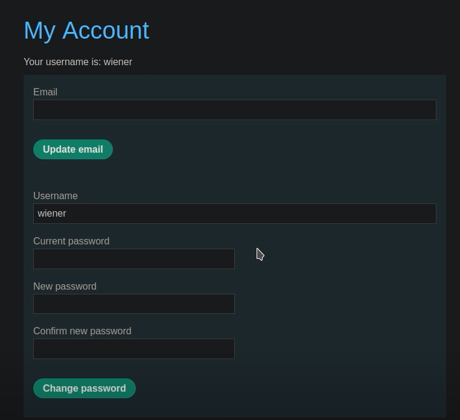
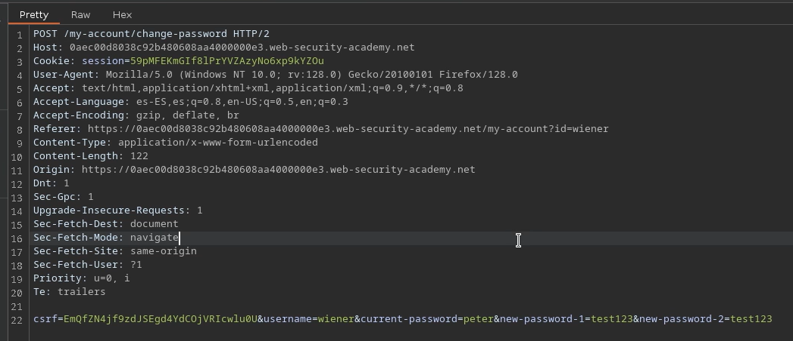
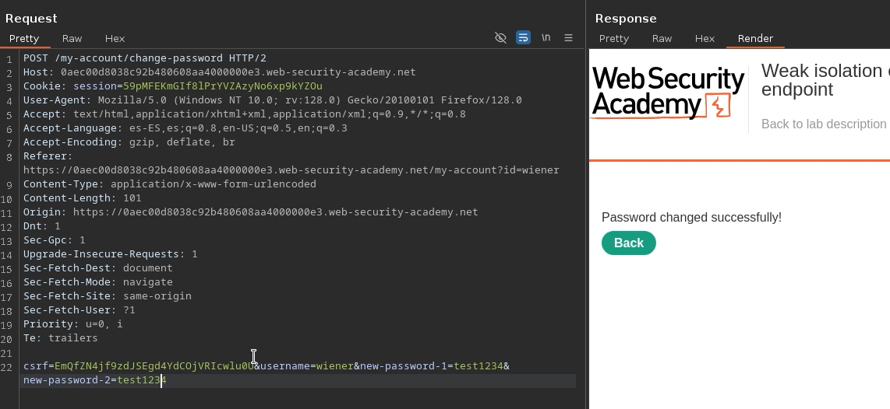
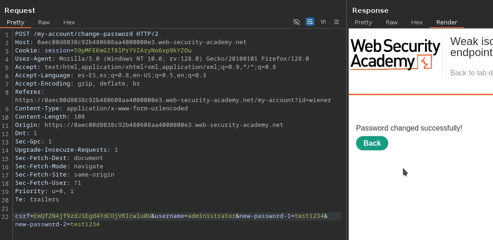

# 🧑‍💻 Aislamiento débil en endpoint de doble uso

## 📄 Descripción del laboratorio

Este laboratorio presenta una vulnerabilidad en un endpoint reutilizado para el cambio de contraseña, donde no existe un correcto aislamiento entre usuarios.

El sistema permite cambiar la contraseña de un usuario, pero no valida correctamente que la solicitud corresponda al usuario autenticado.

El objetivo es:

* Cambiar la contraseña del usuario administrador
* Acceder al panel `/admin`
* Eliminar al usuario carlos


## 📚 Teoría

Algunos endpoints están diseñados para ser reutilizados en distintos contextos, pero deben aplicar controles estrictos de autenticación y autorización.

### 📌 El fallo

El endpoint de cambio de contraseña:

* Acepta un parámetro `username`
* Permite omitir la contraseña actual
* No verifica que el usuario autenticado coincida con el objetivo

Esto provoca que:

* Un usuario pueda cambiar la contraseña de otro
* No exista aislamiento entre cuentas

### 📌 Impacto

Esto permite:

* Escalada de privilegios
* Toma de control de cuentas
* Acceso no autorizado a funciones críticas


## 📝 Práctica

### 1️⃣ Interceptar la petición

Nos logueamos con las credenciales proporcionadas.

Accedemos al panel de usuario.


<br>

Interceptamos la petición de cambio de contraseña:

```http
POST /my-account/change-password
```

La enviamos a Repeater.




### 2️⃣ Modificar la petición

Eliminamos el parámetro:

```
current-password
```


<br>

Enviamos la petición.

Observamos que:

* El servidor acepta la solicitud igualmente


### 3️⃣ Escalar el ataque

Modificamos el parámetro:

```
username=administrator
```

Asignamos una nueva contraseña controlada.

Enviamos la petición.


<br>

Resultado:

* La contraseña del administrador ha sido cambiada


### 4️⃣ Acceder como administrador

Iniciamos sesión con:

```
administrator:nueva_password
```

Accedemos a:

```
/admin
```


### 5️⃣ Explotación final

Desde el panel de administración:

* Buscamos al usuario carlos
* Pulsamos Delete
