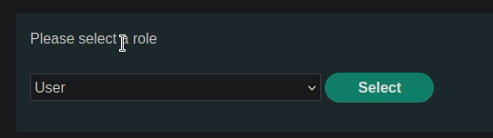
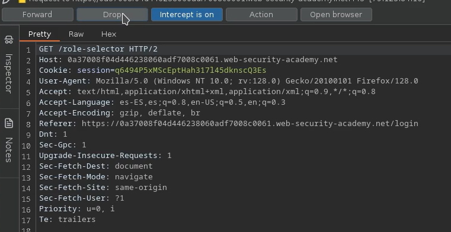
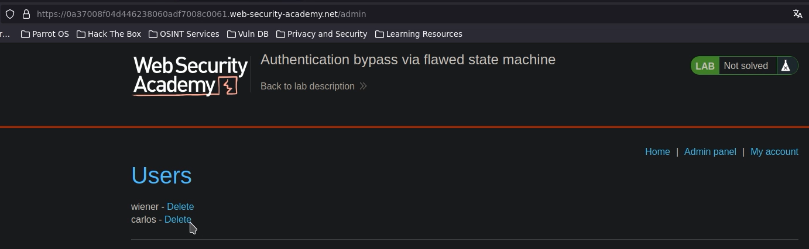

# 🧑‍💻 Bypass por máquina de estados rota

## 📄 Descripción del laboratorio

Este laboratorio presenta una vulnerabilidad en la **máquina de estados del proceso de autenticación**.

Tras el login, la aplicación requiere que el usuario seleccione un rol antes de continuar. Sin embargo, este paso no se valida correctamente.

El objetivo es:

* Obtener acceso como administrador
* Acceder al panel `/admin`
* Eliminar al usuario carlos


## 📚 Teoría

Las aplicaciones suelen implementar flujos basados en estados, donde cada paso depende del anterior.

### 📌 Flujo esperado

1. El usuario introduce sus credenciales
2. El sistema autentica al usuario
3. Se solicita la selección de rol
4. Se asigna el rol elegido
5. El usuario accede a la aplicación

### 📌 El fallo

El sistema:

* No valida que el paso de selección de rol se complete
* Permite continuar el flujo sin elegir rol
* Asigna un rol por defecto

En este caso:

* El rol por defecto es **administrator**

### 📌 Impacto

Esto permite:

* Bypass completo del control de roles
* Escalada de privilegios
* Acceso no autorizado a funcionalidades críticas


## 📝 Práctica

### 1️⃣ Iniciar sesión

Nos logueamos con las credenciales proporcionadas.

Tras autenticarnos, la aplicación nos solicita:

* Seleccionar un rol




### 2️⃣ Interceptar el flujo

Interceptamos con Burp Proxy la petición de login.

Continuamos el flujo hasta la petición de selección de rol.


### 3️⃣ Manipular la máquina de estados

Cuando se realiza la petición de selección de rol:

* La interceptamos
* La descartamos (drop request)



Esto impide que el flujo se complete correctamente.


### 4️⃣ Verificar el comportamiento

Accedemos directamente a la aplicación.

Observamos que:

* El sistema no bloquea el acceso
* Se ha asignado un rol por defecto



En este caso:

* El rol es **administrator**


### 5️⃣ Explotación final

Accedemos a:

```
/admin
```

Desde el panel:

* Buscamos al usuario carlos
* Pulsamos Delete
