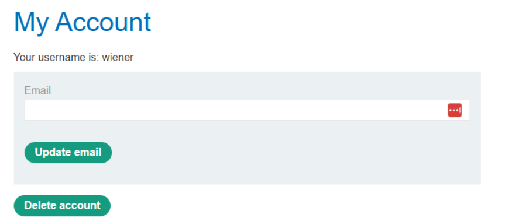
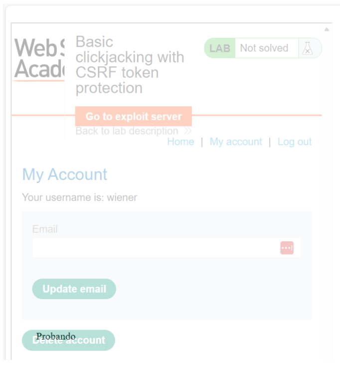
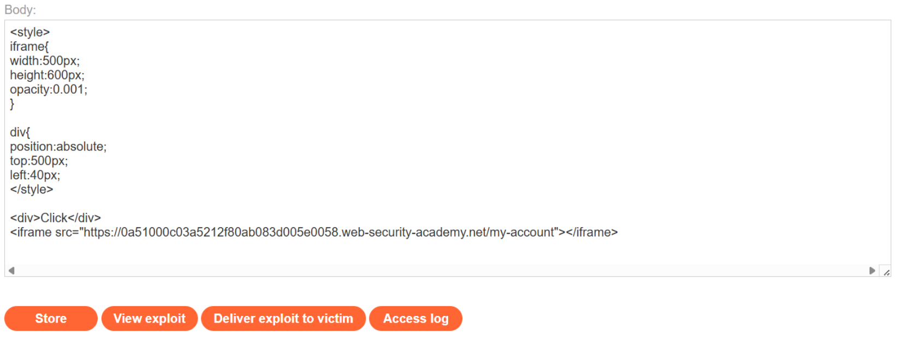
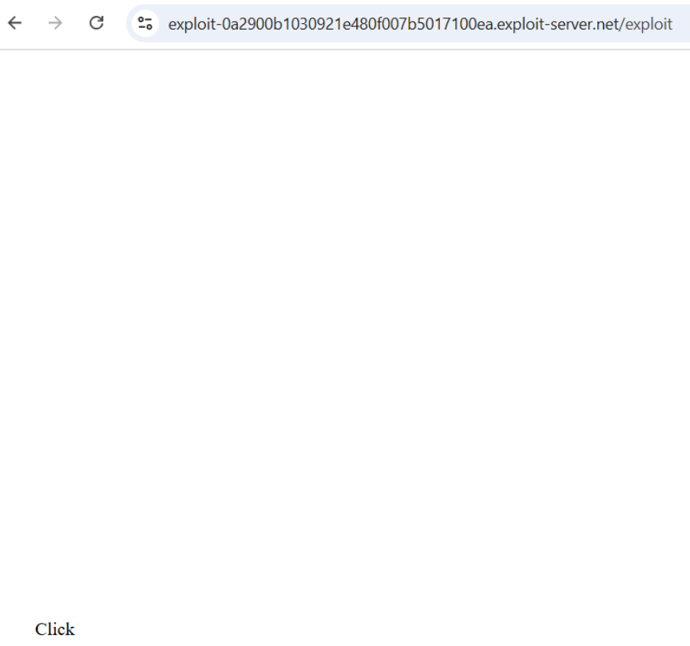
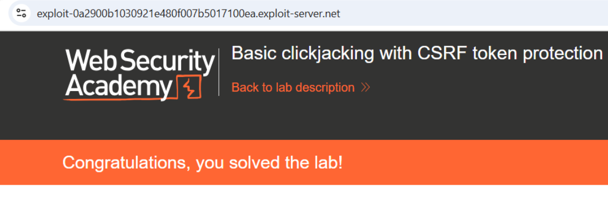

# 💻 Clickjacking básico con token CSRF

## 📄 Descripción del laboratorio

El laboratorio incluye una funcionalidad sensible para **eliminar la cuenta**, protegida mediante un **token CSRF**.

Sin embargo, la aplicación no implementa protecciones **anti-framing**, por lo que la página puede cargarse dentro de un **iframe desde cualquier dominio**.

El objetivo es:

* Incrustar la página `/my-account` en un sitio señuelo.
* Engañar al usuario para que haga clic.
* Provocar la eliminación de su cuenta.

Credenciales de prueba:

```
wiener:peter
```

 

## 📚 Teoría

Este laboratorio demuestra que **CSRF y Clickjacking son problemas distintos**.

Aunque una acción esté protegida por un token CSRF, sigue siendo vulnerable si:

* No se impide que la página se cargue en **iframes**.
* No se utilizan encabezados como **X-Frame-Options** o **frame-ancestors** en **Content Security Policy**.

### 📌 Funcionamiento del ataque

El atacante realiza las siguientes acciones:

1. Carga la página objetivo dentro de un **iframe**.
2. Hace que el iframe sea **casi transparente**.
3. Superpone un elemento visible, por ejemplo un botón o texto.
4. Alinea visualmente el señuelo con el **botón real**.

El usuario cree que está interactuando con un elemento inocuo, pero en realidad:

* Está interactuando con la **interfaz real del sitio vulnerable**.
* El **token CSRF válido** se envía automáticamente.
* La acción se ejecuta correctamente.

El usuario no necesita interactuar conscientemente con el sitio real.

 

## 📝 Práctica

### 🎯 Objetivo

Eliminar la cuenta de la víctima mediante **Clickjacking**.

 

### 1️⃣ Análisis inicial

Se inicia sesión con:

```
wiener:peter
```

Se accede a la sección **My account**.

<br>

Observaciones:

* Existe un botón **Delete account**.
* La acción está protegida por **token CSRF**.
* La página puede cargarse en un **iframe externo**.

Conclusión:

La protección CSRF no es suficiente, por lo que **Clickjacking es viable**.

 

### 2️⃣ Construcción del sitio señuelo

Se crea una página maliciosa en el **Exploit Server** que:

1. Incrusta `/my-account` dentro de un **iframe**.
2. Reduce la **opacidad** del iframe para hacerlo casi invisible.
3. Coloca un texto visible **“Click”** encima del botón real.


 

### 3️⃣ Alineación visual

Se ajustan el tamaño, la posición y la opacidad para que el clic del usuario coincida exactamente con el botón **Delete account**.

Código final del exploit:

```html
<style>
    iframe {
        width: 500px;
        height: 600px;
        opacity: 0.001;
        position: absolute;
        top: 0;
        left: 0;
    }
    div {
        position: absolute;
        top: 500px;
        left: 40px;
        font-size: 30px;
        color: red;
        pointer-events: none;
    }
</style>

<div>Click</div>
<iframe src="https://ID-DEL-LAB.web-security-academy.net/my-account"></iframe>
```

Detalles importantes:

* `opacity: 0.001` hace el iframe invisible pero interactivo.
* `pointer-events: none` permite que el clic pase al iframe.
* Las coordenadas se alinean con el botón real.

 

### 4️⃣ Ejecución del ataque

Se guarda el exploit en el **Exploit Server** mediante **Store**.

Posteriormente se selecciona **Deliver exploit to victim**.

<br>
<br>
 

### 5️⃣ Resultado final

Cuando la víctima carga la página maliciosa:

1. Ve el texto **“Click”**.
2. Hace clic creyendo que es inofensivo.
3. En realidad pulsa **Delete account** dentro del iframe.
4. El **token CSRF se envía automáticamente**.
5. La cuenta se elimina.

El laboratorio se resuelve correctamente.


