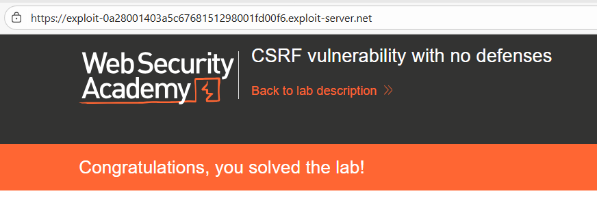
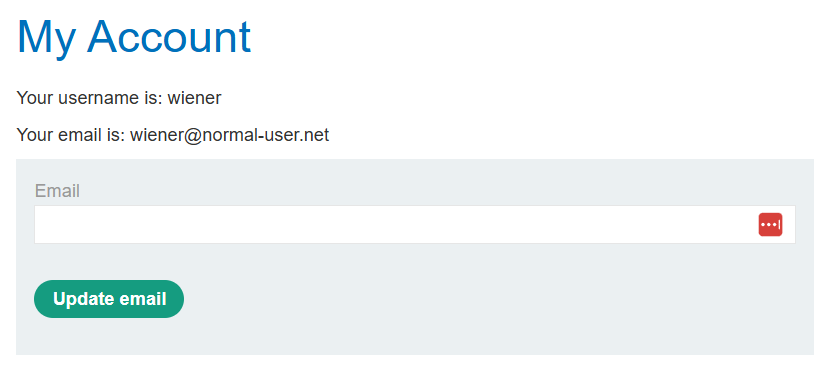
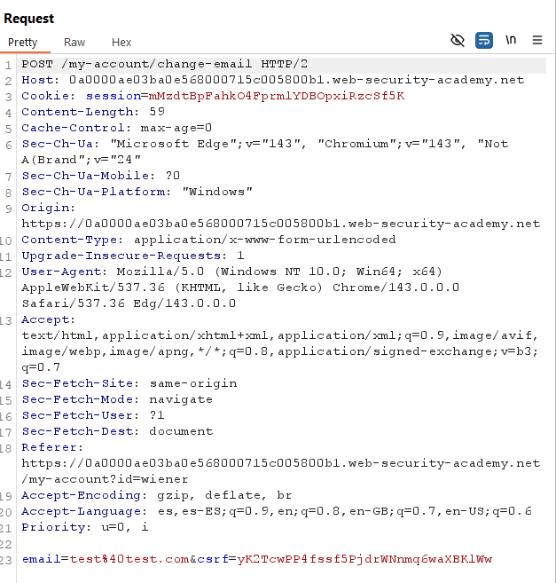
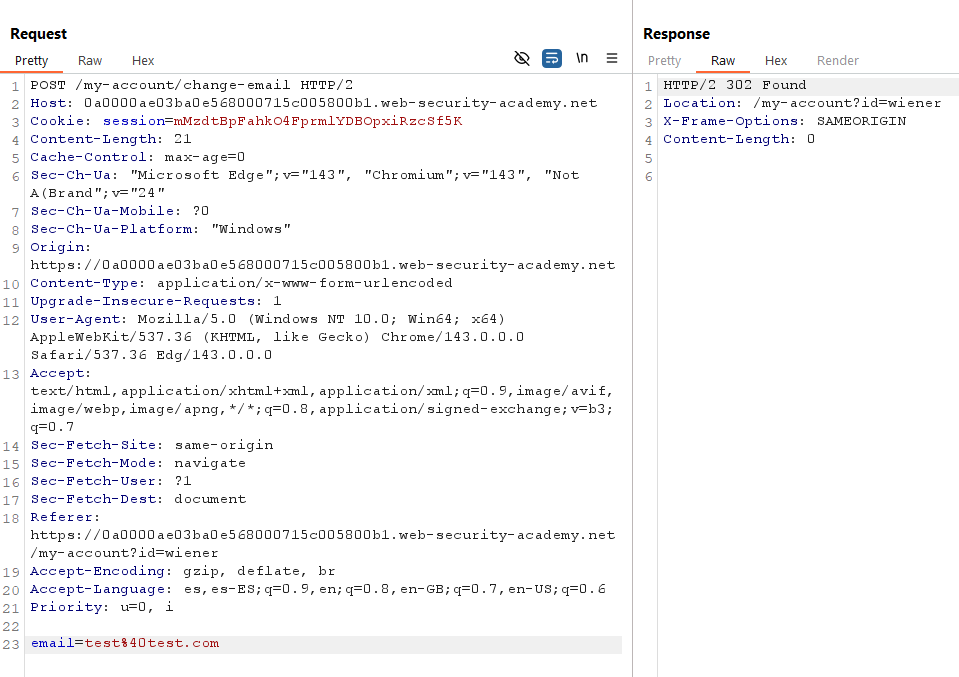
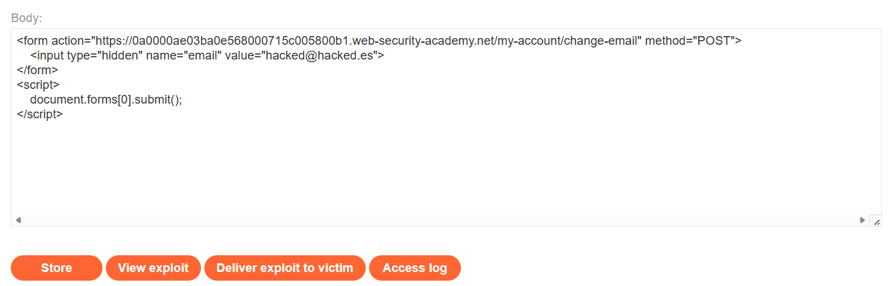

# 🔑 CSRF con validación solo si hay token presente

## 📄 Descripción del laboratorio

La funcionalidad de cambio de correo electrónico es vulnerable a **CSRF**. La aplicación intenta proteger la acción mediante un **token CSRF**, pero la validación se aplica únicamente si el token está presente en la solicitud.

El objetivo es:

* Alojar una página maliciosa en el **Exploit Server**.
* Ejecutar un ataque CSRF que cambie el correo de la víctima.
* Aprovechar una **validación condicional defectuosa**.

Credenciales proporcionadas:

* **wiener : peter**


## 📚 Teoría

En este laboratorio nos encontramos con una **defensa CSRF condicional y mal implementada**.

El comportamiento del servidor es el siguiente:

* Valida el **token CSRF** solo cuando el parámetro `csrf` existe.
* Si el parámetro `csrf` no está presente, **no se realiza ninguna validación**.

### 📌 Error lógico

El desarrollador asume que la mera presencia del token es suficiente para proteger la solicitud. Sin embargo, esto introduce un fallo lógico importante.

En la práctica ocurre lo siguiente:

* Un atacante puede **eliminar el parámetro `csrf`** de la petición.
* El servidor **no exige obligatoriamente el token**.
* La acción sensible se ejecuta **sin comprobaciones adicionales**.

El bypass consiste simplemente en **replicar el formulario legítimo sin incluir el campo `csrf`**. El servidor acepta la petición como válida.

Este fallo genera una **falsa sensación de seguridad**, ya que aparenta existir protección CSRF cuando en realidad es completamente evitable.


## 📝 Práctica

### 1️⃣ Análisis inicial

Se inicia sesión con **wiener:peter** y se accede a **My account**, donde se encuentra la funcionalidad de cambio de correo electrónico.




### 2️⃣ Interceptación de la petición legítima

Se intercepta la solicitud **POST** generada al cambiar el correo electrónico.

* **URL:** `/my-account/change-email`
* **Método:** `POST`
* **Parámetros:** `email=nuevo@correo.com` + `csrf=TOKEN`

<br>

**Observación**

Existe un **token CSRF**, lo que en teoría debería proteger la acción.


### 3️⃣ Bypass eliminando el token

Se prueba eliminar completamente el parámetro `csrf` y reenviar la petición en **Repeater**:

```
email=test@test.com
```

<br>

**Resultado**

La petición se acepta correctamente y el correo se cambia sin ningún error.

Esto confirma que **si el token no está presente, el servidor no realiza ninguna validación**.


### 4️⃣ Construcción del exploit

Se construye el exploit en el **Exploit Server** siguiendo estos pasos:

1. Replicar el formulario legítimo **sin el campo `csrf`**.
2. Indicar el correo que se quiere forzar (`hacked@hacked.es`).
3. Ocultar el campo utilizando `type="hidden"`.
4. Autoenviar el formulario al cargar la página.

El exploit final es el siguiente:

```html
<form action="https://ID-LABORATORIO.web-security-academy.net/my-account/change-email" method="POST">
    <input type="hidden" name="email" value="hacked@hacked.es">
</form>
<script>
    document.forms[0].submit();
</script>
```

El código se pega en el **Exploit Server**, se pulsa **Store** y posteriormente **Deliver exploit to victim**.




### 5️⃣ Resultado final

El laboratorio se resuelve correctamente.

Cuando el administrador carga la página maliciosa:

* El navegador envía automáticamente sus **cookies de sesión**.
* Se ejecuta la petición **POST** sin token CSRF.
* El servidor **no realiza ninguna validación**.

Como resultado, el correo del administrador se cambia a **hacked@hacked.es**


