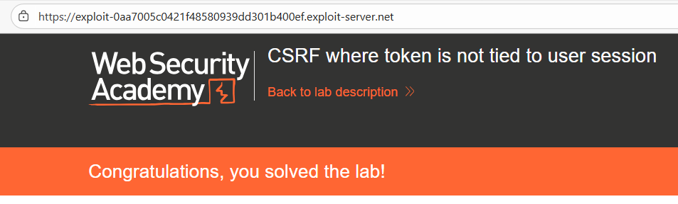
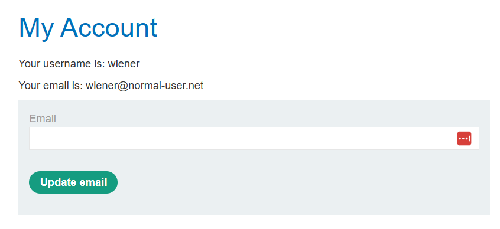
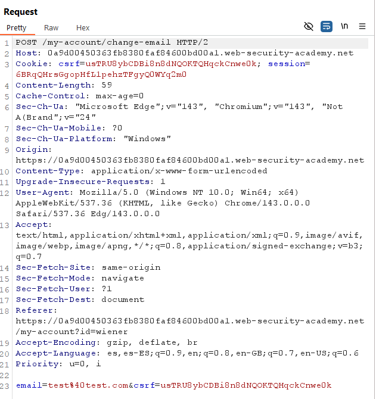
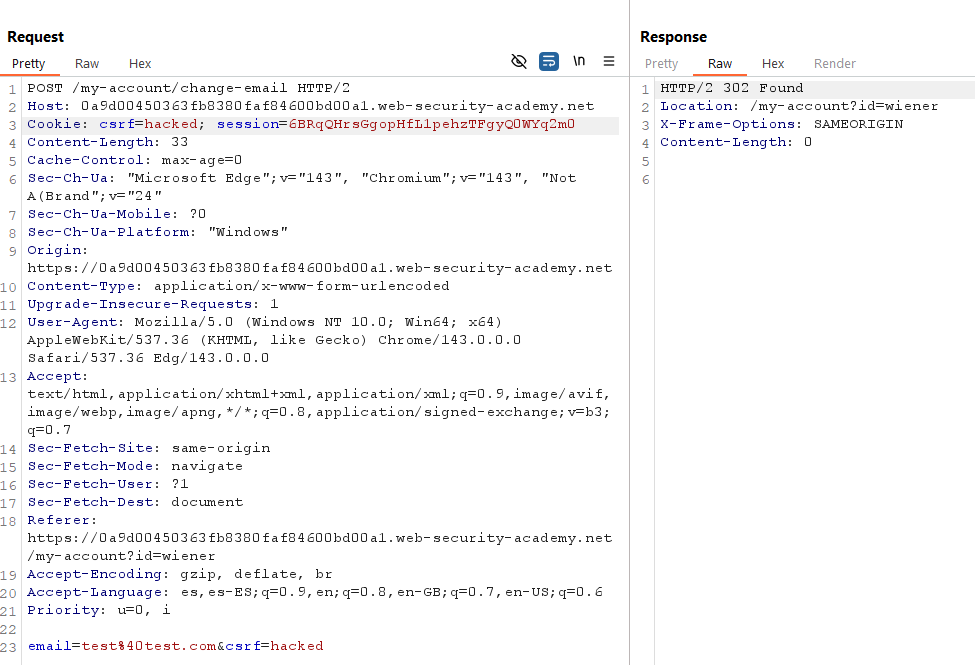
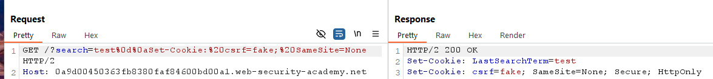
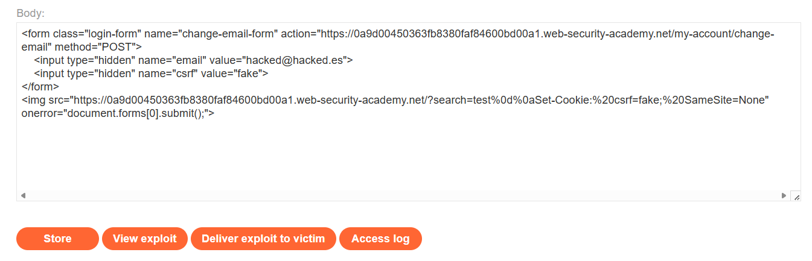

# 🔑 CSRF con token duplicado en cookie

## 📄 Descripción del laboratorio

La funcionalidad de cambio de correo electrónico es vulnerable a **CSRF**. La aplicación intenta prevenir este tipo de ataques utilizando la técnica de **double-submit cookie**, que no es segura si se utiliza de forma aislada.

El objetivo es:

* Alojar una **página maliciosa** en el **Exploit Server**.
* Forzar el cambio de correo del espectador.
* Abusar de un **token CSRF duplicado y controlable**.

Credenciales proporcionadas:

* **wiener : peter**


## 📚 Teoría

En este laboratorio la aplicación implementa la técnica de **double-submit cookie**, cuyo funcionamiento es el siguiente:

1. El servidor genera un **token CSRF**.
2. Envía ese token en dos ubicaciones:
   * En una **cookie** (`csrf=valor`).
   * En el **cuerpo del formulario** (`csrf=valor`).
3. En la petición **POST**, el servidor compara ambos valores.

### 📌 Problema de diseño

Este enfoque es inseguro si:

* El token **no está ligado a la sesión**.
* El atacante **puede controlar la cookie**.

En este caso, ambos valores pueden ser controlados por el atacante:

1. El atacante puede **inyectar una cookie `csrf` falsa**.
2. Envía una petición **POST** con ese mismo valor falso.
3. El servidor solo comprueba que **ambos valores coincidan**, por lo que acepta la petición.

### 📌 Vector clave: CRLF Injection

La funcionalidad de búsqueda refleja parámetros en la respuesta sin filtrarlos correctamente, lo que permite realizar **HTTP response splitting** mediante **CRLF injection**.

Ejemplo de payload:

```
%0d%0aSet-Cookie: csrf=fake
```

Esto permite **inyectar una cookie arbitraria** en el navegador de la víctima.

El resultado es un **bypass completo del mecanismo double-submit**.


## 📝 Práctica

### 1️⃣ Análisis inicial

Se inicia sesión con **wiener:peter** y se accede a **My account**, donde se encuentra la funcionalidad de cambio de correo electrónico.




### 2️⃣ Interceptación de la petición legítima

Se intercepta la solicitud **POST** generada al cambiar el correo electrónico.

* **URL:** `/my-account/change-email`
* **Método:** `POST`
* **Parámetros:** `email=nuevo@correo.com` + `csrf=TOKEN`

<br>

**Observaciones**

El token CSRF se envía en dos ubicaciones:

* En el **cuerpo de la petición**.
* En una **cookie `csrf`**.

Si ambos valores coinciden, la petición es aceptada.

Conclusión: el servidor **solo compara los valores**, pero **no los vincula a la sesión del usuario**.




### 3️⃣ Inyección de cookie CSRF falsa

Se analiza la funcionalidad de búsqueda:

```
/?search=valor
```

Se observa que el parámetro se refleja sin una sanitización adecuada.

Se prueba una **CRLF injection** utilizando el siguiente payload:

```
/?search=test%0d%0aSet-Cookie:%20csrf=fake;%20SameSite=None
```

<br>

Resultado:

La respuesta incluye la cabecera:

```http
Set-Cookie: csrf=fake; SameSite=None
```

Esto confirma que es posible **forzar al navegador de la víctima a establecer una cookie `csrf` arbitraria**.


### 4️⃣ Construcción del exploit

Se construye el exploit en el **Exploit Server**.

Pasos:

1. Crear un formulario **POST**.
2. Definir el correo deseado (`hacked@hacked.es`).
3. Incluir `csrf=fake` en el cuerpo de la petición.
4. Utilizar una etiqueta `` para **inyectar la cookie falsa**.
5. Aprovechar el evento `onerror` para **autoenviar el formulario**.

El exploit final es el siguiente:

```html
<form class="login-form" name="change-email-form" action="https://ID-LABORATORIO.web-security-academy.net/my-account/change-email" method="POST">
    <input type="hidden" name="email" value="hacked@hacked.es">
    <input type="hidden" name="csrf" value="fake">
</form>

```

El código se pega en el **Exploit Server**, se pulsa **Store** y posteriormente **Deliver exploit to victim**.




### 5️⃣ Resultado final

El laboratorio se resuelve correctamente.

Cuando el administrador carga la página maliciosa:

1. La etiqueta `` intenta cargar una URL inválida.
2. La respuesta inyecta la cabecera `Set-Cookie: csrf=fake`.
3. El evento `onerror` autoenvía el formulario.
4. El navegador envía la petición incluyendo:
   * La cookie `csrf=fake`.
   * El parámetro `csrf=fake`.

El servidor comprueba que ambos valores coinciden y acepta la petición.

Como resultado, el correo del administrador se cambia a **hacked@hacked.es**.


