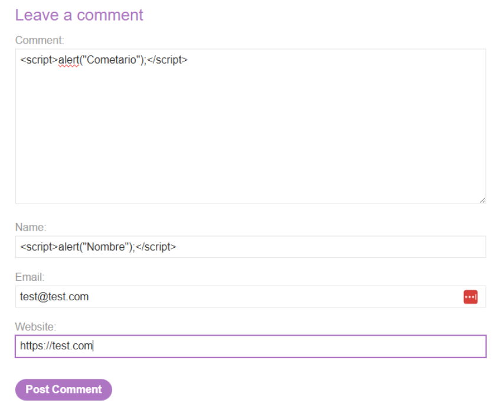
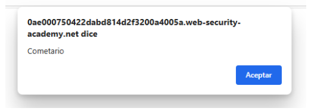

# 🌐 XSS almacenado en HTML sin codificación

## 📄 Descripción del laboratorio

Este laboratorio contiene una vulnerabilidad de **Cross-Site Scripting (XSS) almacenado** en la funcionalidad de comentarios de una entrada de blog.

Los datos introducidos por el usuario se guardan en el servidor y posteriormente se muestran en la página **sin ningún tipo de codificación ni validación**.

🎯 **Objetivo del laboratorio:**

* Enviar un comentario que ejecute la función `alert()` cuando se visualice la entrada del blog.


## 📚 Teoría

Este laboratorio introduce el concepto de **Stored Cross-Site Scripting (XSS)**.

La diferencia principal respecto al XSS reflejado es **dónde vive el payload**.

En un **XSS reflejado**:

```
1. El payload viaja en la petición
2. El servidor lo devuelve inmediatamente en la respuesta
3. El script se ejecuta una sola vez
```

En un **XSS almacenado**:

```
1. El payload se guarda en el servidor
2. Se sirve a todos los usuarios que visiten el contenido
3. El script se ejecuta automáticamente en cada visita
```

En este laboratorio ocurre lo siguiente:

* La aplicación permite publicar comentarios en el blog.
* Los datos introducidos se almacenan directamente en el backend.
* Los comentarios se insertan posteriormente en el HTML de la página.

No existe:

```
HTML encoding
sanitización del input
filtrado de etiquetas
protección frente a JavaScript
```

Desde la perspectiva del navegador, el contenido del comentario **forma parte del HTML legítimo de la página**, por lo que cualquier etiqueta o script será interpretado y ejecutado.

Esto convierte el XSS almacenado en una vulnerabilidad especialmente peligrosa, ya que permite:

```
comprometer a múltiples usuarios
robar sesiones
ejecutar acciones en nombre de usuarios autenticados
atacar cuentas administrativas
```


## 📝 Práctica

### 1️⃣ Identificar el punto de entrada

Accedemos a una entrada del blog que permita dejar comentarios.

Observamos que el formulario incluye varios campos:

```
Nombre
Email
Website
Comentario
```

No sabemos de antemano:

```
qué campos se almacenan
cuáles se muestran en la página
en qué contexto se renderizan
```

Por lo tanto, debemos probar la inyección en los campos disponibles.


### 2️⃣ Probar inyección de JavaScript

Introducimos un payload sencillo en el formulario de comentarios:

```html
<script>alert("Comentario");</script>
```

Enviamos el comentario.

<br>


### 3️⃣ Volver a cargar la entrada del blog

Tras enviar el comentario, recargamos la página del blog.

El sistema muestra los comentarios almacenados.

Resultado:

Aparece una ventana emergente ejecutando:

```javascript
alert("Comentario")
```

<br>

Esto confirma que:

```
el payload ha sido almacenado en el servidor
el script se ejecuta automáticamente al cargar la página
al menos uno de los campos se inserta sin codificación
```


### 4️⃣ Resultado

Se consigue:

* Inyectar código JavaScript en un comentario del blog
* Almacenar el payload en el servidor
* Ejecutar el script automáticamente cuando se visualiza la página

**Laboratorio resuelto.**
