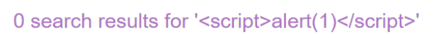
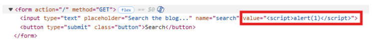
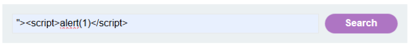
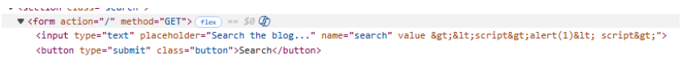
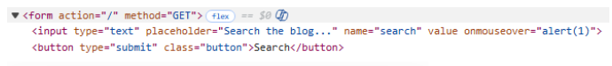
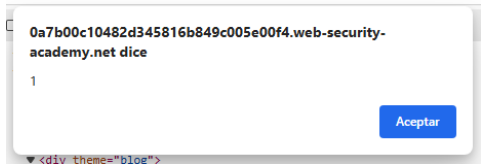

# 🌐 XSS reflejado en atributo con corchetes codificados

## 📄 Descripción del laboratorio

Este laboratorio contiene una vulnerabilidad de **XSS reflejado** en la funcionalidad de búsqueda del blog.

La aplicación codifica los caracteres `<` y `>`, lo que impide la inyección directa de etiquetas HTML. Sin embargo, el input del usuario se refleja **dentro de un atributo HTML**, lo que permite explotar la vulnerabilidad de otra forma.

🎯 **Objetivo del laboratorio:**

* Realizar un ataque XSS que inyecte un atributo y ejecute la función `alert()`.


## 📚 Teoría

Este laboratorio introduce un concepto clave en XSS: **el contexto del atributo HTML**.

En este caso, el input del usuario no se inserta:

```
en el cuerpo del HTML
dentro de una etiqueta <script>
```

Sino dentro del valor de un atributo HTML.

Un ejemplo simplificado del HTML generado sería:

```html
<input type="text" name="search" value="VALOR_USUARIO">
```

La aplicación implementa una defensa parcial:

```
codifica los caracteres < y >
no protege el contenido dentro de atributos
```

Esto permite un ataque diferente.

Si el atacante controla el valor de un atributo, puede intentar:

```
cerrar el atributo actual
inyectar un nuevo atributo
usar un event handler como onmouseover o onclick
```

Aunque no se puedan crear nuevas etiquetas HTML, **los event handlers siguen siendo código JavaScript ejecutable**.

Por ejemplo:

```html
<input value="" onmouseover="alert(1)">
```

Cuando el navegador procesa este HTML, el evento se ejecutará cuando ocurra la acción correspondiente.


## 📝 Práctica

### 1️⃣ Probar XSS clásico

Probamos el payload típico en el buscador:

```html
<script>alert(1)</script>
```

<br>

<br>

Resultado:

El código no se ejecuta.

Esto ocurre porque los caracteres `<` y `>` están codificados por la aplicación.

Conclusión:

```
no podemos crear nuevas etiquetas HTML
```


### 2. Analizar el contexto en el HTML

Inspeccionamos el código fuente de la página.

Observamos una estructura similar a:

```html
<input type="text" name="search" value="VALOR_USUARIO">
```

<br>

Nuestro input se inserta dentro del atributo `value`, entre comillas dobles.

Esto significa que si conseguimos cerrar ese atributo, podremos **inyectar uno nuevo**.


### 3️⃣ Intentar cerrar el atributo e inyectar HTML

Probamos el payload:

```html
"><script>alert(1)</script>
```

<br>

Resultado:

No funciona.

Las etiquetas siguen estando bloqueadas por la codificación de `<` y `>`.

Esto confirma que **no podemos usar etiquetas HTML nuevas**.




### 4️⃣ Inyectar un event handler

En lugar de usar etiquetas, inyectamos un nuevo atributo con un evento.

Payload:

```javascript
" onmouseover="alert(1)
```

Este payload hace lo siguiente:

```
cierra el atributo value
inyecta un nuevo atributo onmouseover
el navegador interpreta el HTML resultante como válido
```

<br>



### 5️⃣ Ejecutar el XSS

Accedemos a la URL con el payload.

La página carga normalmente.

Al pasar el ratón sobre el campo afectado, se ejecuta:

```javascript
alert(1)
```

<br>

Esto confirma que existe un **XSS reflejado explotable mediante inyección de atributos**.

El laboratorio se marca como completado.


### 6️⃣ Resultado

Se consigue:

* Escapar del atributo HTML original
* Inyectar un nuevo atributo con un event handler
* Ejecutar JavaScript mediante `onmouseover`

**Laboratorio resuelto.**
