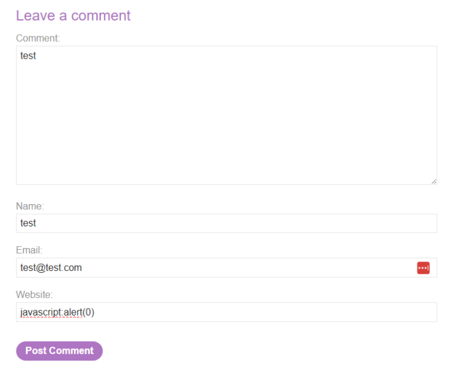
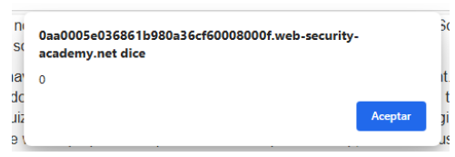

# 🌐 XSS almacenado en `href` con comillas codificadas

## 📄 Descripción del laboratorio

Este laboratorio contiene una vulnerabilidad de **XSS almacenado** en la funcionalidad de comentarios del blog.

El sistema genera un enlace alrededor del nombre del autor utilizando el valor introducido en el campo **website**, sin validar el esquema de la URL.

🎯 **Objetivo del laboratorio:**

* Enviar un comentario que ejecute `alert()` cuando se haga clic en el nombre del autor.


## 📚 Teoría

En este laboratorio se explora un caso común de **Stored XSS en atributos `href`**.

El flujo vulnerable es el siguiente:

```
1. El usuario envía un comentario con varios campos
2. El servidor almacena los valores introducidos
3. Al mostrar el comentario, el nombre del autor se convierte en un enlace
4. El atributo href del enlace se rellena con el valor del campo website
```

Un ejemplo simplificado del HTML generado sería:

```html
<a href="VALOR_WEBSITE">Nombre del autor</a>
```

La aplicación implementa una defensa parcial:

```
codifica las comillas dobles
no valida el contenido del enlace
no restringe el esquema de la URL
```

Esto es un problema porque el atributo `href` acepta múltiples esquemas válidos.

Por ejemplo:

```
http:
https:
mailto:
javascript:
```

Si el servidor no valida el esquema permitido, un atacante puede usar:

```javascript
javascript:alert(1)
```

El navegador se comporta de la siguiente forma:

```
no ejecuta el código al cargar la página
ejecuta el código cuando el usuario hace clic en el enlace
```

Al tratarse de un **XSS almacenado**, el payload:

```
queda guardado en el servidor
se ejecuta para cualquier visitante que interactúe con el enlace
```


## 📝 Práctica

### 1️⃣ Identificar el campo vulnerable

Accedemos a una entrada del blog y observamos el formulario de comentarios.

El formulario incluye varios campos:

```
Nombre
Email
Website
Comentario
```

Enviamos un comentario normal y observamos el resultado.

El nombre del autor aparece como un enlace y el destino del enlace coincide con el valor introducido en el campo **website**.

Esto confirma que el campo vulnerable es:

```
website
```


### 2️⃣ Probar un esquema malicioso

En lugar de introducir una URL normal, utilizamos un esquema `javascript:`.

En el campo **website** introducimos:

```java
javascript:alert(0)
```

Rellenamos los demás campos del formulario y enviamos el comentario.




### 3️⃣ Ejecutar el XSS

Recargamos la página del blog donde aparece el comentario.

Observamos que el nombre del autor ahora es un enlace que apunta a:

```java
javascript:alert(0)
```

Hacemos clic en el nombre del autor.

Resultado:

<br>

El navegador ejecuta el código JavaScript y aparece la ventana:

```javascript
alert(0)
```

Esto confirma que el **XSS almacenado es explotable**.

El laboratorio se marca como completado.


### 4️⃣ Resultado

Se consigue:

* Identificar el campo vulnerable (`website`)
* Insertar un esquema `javascript:` en el atributo `href`
* Ejecutar código JavaScript al hacer clic en el enlace

**Laboratorio resuelto.**
