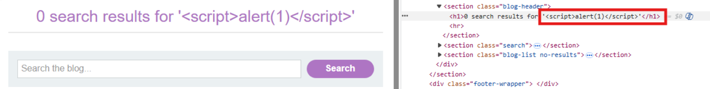
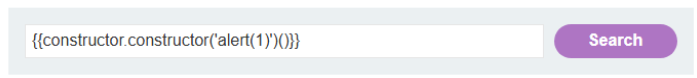
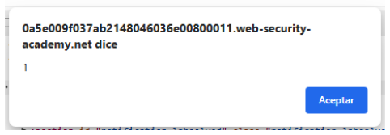

# 🌐 XSS DOM en AngularJS con comillas codificadas

## 📄 Descripción del laboratorio

Este laboratorio contiene una vulnerabilidad de **DOM-based XSS** dentro de una expresión **AngularJS** en la funcionalidad de búsqueda.

La aplicación utiliza AngularJS mediante la directiva `ng-app`, que evalúa expresiones encerradas entre `{{ }}` dentro de nodos HTML gestionados por el framework.

🎯 **Objetivo del laboratorio:**

* Ejecutar una expresión AngularJS que invoque la función `alert()`.


## 📚 Teoría

Este laboratorio introduce un vector de XSS específico de frameworks: **AngularJS expression injection**.

AngularJS incluye un motor de plantillas que evalúa expresiones dentro de:

```
{{ expresión }}
```

Estas expresiones se ejecutan en tiempo de renderizado dentro del contexto del framework.

En este laboratorio ocurre lo siguiente:

```
1. El usuario introduce un término de búsqueda
2. El valor se refleja en la página
3. El contenido está dentro de un nodo con la directiva ng-app
4. AngularJS procesa y evalúa expresiones dentro de {{ }}
```

La aplicación implementa una defensa parcial:

```
codifica los caracteres < y >
codifica comillas
```

Esto bloquea ataques XSS tradicionales basados en HTML o atributos.

Sin embargo, esta protección **no afecta al motor de expresiones de AngularJS**.

AngularJS permite acceder a objetos internos y a constructores mediante su sistema de expresiones. Si el atacante puede llegar al constructor de `Function`, es posible ejecutar JavaScript arbitrario.

Una técnica conocida consiste en acceder a:

```
constructor.constructor
```

Esto permite crear una nueva función JavaScript dinámicamente.

Este tipo de XSS:

```
no requiere etiquetas <script>
no depende del HTML
se ejecuta dentro del motor de AngularJS
```


## 📝 Práctica

### 1️⃣ Identificar el uso de AngularJS

Accedemos a la funcionalidad de búsqueda del laboratorio.

Observamos que el término introducido se refleja en la página.

Inspeccionando el HTML con las herramientas de desarrollo del navegador encontramos un nodo que incluye la directiva:

```
ng-app
```

Esto confirma que AngularJS está activo.

Probamos un payload clásico:

```html
<script>alert(1)</script>
```

Resultado:

El payload no se ejecuta.

Esto confirma que:

```
no estamos en un contexto HTML
el contenido está siendo procesado por AngularJS
```


### 2️⃣ Confirmar que el input se evalúa como expresión

Introducimos contenido simple en el buscador.

Observamos que Angular procesa el valor y lo renderiza en la página.

Esto indica que el input se evalúa dentro del motor de expresiones de Angular.




### 3️⃣ Construir una expresión Angular maliciosa

AngularJS permite acceder al constructor de funciones a través de la cadena de prototipos.

Payload utilizado:

```javascript
{{constructor.constructor('alert(1)')()}}
```

Funcionamiento del payload:

```
constructor accede al constructor del objeto actual
constructor.constructor accede al constructor Function
'alert(1)' define el código a ejecutar
() ejecuta la función creada
```

Esto permite ejecutar JavaScript dentro del contexto del framework.


### 4️⃣ Ejecutar el XSS

Introducimos el payload en el campo de búsqueda:

```javascript
{{constructor.constructor('alert(1)')()}}
```

<br>

Resultado:

La página se carga normalmente y aparece la ventana:

```java
alert(1)
```

Esto confirma que existe un **DOM-based XSS explotable mediante AngularJS expressions**.

El laboratorio se marca como completado.




### 5️⃣ Resultado

Se consigue:

* Identificar el uso de AngularJS
* Inyectar una expresión Angular
* Escalar hasta ejecución de JavaScript mediante `constructor.constructor`

**Laboratorio resuelto.**
