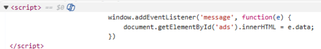
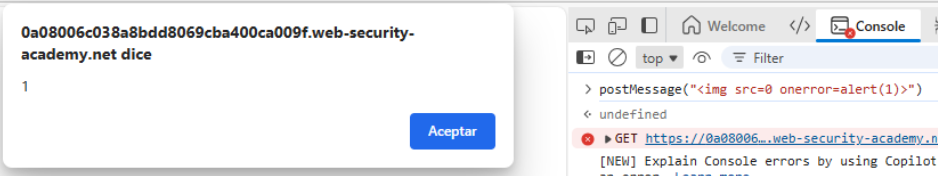
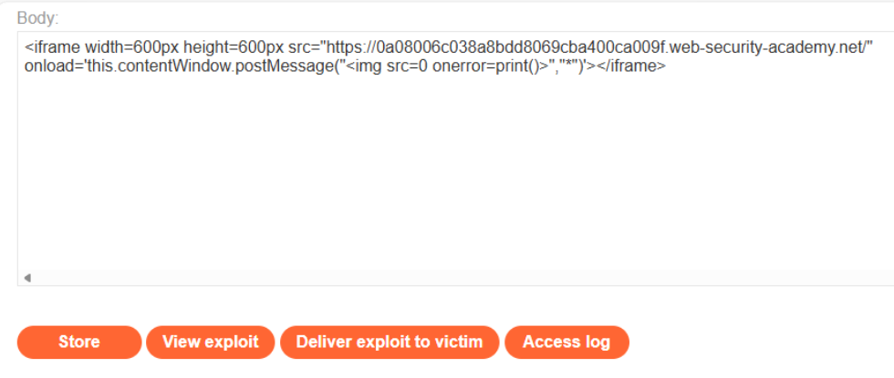
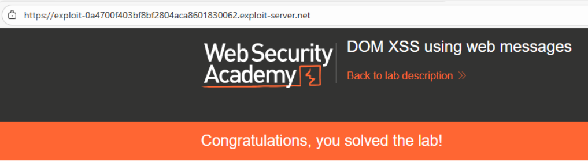

# 🌐 DOM XSS mediante Web Messages

## 📄 Descripción del laboratorio

Este laboratorio es vulnerable a **DOM-Based XSS** debido a un uso inseguro de Web Messages mediante `postMessage`.\
La aplicación escucha mensajes entrantes y los inserta directamente en el DOM sin validación.

El problema radica en que:

* No se valida el origen del mensaje (`event.origin`)
* Se inserta el contenido directamente usando `innerHTML`

Esto permite a un atacante enviar un mensaje malicioso que será interpretado como HTML y ejecutará JavaScript en el navegador de la víctima.

El objetivo es conseguir que se invoque la función `print()` enviando un mensaje malicioso desde el Exploit Server.

 

## 📚 Teoría

### 📌 **DOM XSS mediante Web Messages**

El método `postMessage` permite la comunicación entre ventanas o iframes de distintos orígenes.

Ejemplo vulnerable del laboratorio:

```javascript
window.addEventListener("message", function(e) {
    document.getElementById("ads").innerHTML = e.data;
});
```

Este código introduce dos problemas críticos:

**1. No valida el origen del mensaje**\
La aplicación no comprueba `event.origin`, por lo que acepta mensajes desde cualquier dominio.

**2. Inserta datos no confiables con innerHTML**\
El contenido de `e.data` se interpreta como HTML, permitiendo la ejecución de código JavaScript.

### 📌 **¿Por qué esto es DOM-Based XSS?**

* El payload nunca pasa por el servidor
* La ejecución ocurre completamente en el navegador
* Se explota directamente el JavaScript del cliente

**Conclusión clave:**\
Si una aplicación:

* Usa `postMessage`
* No valida `event.origin`
* Inserta datos con `innerHTML`

El XSS es trivial de explotar.

 

## 📝 Práctica

### 1️⃣ **Analizar el código vulnerable**

Revisamos el código fuente de la página y localizamos el listener de mensajes:

```javascript
window.addEventListener("message", function(e) {
    document.getElementById("ads").innerHTML = e.data;
});
```

<br>

Confirmamos que:

* Usa `addEventListener("message")`
* Inserta `event.data` directamente en el DOM
* No valida `event.origin`

 

### 2️⃣ **Prueba manual desde consola**

Probamos a enviar un mensaje manualmente:

```
postMessage("");
```

<br>

**Resultado:** se ejecuta `print()`

Esto confirma que el DOM es vulnerable a XSS.

 

### 3️⃣ **Explotación mediante Exploit Server**

Creamos una página maliciosa que:

* Carga la página vulnerable en un `<iframe>`
* Envía automáticamente un mensaje malicioso

Payload final:

```html
<iframe
  width="600"
  height="600"
  src="https://ID-DEL-LABORATORIO/"
  onload='this.contentWindow.postMessage("","*")'>
</iframe>
```


 

### 4️⃣ **Enviar el exploit**

* Guardamos el exploit en el Exploit Server
* Pulsamos **Store**
* Pulsamos **Deliver exploit to victim**

Cuando la víctima carga la página:

* Se renderiza el iframe
* Se envía el mensaje malicioso
* El script vulnerable lo inserta en el DOM

 

### 5️⃣ **Resultado**

Se ejecuta la función `print()` en el navegador de la víctima.


