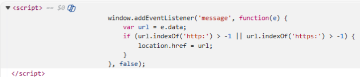
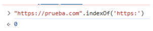
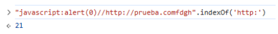
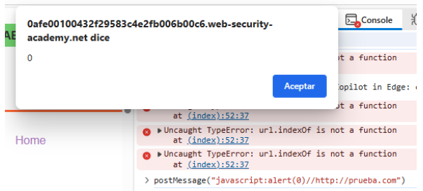
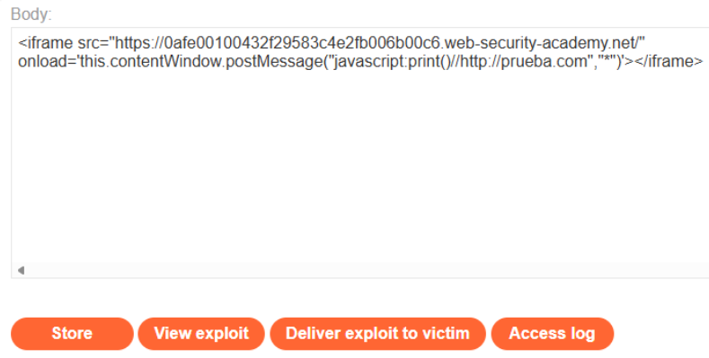
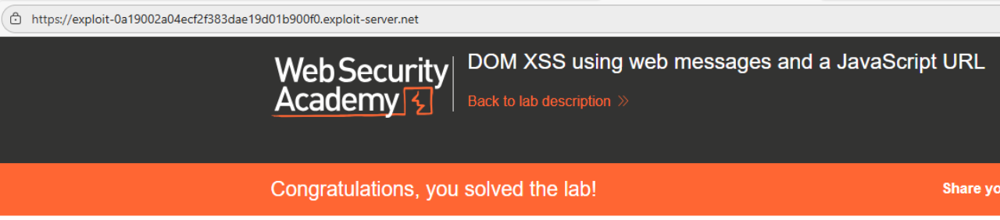

# 🌐 DOM XSS mediante Web Messages y URL JavaScript

## 📄 Descripción del laboratorio

Este laboratorio es vulnerable a **DOM-Based XSS** debido a un uso inseguro de Web Messages combinado con redirecciones mediante `location.href`.

La aplicación escucha mensajes entrantes y utiliza su contenido directamente como destino de navegación, aplicando una validación insuficiente sobre la URL.

El problema radica en que:

* La validación de la URL es débil (uso de `indexOf`)
* Se utiliza `event.data` directamente en `location.href`
* No se valida el origen del mensaje (`event.origin`)

Esto permite a un atacante enviar una URL maliciosa con esquema `javascript:` que será ejecutada en el navegador de la víctima.

El objetivo es crear una página en el Exploit Server que envíe un mensaje malicioso y ejecute la función `print()`.

 

## 📚 Teoría

### 📌 **DOM XSS mediante redirección con location.href**

Ejemplo vulnerable del laboratorio:

```javascript
window.addEventListener("message", function(e) {
    if (e.data.indexOf("http") > -1) {
        location.href = e.data;
    }
});
```

Este código introduce tres problemas críticos:

**1. Validación débil de la URL**\
Se utiliza `indexOf("http")`, lo que únicamente comprueba si la cadena contiene “http”.

❌ No verifica que la URL empiece por `http://` o `https://`\
❌ Permite contenido arbitrario antes de “http”

**2. Uso directo de event.data en location.href**\
El valor recibido se asigna directamente a `location.href`, permitiendo:

* Redirecciones arbitrarias
* Ejecución de esquemas peligrosos como `javascript:`

**3. Falta de validación de event.origin**\
No se comprueba el origen del mensaje, por lo que cualquier dominio puede enviar datos al listener.

### 📌 **Bypass del filtro con javascript:**

Payload clave:

```
javascript:print()//http://prueba.com
```

**Cómo funciona:**

* `javascript:print()` → se ejecuta al asignarse a `location.href`
* `//` → comenta el resto de la URL
* `http://prueba.com` → hace que la condición `indexOf("http") > -1` sea verdadera

💡 El filtro considera la URL válida, pero el navegador ejecuta código JavaScript.

 

## 📝 Práctica

### 1️⃣ **Analizar el código vulnerable**

Revisamos el código fuente y encontramos:

```javascript
window.addEventListener("message", function(e) {
    var url = e.data;
    if (url.indexOf('http:') > -1 || url.indexOf('https:') > -1) {
        location.href = url;
    }
}, false);
```

<br>

Confirmamos que:

* Usa `addEventListener("message")`
* Inserta `event.data` directamente
* Redirige con `location.href`
* Valida incorrectamente usando `indexOf`

 

### 2️⃣ **Comprobar la validación**

Probamos cómo funciona el filtro:

```javascript
"https://prueba.com".indexOf('https:')
```

<br>

Devuelve `0`, lo que cumple la condición (> -1).

Probamos un caso manipulado:

```javascript
"javascript:print()//http://prueba.com".indexOf('http:')
```

<br>

También devuelve un valor válido.

Esto confirma que el filtro es fácilmente bypassable.

 

### 3️⃣ **Prueba manual**

Desde la consola ejecutamos:

```
postMessage("javascript:alert()//http://prueba.com");
```

<br>

🟢 **Resultado:** se ejecuta `alert()`

Confirmado: la aplicación es vulnerable a DOM XSS.

 

### 4️⃣ **Explotación mediante Exploit Server**

Creamos una página maliciosa que:

* Carga la página vulnerable en un `<iframe>`
* Envía automáticamente el payload al cargarse

Payload final:

```html
<iframe 
  width="600" 
  height="600" 
  src="https://ID-DEL-LABORATORIO/" 
  onload='this.contentWindow.postMessage("javascript:print()//http://prueba.com","*")'>
</iframe>
```

<br>
 

### 5️⃣ **Enviar el exploit**

* Guardamos el exploit en el Exploit Server
* Pulsamos **Store**
* Pulsamos **Deliver exploit to victim**

Cuando la víctima accede:

* Se carga el iframe
* Se envía el mensaje malicioso
* La aplicación asigna el valor a `location.href`
* Se ejecuta `print()`


