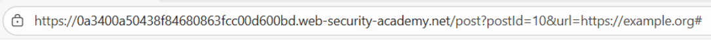
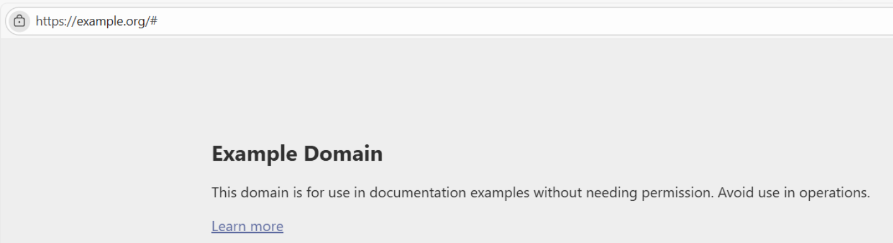
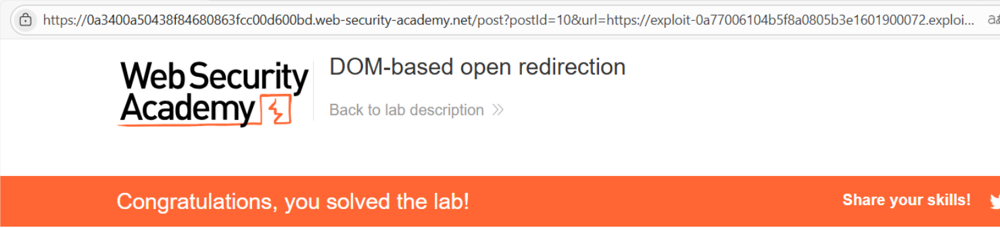

# 🌐 Redirección abierta basada en el DOM

## 📄 Descripción del laboratorio

Este laboratorio es vulnerable a **DOM-Based Open Redirect** debido a un uso inseguro de parámetros de la URL.

La aplicación extrae el valor de un parámetro desde el fragmento de la URL (`#`) y lo utiliza directamente para redirigir al usuario mediante `location.href`, sin ningún tipo de validación.

El problema radica en que:

* Se utiliza un parámetro controlado por el usuario
* No se valida el destino de la redirección
* La lógica ocurre completamente en el cliente (DOM)

Esto permite a un atacante construir una URL maliciosa que redirija a la víctima a un dominio externo controlado por él.

El objetivo es explotar esta vulnerabilidad para redirigir a la víctima al Exploit Server.

 

## 📚 Teoría

#### 📌 **DOM Open Redirect**

En este tipo de vulnerabilidad, la redirección se realiza completamente en el navegador mediante JavaScript.

Ejemplo vulnerable del laboratorio:

```
returnUrl = /url=(https?:\/\/.+)/.exec(location);
location.href = returnUrl ? returnUrl[1] : "/";
```

Este código introduce varios problemas críticos:

**1. Uso de datos controlados por el usuario**\
El valor se extrae directamente de la URL (`location`) sin ningún tipo de sanitización.

**2. Falta de validación del destino**\
No se comprueba si la URL es:

* Interna
* De confianza
* Parte de una whitelist

**3. Redirección directa con location.href**\
El valor extraído se asigna directamente a `location.href`, permitiendo redirecciones arbitrarias.

**Conclusión clave:**\
Si una aplicación:

* Extrae datos de la URL
* No valida el destino
* Usa `location.href`

➡️ Es vulnerable a Open Redirect.

 

## 📝 Práctica

#### 1️⃣ **Identificar el punto vulnerable**

Navegando por la aplicación encontramos un botón:

```html
<a href="#" onclick="returnUrl = /url=(https?:\/\/.+)/.exec(location); location.href = returnUrl ? returnUrl[1] : '/'">Back to blog</a>
```

Este botón:

* Extrae el parámetro `url` de la URL
* Lo utiliza directamente para redirigir

 

#### 2️⃣ **Analizar el comportamiento**

Cuando hacemos clic en el botón:

* Se ejecuta el script
* Se obtiene el valor del parámetro `url`
* Se redirige automáticamente con `location.href`

<br>

 

#### 3️⃣ **Construir la URL maliciosa**

Modificamos la URL para incluir nuestro dominio (Exploit Server):

```
https://LAB-ID.web-security-academy.net/post?postId=1#url=https://exploit-server.exploit-server.net
```

 

#### 4️⃣ **Ejecutar el ataque**

* Enviamos esta URL a la víctima
* La víctima accede a la página
* Hace clic en **Back to blog**
* El script extrae el parámetro `url`
* Se produce la redirección al Exploit Server

<br>
El laboratorio queda resuelto.
