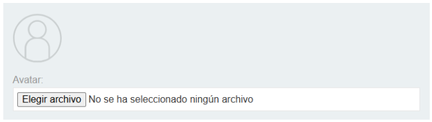
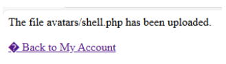
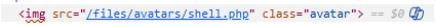
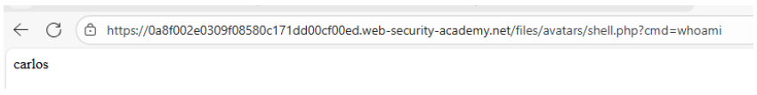
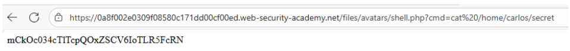
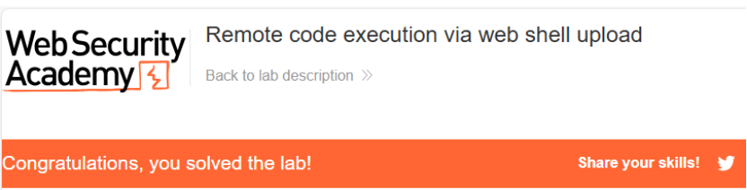

# 📤 Ejecución remota de código vía web shell subida

## 📄 Descripción del laboratorio

En este laboratorio se explota una vulnerabilidad de **ejecución remota de código (RCE)** mediante la subida de una **web shell**, originada por la falta de validación adecuada en la funcionalidad de carga de archivos.

El objetivo consiste en obtener el contenido del archivo:

```
/home/carlos/secret
```

Para lograrlo, es necesario conseguir que el servidor ejecute **código PHP controlado por el atacante**.

El laboratorio proporciona credenciales válidas, por lo que se comienza iniciando sesión con el usuario indicado.


### 1️⃣ Análisis de la funcionalidad vulnerable

Una vez autenticados, accedemos al panel **My Account**.

En esta sección identificamos una funcionalidad que permite **actualizar el avatar del perfil**.

<br>

Esta característica resulta especialmente interesante porque permite **subir archivos al servidor**, lo que puede ser explotado si la aplicación no implementa controles adecuados sobre:

* La **extensión del archivo**
* El **tipo de contenido**
* El **directorio de almacenamiento**
* La **ejecución del archivo en el servidor**


### 2️⃣ Creación de la web shell

Para aprovechar esta funcionalidad, se crea un archivo PHP que permita ejecutar comandos en el servidor.

El contenido del archivo es el siguiente:

```php
<?php
  system($_GET['cmd']);
?>
```

Esta web shell ejecuta cualquier comando enviado a través del parámetro `cmd`.


### 3️⃣ Subida del archivo malicioso

A continuación, se selecciona este archivo como **nuevo avatar** y se sube mediante el formulario disponible en el perfil.

La aplicación acepta el archivo sin aplicar restricciones sobre:

* La **extensión**
* El **contenido real del archivo**

Tras la subida, el sistema confirma que el proceso ha sido exitoso.




### 4️⃣ Identificación de la ruta del archivo subido

Al regresar al perfil, se observa que el avatar **no se muestra correctamente**, lo que indica que el sistema intenta renderizar como imagen un archivo que en realidad contiene código PHP.

Inspeccionando el elemento del avatar o accediendo directamente a la URL donde se ha almacenado el archivo, se identifica la ruta del archivo subido.




### 5️⃣ Ejecución de comandos en el servidor

Al visitar la ruta del archivo desde el navegador, se comprueba que el servidor interpreta el archivo como **código PHP ejecutable**.

Esto permite ejecutar comandos arbitrarios utilizando el parámetro `cmd`.

<br>

Para leer el archivo objetivo se utiliza la siguiente URL:

```
/files/avatars/shell.php?cmd=cat /home/carlos/secret
```




### 6️⃣ Resultado

El servidor ejecuta el comando y devuelve el contenido del archivo:

```
/home/carlos/secret
```

Finalmente, se introduce el valor obtenido en el formulario de resolución del laboratorio, completándolo con éxito.


