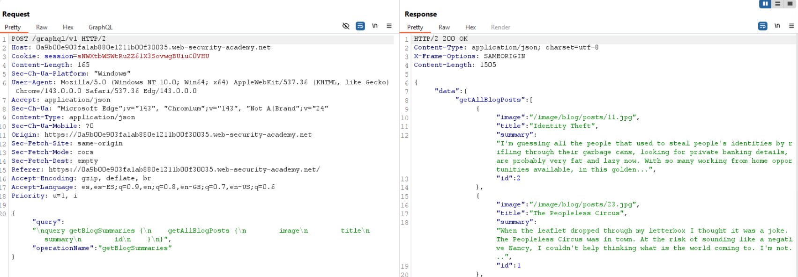
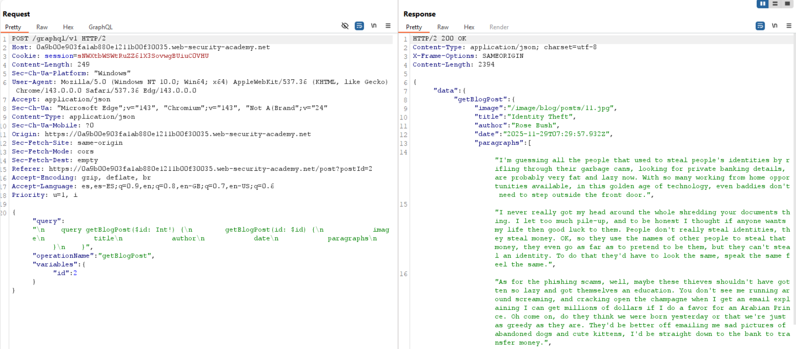
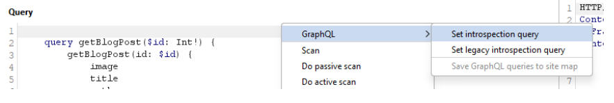
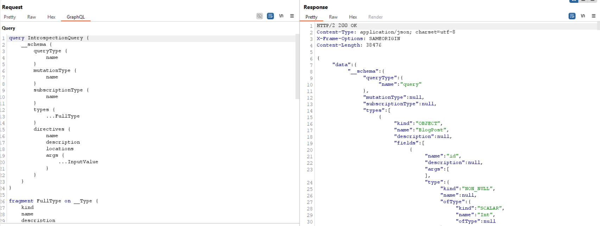
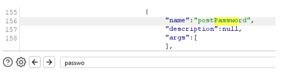
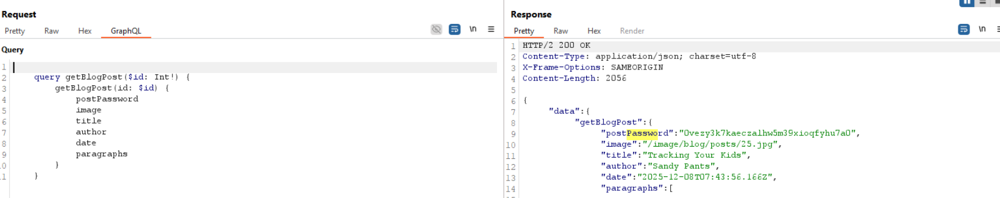
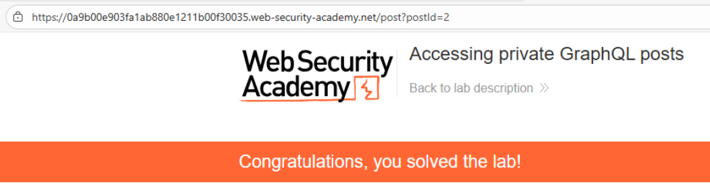

# 💻 Acceso a publicaciones privadas en GraphQL

## 📄 Descripción del laboratorio

La página del blog contiene una **entrada oculta** que incluye una **contraseña secreta**.

Aunque esta publicación no aparece en la interfaz del sitio, sigue siendo accesible mediante la API GraphQL.

🎯 **Objetivo del laboratorio:**

* Localizar la entrada privada del blog
* Extraer la contraseña almacenada en ella


## 📚 Teoría

Este laboratorio muestra un caso típico de **exposición de datos en GraphQL** causado por dos problemas frecuentes.

### 📌 IDOR mediante IDs secuenciales

La API permite consultar publicaciones mediante un identificador numérico.

Ejemplo:

```
blogPost(id: 1)
```

Aunque un post no esté listado en la interfaz, puede seguir existiendo en la base de datos y ser accesible mediante un ID distinto.

Esto permite probar valores como:

```
1
2
3
4
...
```

Si los IDs son secuenciales, se pueden descubrir recursos ocultos.

### 📌 Exposición de campos sensibles en el schema

GraphQL permite realizar **introspection** para consultar el esquema de la API.

Esto permite descubrir:

* Tipos definidos
* Campos disponibles
* Estructura completa del backend

En este laboratorio, el tipo `BlogPost` contiene un campo sensible:

```
postPassword
```

Este campo no es utilizado por la interfaz web, pero sigue siendo accesible desde la API.


## 📝 Práctica

### 1️⃣ Detectar el endpoint GraphQL

Navegamos por el blog mientras interceptamos tráfico con **Burp Suite**.

Observamos una petición como:

```http
POST /graphql
```

El cuerpo contiene una query que obtiene las publicaciones visibles.


<br>

En la respuesta aparecen varios posts, pero falta uno de los IDs intermedios.

Esto sugiere que puede existir **una publicación oculta**.


### 2️⃣ Confirmar la existencia del post oculto

Abrimos una publicación visible y observamos una query similar a:

```graphql
query {
  blogPost(id: 1) {
    id
    title
    body
  }
}
```

Modificamos el ID manualmente a:

```graphql
query {
  blogPost(id: 3) {
    id
    title
    body
  }
}
```

<br>

La API devuelve el contenido.

Esto confirma que el **post con ID 3 existe**, aunque no se muestre en la interfaz.


### 3️⃣ Enumerar el schema con introspection

Enviamos una consulta de introspection desde **Burp Repeater**:

```json
{
  __schema {
    types {
      name
      fields {
        name
      }
    }
  }
}
```

<br>

La respuesta devuelve el esquema completo.

<br>

Con el schema devuelto, buscamos términos como `password`.

<br>

Al revisar los tipos relacionados con el blog encontramos:

```
BlogPost
```

Dentro de sus campos aparece:

```
postPassword
```


### 4️⃣ Extraer la contraseña del post privado

Construimos una nueva query solicitando ese campo:

```graphql
query {
  blogPost(id: 3) {
    id
    title
    postPassword
  }
}
```

<br>

La respuesta devuelve el valor del campo `postPassword`.


### 5️⃣ Resultado

Se obtiene la contraseña almacenada en el post oculto.

Introducimos ese valor en el campo de solución del laboratorio.

**Laboratorio resuelto.**


