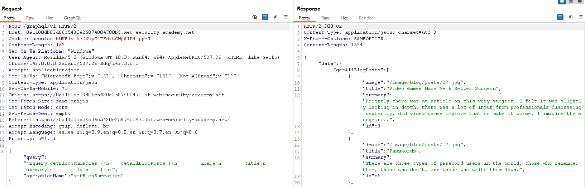
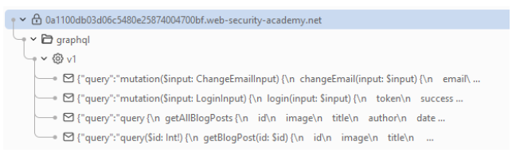
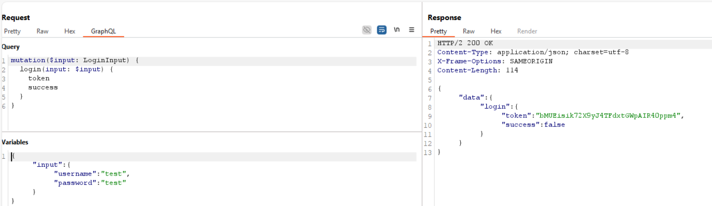
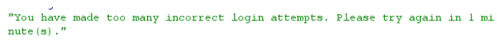
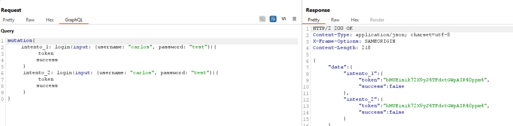
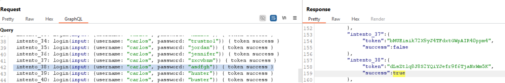
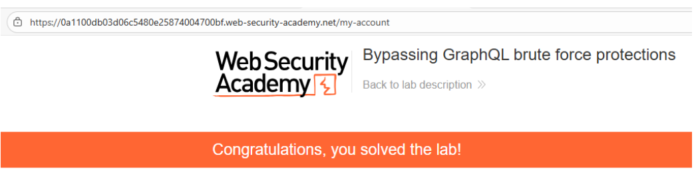

# 💻 Bypass de protección contra fuerza bruta en GraphQL

## 📄 Descripción del laboratorio

El sistema de autenticación de este laboratorio utiliza una **API GraphQL** para procesar los intentos de login.

El endpoint implementa **rate limiting**, bloqueando múltiples solicitudes de autenticación realizadas en un corto periodo de tiempo.

Sin embargo, la implementación del control de intentos es defectuosa y puede evadirse utilizando funcionalidades propias de GraphQL.

🎯 **Objetivo del laboratorio:**

* Realizar un ataque de **fuerza bruta contra el login GraphQL**
* Descubrir la contraseña del usuario `carlos`
* Iniciar sesión en su cuenta


## 📚 Teoría

El problema principal es que el **rate limiting se aplica a nivel de petición HTTP**, no a nivel de operación lógica dentro de GraphQL.

GraphQL permite ejecutar **múltiples mutaciones dentro de una sola petición** utilizando **aliases**.

### 📌 Aliases en GraphQL

Un alias permite ejecutar la misma query o mutación varias veces en una única petición, asignando un nombre diferente a cada respuesta.

Ejemplo:

```
alias1: login(...)
alias2: login(...)
alias3: login(...)
```

Cada alias se ejecuta de forma independiente en el backend.

Sin embargo, el sistema de protección solo detecta que existe **una única petición HTTP**, por lo que el rate limiting no se activa.

Esto permite:

* Ejecutar **decenas de intentos de login en una sola request**
* Evadir controles de **rate limiting**
* Realizar ataques de **fuerza bruta de forma eficiente**


## 📝 Práctica

### 1️⃣ Identificar el endpoint GraphQL

Navegamos por la aplicación interceptando tráfico con **Burp Suite**.

Observamos peticiones dirigidas a un endpoint GraphQL, por ejemplo:

```
/graphql
```

Las consultas iniciales están relacionadas con la obtención de publicaciones del blog, lo que confirma el uso de GraphQL.




### 2️⃣ Enumerar mutaciones disponibles

Ejecutamos una **introspection query** para enumerar el schema de la API.

El resultado se envía al **Sitemap de Burp** para facilitar el análisis.

Entre las mutaciones disponibles encontramos una relacionada con el login.




### 3️⃣ Probar el login manualmente

Probamos una mutación básica para comprobar el comportamiento del endpoint:

<br>

La respuesta devuelve:

```
"success": false
```

Después de varios intentos consecutivos el servidor bloquea nuevas solicitudes, lo que confirma la presencia de **rate limiting**.




### 4️⃣ Bypass usando aliases

En lugar de enviar múltiples peticiones, construimos una sola query con múltiples aliases.

Ejemplo:

```graphql
mutation {
  a1: login(username: "carlos", password: "123456") { success }
  a2: login(username: "carlos", password: "password") { success }
  a3: login(username: "carlos", password: "qwerty") { success }
}
```

<br>

Cada alias representa un intento independiente de login.

El backend procesa todos los intentos, pero el rate limiter solo detecta **una petición HTTP**.

Para automatizar el proceso, generamos múltiples aliases usando la lista de contraseñas candidatas.


### 5️⃣ Analizar la respuesta

Enviamos la petición desde **Burp Repeater**.

Analizamos la respuesta buscando:

```
"success": true
```

<br>

Uno de los intentos devuelve este valor.

Esto indica que la contraseña correspondiente es correcta.


### 6️⃣ Login exitoso

Con la contraseña obtenida iniciamos sesión con:

```
usuario: carlos
contraseña: <contraseña_encontrada>
```

Accedemos correctamente a la cuenta.


### 7️⃣ Resultado

Se consigue:

* Evadir el **rate limiting del endpoint GraphQL**
* Realizar múltiples intentos de login en una sola petición
* Descubrir la contraseña del usuario `carlos`
* Iniciar sesión en su cuenta

**Laboratorio resuelto.**


