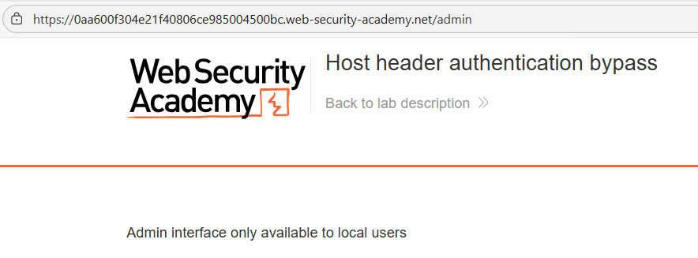
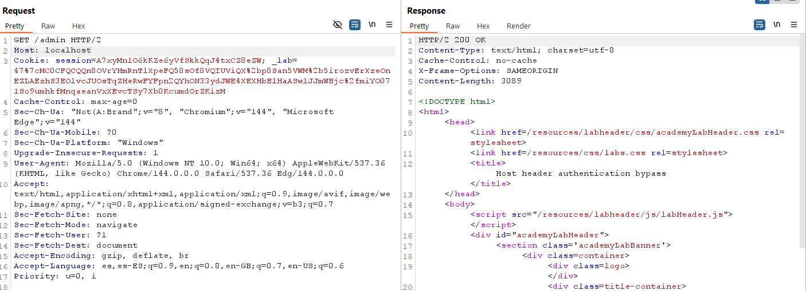
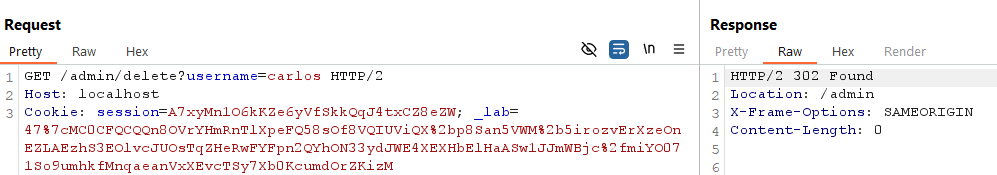
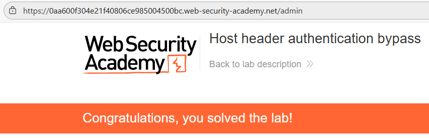

# 📡 Bypass de autenticación por cabecera Host

## 📄 Descripción del laboratorio

Este laboratorio presenta una vulnerabilidad lógica en la que el servidor determina el nivel de privilegios del usuario basándose únicamente en la cabecera HTTP `Host`.

Manipulando esta cabecera es posible engañar al backend para que crea que la petición proviene de un entorno interno, lo que permite acceder al panel de administración sin autenticación.

El objetivo es acceder al endpoint **/admin** y eliminar al usuario **carlos**.


## 📚 Teoría

### 📌 Confianza indebida en la cabecera Host

La cabecera HTTP `Host` indica al servidor qué dominio está siendo solicitado.

Ejemplo típico:

```http
GET / HTTP/1.1
Host: example.com
```

Sin embargo, esta cabecera **no es confiable desde el punto de vista de seguridad**, ya que cualquier cliente puede modificarla libremente.

En algunas aplicaciones mal diseñadas, el backend implementa lógica similar a:

```
Si Host = localhost → usuario de confianza
```

Este tipo de lógica suele aparecer en:

* Paneles administrativos pensados para uso interno.
* Funcionalidades de mantenimiento.
* Aplicaciones configuradas incorrectamente en producción.

El problema es que el servidor utiliza `Host` como mecanismo de **autorización**, lo cual es incorrecto.

Un atacante puede simplemente:

1. Interceptar la petición HTTP.
2. Modificar la cabecera `Host`.
3. Hacer que el servidor crea que la petición proviene de **localhost**.

Esto permite un **bypass completo de autenticación**.


## 📝 Práctica

### 1️⃣ Intentar acceder al panel de administración

Accedemos directamente a la ruta:

```
/admin
```


<br>

La aplicación responde con un mensaje similar a:

```
This functionality is only available to local users
```

Esto indica que el acceso al panel está restringido a usuarios considerados **locales**.


### 2️⃣ Interceptar la petición

Interceptamos la petición `GET /admin` utilizando **Burp Suite** y la enviamos a **Repeater**.

Petición original:

```http
GET /admin HTTP/1.1
Host: lab-id.web-security-academy.net
```


### 3️⃣ Manipular la cabecera Host

Modificamos la cabecera `Host` para que el servidor crea que la petición proviene de localhost.

```http
Host: localhost
```

La petición queda así:

```http
GET /admin HTTP/1.1
Host: localhost
```

Enviamos la petición desde **Repeater**.




### 4️⃣ Acceder al panel de administración

El servidor responde con el panel de administración completo.

No se solicita autenticación adicional.

Esto confirma que el backend confía únicamente en la cabecera `Host` para determinar privilegios.


### 5️⃣ Eliminar al usuario carlos

Dentro del panel de administración aparece una lista de usuarios.

Localizamos al usuario **carlos** y utilizamos la opción **Delete**.

También es posible interceptar la petición correspondiente y enviarla manualmente desde Burp.


<br>

El servidor procesa la solicitud y elimina al usuario.




### 6️⃣ Resultado

Mediante la manipulación de la cabecera `Host` se ha conseguido:

* Evadir la restricción de acceso al endpoint `/admin`.
* Acceder al panel de administración sin autenticación.
* Eliminar al usuario **carlos**.

✅ El laboratorio queda completado.
