# 📥 Confirmación de CL.TE por respuestas diferenciales

## 📄 Descripción del laboratorio

Este laboratorio presenta una arquitectura con servidor front-end y servidor back-end, donde el **front-end no admite codificación por fragmentos (chunked encoding)**, mientras que el **back-end sí la soporta**.

El objetivo del laboratorio es **enviar una petición al servidor back-end** de tal forma que una **petición posterior a `/` (raíz)** provoque una **respuesta 404**, confirmando así la explotación de una vulnerabilidad de HTTP Request Smuggling.


## 📚 Teoría

En este laboratorio se trabaja con una configuración **CL.TE (Content-Length + Transfer-Encoding)**, en la que:

* El **front-end interpreta la petición basándose en `Content-Length`**
* El **back-end procesa la petición usando `Transfer-Encoding`**

Esta diferencia en la interpretación de las cabeceras permite **desincronizar el flujo de peticiones HTTP** entre ambos servidores.

La técnica consiste en **inyectar una petición smuggleada** dentro del cuerpo de una solicitud inicial, de forma que:

* El front-end considera la petición válida
* El back-end queda esperando el final de la codificación chunked

Como resultado, una **petición embebida** queda en espera y se **concatena con la siguiente solicitud legítima**, provocando un comportamiento inesperado.

En este laboratorio, dicho comportamiento se confirma observando una **respuesta 404 diferencial** al acceder posteriormente a la raíz del sitio.


## 📝 Práctica

Para resolver el laboratorio, debemos conseguir que una petición a `/` devuelva un **error 404** como consecuencia de una desincronización previa.

Interceptamos una petición a la home (`/`) y la enviamos a **Repeater**. Realizamos los siguientes cambios:

* Cambiamos el método a **POST**
* Forzamos el protocolo a **HTTP/1.1**
* Eliminamos cabeceras innecesarias

El resultado es una petición mínima como la siguiente


```
POST / HTTP/1.1
Host: 0a1100ff04e18df2827cb60400f000ec.web-security-academy.net
Content-Length: 0
```


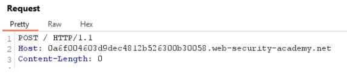<br>

Al modificar el cuerpo de la petición, observamos que **Burp recalcula automáticamente el `Content-Length`**


```
POST / HTTP/1.1
Host: 0a1100ff04e18df2827cb60400f000ec.web-security-academy.net
Content-Length: 9

test=test
```


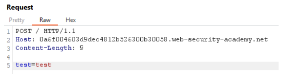<br>

Esto no nos interesa, por lo que accedemos a la configuración y **desactivamos la actualización automática del `Content-Length:`**&#x20;

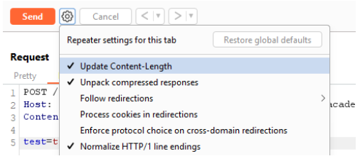<br>

Esto nos permite **controlar manualmente el valor del `Content-Length`**.

### Verificación del comportamiento del front-end


A continuación, añadimos la cabecera `Transfer-Encoding: chunked`.

Dado que el front-end **no admite esta cabecera**, esperamos un error:


```
POST / HTTP/1.1
Host: 0a1100ff04e18df2827cb60400f000ec.web-security-academy.net
Content-Length: 9
Transfer-Encoding: chunked

test=test
```


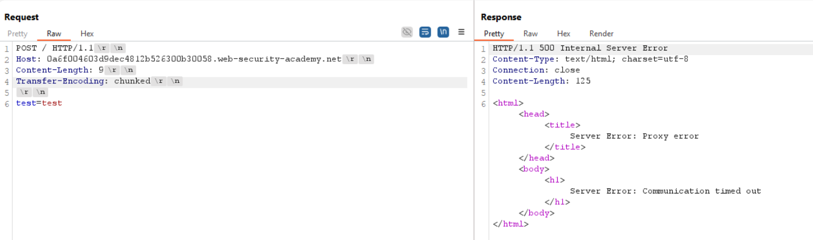<br>

Efectivamente, el servidor responde con un error, lo que confirma que **el front-end y el back-end están interpretando la petición de forma distinta**, condición necesaria para explotar **CL.TE**.

### Envío de datos en formato chunked


Ahora enviamos datos usando codificación chunked, ajustando el **`Content-Length`** al número de bytes enviados:


```
POST / HTTP/1.1
Host: 0a1100ff04e18df2827cb60400f000ec.web-security-academy.net
Content-Length: 9
Transfer-Encoding: chunked

3
abc
0


```


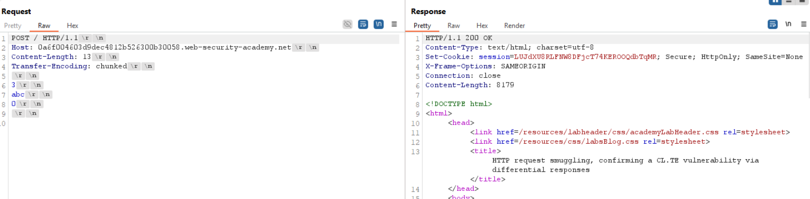<br>

El comportamiento es el esperado.

Sabemos que una petición chunked debe finalizar con un **`0`**.

Si sustituimos este valor por un carácter inválido (`X`), el back-end no puede interpretar correctamente el final del cuerpo:


```
POST / HTTP/1.1
Host: 0a1100ff04e18df2827cb60400f000ec.web-security-academy.net
Content-Length: 9
Transfer-Encoding: chunked

3
abc
x


```


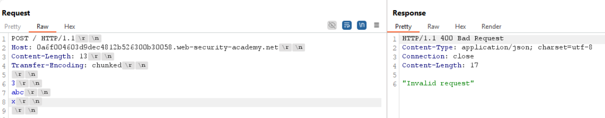<br>

### Forzando la desincronización


A continuación, ajustamos el **`Content-Length` a 8**, dejando fuera el byte correspondiente al `0` final del chunked:

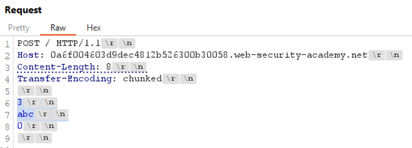<br>

Con esto, el **back-end queda esperando el final del chunked**, ya que no recibe el `0` que indica el cierre del cuerpo.

Al no recibirlo, mantiene la conexión abierta y espera más datos, provocando una **desincronización:**

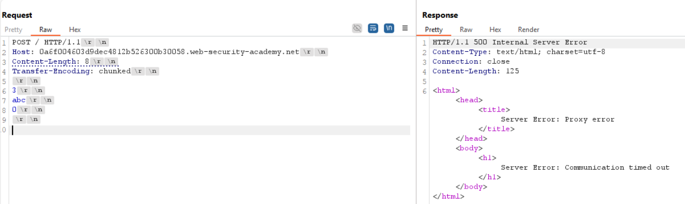<br>

### Inyección de la petición smuggleada


El siguiente paso consiste en **añadir una nueva solicitud HTTP después del cuerpo chunked**, apuntando a una ruta inexistente (`/error`).

Esta solicitud:

* No se procesa inmediatamente
* Queda en espera hasta que el back-end recibe el `0` final del chunked
* Se concatena con la siguiente petición legítima

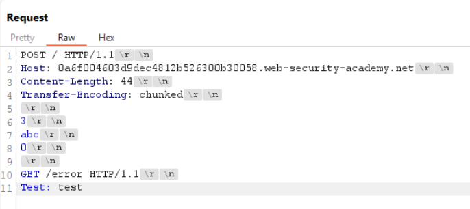<br>

Al enviar la petición por primera vez, el back-end procesa correctamente el chunked y deja la petición GET en espera.

Al enviar la solicitud **por segunda vez**, la petición pendiente se une a la nueva solicitud, provocando que el back-end interprete una ruta inválida y responda con el **404 esperado:**

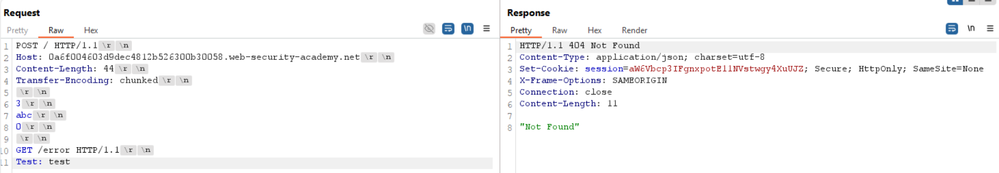<br>

Con esto, se confirma la vulnerabilidad mediante **respuestas diferenciales**.

Conseguido. Laboratorio resuelto

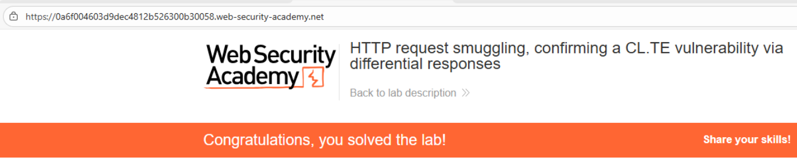
