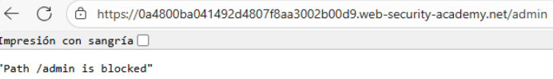
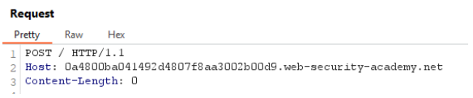
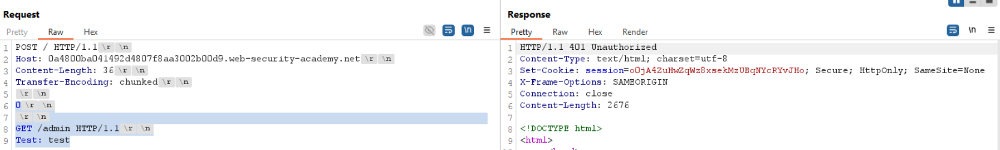
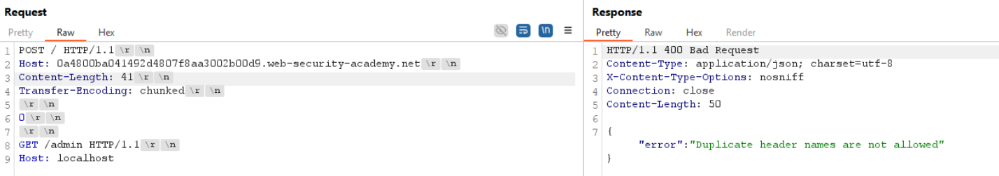
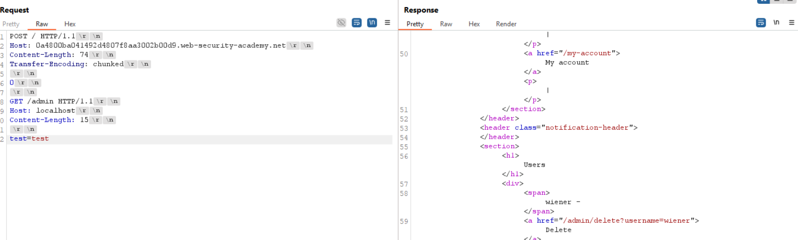
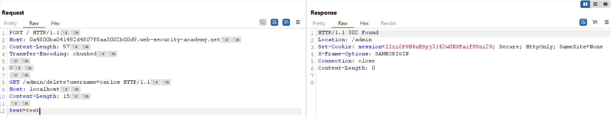
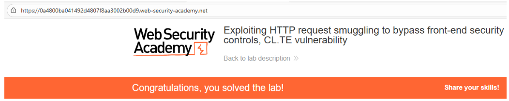

# 📥 Bypass de seguridad front-end CL.TE

## 📄 Descripción del laboratorio

Este laboratorio incluye un servidor front-end y un servidor back-end. El front-end **no admite Transfer-Encoding: chunked** y además **bloquea el acceso al panel de administración** ubicado en `/admin`.

El objetivo es **bypassear las restricciones del front-end**, acceder al panel de administración desde el back-end y **eliminar al usuario `carlos`**.

## 📚 Teoría

En este escenario aplicamos **HTTP Request Smuggling con la combinación CL.TE**.

La vulnerabilidad se produce porque:

* El **front-end confía en la cabecera `Content-Length`**
* El **back-end interpreta la cabecera `Transfer-Encoding`**

Esto permite construir una petición donde el front-end considera que la solicitud finaliza tras leer los bytes indicados por `Content-Length`, mientras que el back-end procesa el cuerpo como datos chunked, interpretando una **segunda petición HTTP embebida**.

Gracias a esta desincronización, el back-end acaba procesando rutas protegidas como `/admin` **sin que el front-end llegue a validarlas**. Ajustando correctamente las longitudes y encabezados, es posible incluir una cabecera `Host: localhost` válida dentro de la petición smuggled, requisito necesario para acceder al panel de administración.

## 📝 Práctica

Nuestro objetivo final es **eliminar al usuario `carlos`**, pero primero necesitamos acceder al panel de administración.

Si intentamos acceder directamente a `/admin`, el front-end bloquea la solicitud:

 

Como en laboratorios anteriores, interceptamos una petición a la raíz `/` y realizamos los ajustes habituales:

* Cambiamos el método a **POST**
* Forzamos **HTTP/1.1**
* Eliminamos el **Content-Length automático**

La petición base queda de la siguiente forma:

 

A continuación, añadimos una **nueva solicitud `GET /admin` dentro del cuerpo**, englobándola dentro del `Content-Length` para que el front-end la trate como datos.

El back-end, al interpretar `Transfer-Encoding: chunked`, detecta el `0` final del chunk y considera la petición válida, pero deja la solicitud `GET /admin` **en cola** para ser procesada posteriormente:

 

En el primer envío no observamos ningún cambio relevante. Sin embargo, al **reenviar la petición**, el back-end procesa la solicitud encolada y realiza un `GET /admin`, consiguiendo así **bypassear la validación del front-end**.

Una vez dentro, el panel indica que **solo se permiten usuarios locales**, por lo que intentamos añadir `Host: localhost` en la petición smuggled:

 

Esto genera un conflicto entre cabeceras `Host`, lo que indica que el back-end todavía interpreta la petición como parte de la solicitud original.

Para solucionarlo, reconstruimos la segunda petición con una **estructura HTTP completa y válida**, inflando su `Content-Length` para que el back-end quede a la espera de más datos y separe correctamente ambas solicitudes:

 

Con esta estructura, el back-end procesa correctamente la petición smuggled con `Host: localhost`.

Una vez con acceso al panel, localizamos la funcionalidad para borrar usuarios, copiamos la URL correspondiente y la insertamos en la solicitud `GET` smuggled:

 

El back-end ejecuta la acción correctamente y **el usuario `carlos` es eliminado**.

### Resultado

Acceso al panel de administración sin pasar por los controles del front-end y ejecución de acciones privilegiadas directamente en el back-end.

 

**¡Laboratorio resuelto!**
