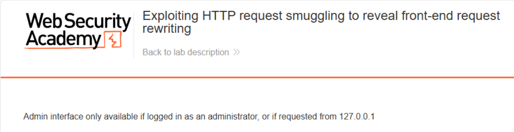
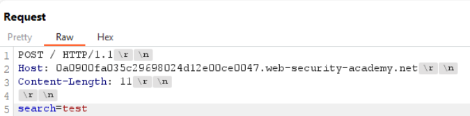
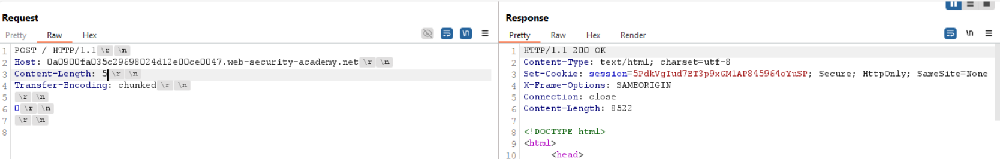
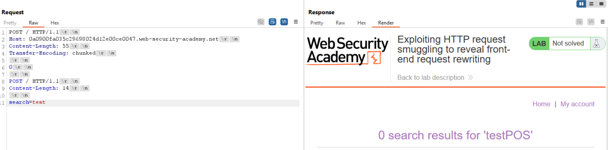
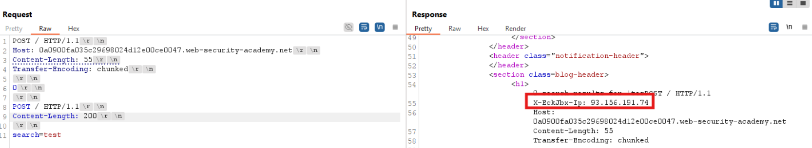
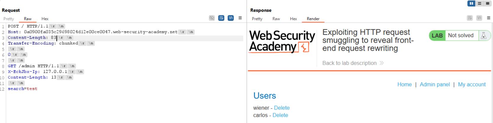
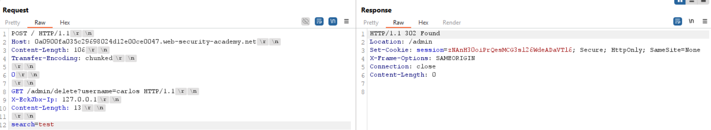
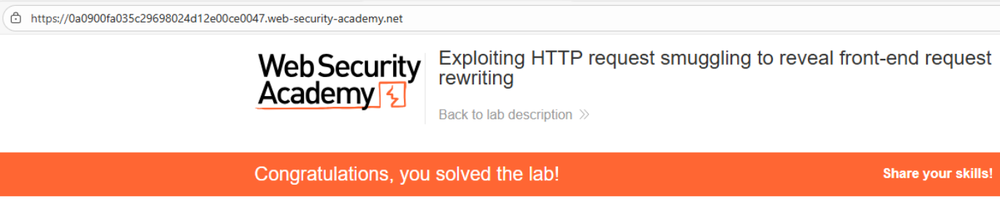

# 📥 Descubrimiento de reescritura en front-end

## 📄 Descripción del laboratorio

Este laboratorio incluye un servidor front-end y un servidor back-end. El front-end **no admite Transfer-Encoding: chunked**.

Existe un panel de administración en `/admin`, pero **solo es accesible desde la IP 127.0.0.1**. El servidor front-end añade automáticamente una cabecera HTTP a las peticiones entrantes que contiene la dirección IP del cliente. Esta cabecera es similar a `X-Forwarded-For`, pero utiliza un **nombre personalizado**.

El objetivo es **descubrir dicha cabecera**, reutilizarla manualmente y acceder al panel de administración para **eliminar al usuario `carlos`**.

## 📚 Teoría

En este laboratorio aprovechamos una vulnerabilidad de **HTTP Request Smuggling CL.TE** para observar cómo el servidor front-end **reescribe las peticiones antes de enviarlas al back-end**.

Mediante una petición smuggled cuidadosamente construida, conseguimos que el back-end refleje fragmentos de una solicitud posterior dentro de la respuesta. Esto nos permite identificar **cabeceras ocultas añadidas por el front-end**, incluyendo aquella que transporta la IP del cliente.

Una vez identificada esta cabecera, repetimos el ataque incluyendo manualmente el valor `127.0.0.1`, logrando así **bypassear la restricción de acceso al panel `/admin`**. Finalmente, modificamos la petición para ejecutar la acción administrativa necesaria y resolver el laboratorio.

## 📝 Práctica

Nuestro objetivo es **acceder al panel de administración y eliminar al usuario `carlos`**.

Si intentamos acceder directamente a `/admin`, el servidor indica que solo permite el acceso desde la IP local o como administrador

 

Interceptamos una petición desde la barra de búsqueda y la enviamos al **Repeater**. Realizamos los ajustes habituales:

* Forzamos **HTTP/1.1**
* Eliminamos el **Content-Length automático**
* Eliminamos cabeceras innecesarias

La petición base queda de la siguiente forma

 

Asumimos que el back-end interpreta `Transfer-Encoding`, por lo que lo comprobamos enviando una petición con formato chunked

 

Al **inflar ligeramente el `Content-Length`**, observamos algo interesante en la respuesta: parte de otra solicitud empieza a reflejarse en el parámetro de búsqueda

 

Si seguimos aumentando el `Content-Length`, el back-end refleja aún más contenido de la solicitud posterior

 

En esta información filtrada encontramos una cabecera interna añadida por el front-end llamada `X-EckJbx-Ip`.

Esta cabecera contiene la **dirección IP del cliente**. Si conseguimos establecer su valor como `127.0.0.1`, podremos acceder al panel de administración.

Construimos una nueva petición smuggled incluyendo manualmente dicha cabecera con el valor correcto, logrando acceso a `/admin`

 

Como el back-end interpreta `Transfer-Encoding`, al llegar al `0` final del chunk deja de procesar datos. La solicitud `GET /admin` queda **en cola** y se concatena con la siguiente petición legítima del usuario.

Aprovechando este comportamiento, modificamos la petición para apuntar directamente a la funcionalidad de borrado del usuario `carlos`

 

**¡Laboratorio resuelto!**

