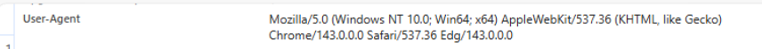
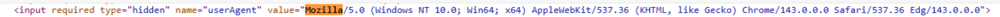
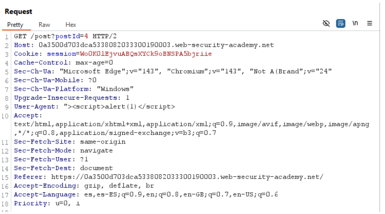
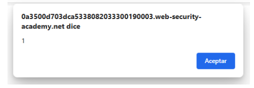
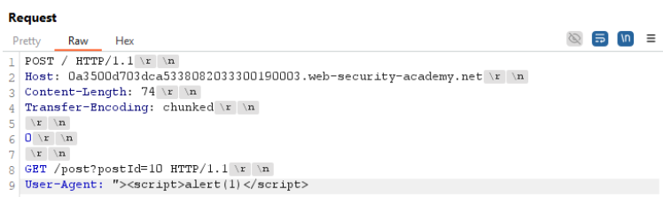
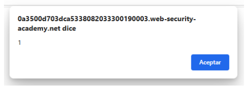
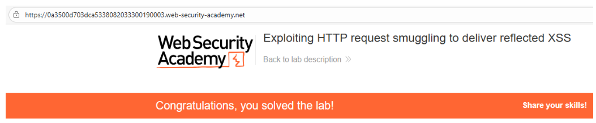

# 📥 Entrega de XSS reflejado por smuggling

## 📄 Descripción del laboratorio

Este laboratorio incluye un servidor front-end y un servidor back-end. El servidor front-end **no admite Transfer-Encoding: chunked**.

La aplicación es vulnerable a **XSS reflejado a través de la cabecera `User-Agent`**.

El objetivo es **inyectar una carga XSS mediante HTTP Request Smuggling**, de forma que **la siguiente petición de un usuario legítimo** reciba una respuesta que ejecute `alert(1)`.

## 📚 Teoría

En este escenario combinamos dos vulnerabilidades:

* **HTTP Request Smuggling**
* **XSS reflejado en la cabecera `User-Agent`**

La idea es ocultar una petición HTTP secundaria dentro de otra, manipulando la longitud del cuerpo para provocar una **desincronización entre el front-end y el back-end**. Esta segunda petición contiene un `User-Agent` malicioso con una carga XSS.

Cuando un usuario legítimo realiza la siguiente solicitud, el back-end concatena ambas peticiones, provocando que la respuesta generada incluya el `User-Agent` inyectado y ejecute código JavaScript en el navegador de la víctima.

Este laboratorio demuestra cómo **encadenar vulnerabilidades de distinta naturaleza** puede derivar en impactos críticos incluso sin interacción directa del usuario atacante.

## 📝 Práctica

Nuestro objetivo es provocar la ejecución de `alert(1)` en el navegador de la víctima. El laboratorio indica que el **XSS se produce a través del `User-Agent`**.

Primero identificamos nuestro `User-Agent` desde el navegador usando las herramientas de desarrollador (F12):

 

Si accedemos a la página de posts y examinamos el código fuente, observamos que el valor del `User-Agent` se refleja dentro del HTML como un campo oculto:

 

Esto nos permite **romper el contexto HTML** usando `">` e inyectar un `<script>` para ejecutar JavaScript.

Interceptamos la petición de la página de posts y modificamos manualmente la cabecera `User-Agent` para incluir la carga XSS:

 

Al reenviar la petición, comprobamos que el XSS se ejecuta correctamente:

 

Sin embargo, este comportamiento ocurre **solo en nuestra sesión**. El objetivo es que **la víctima reciba esta respuesta**, no el atacante.

Para ello, interceptamos una petición a la página principal y la enviamos al **Repeater**. Realizamos los ajustes habituales:

* Cambiamos el método a **POST**
* Forzamos **HTTP/1.1**
* Desactivamos el **Content-Length automático**

Sabemos que el front-end utiliza `Content-Length` y el back-end interpreta `Transfer-Encoding`. Aprovechando esto, construimos una **segunda petición `GET` embebida** apuntando a la página de posts, incluyendo el `User-Agent` malicioso con la carga XSS.

Esta petición queda **en cola en el back-end** y se concatena con la siguiente solicitud de un usuario legítimo.

La estructura final de la petición queda así:

 

Enviamos la petición **una sola vez**. A continuación, accedemos a la página principal y recargamos. En ese momento, la petición del usuario se concatena con la nuestra y el XSS se ejecuta:

 

**¡Laboratorio resuelto!**

