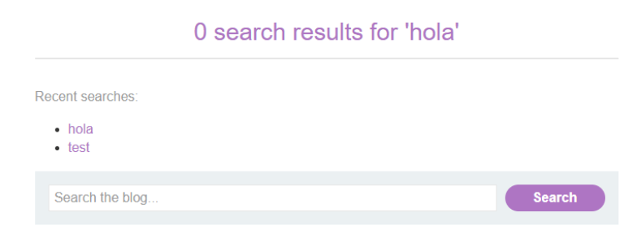
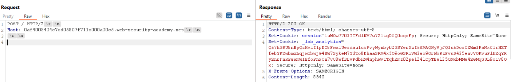
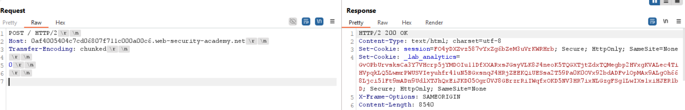
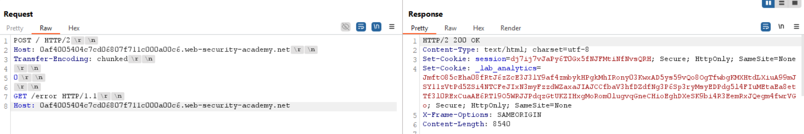
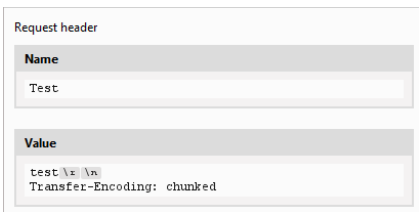
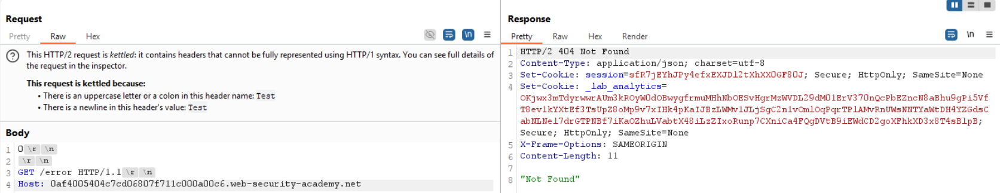
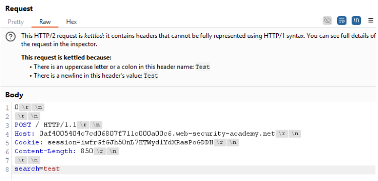
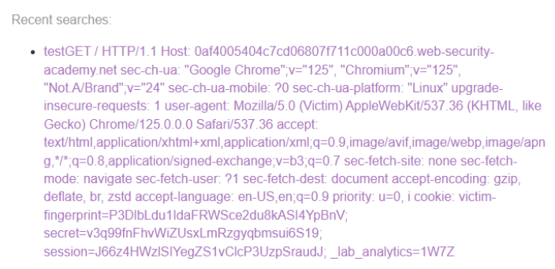

# 📥 Smuggling HTTP/2 por inyección CRLF

## 📄 Descripción del laboratorio

Este laboratorio es vulnerable a **HTTP request smuggling** porque el servidor front-end degrada las solicitudes **HTTP/2 a HTTP/1.1** y no sanitiza correctamente los encabezados entrantes.

El objetivo es utilizar un vector de smuggling **exclusivo de HTTP/2**, basado en **inyección CRLF**, para capturar la sesión de otro usuario.\
La víctima accede a la **home cada 15 segundos**.

## 📚 Teoría

En este laboratorio explotamos un ataque de **request smuggling en HTTP/2** aprovechando una mala limpieza de cabeceras por parte del front-end.

La técnica se basa en inyectar caracteres **CRLF (`\r\n`)** dentro del valor de una cabecera HTTP/2, lo que nos permite **inyectar cabeceras adicionales** cuando la petición es degradada a HTTP/1.1 por el front-end.

Mediante esta inyección introducimos una cabecera **`Transfer-Encoding: chunked`** maliciosa junto a un cuerpo que finaliza en `0`. Esto provoca una **desincronización** entre front-end y back-end, haciendo que parte de la siguiente solicitud del usuario víctima quede mezclada con nuestra petición.

Como resultado, la solicitud del usuario víctima aparece reflejada en el **historial de búsquedas**, permitiéndonos capturar su **cookie de sesión**, reutilizarla y acceder a su cuenta.

## 📝 Práctica

> CRLF equivale a los caracteres `\r\n`.

Observamos que la aplicación muestra un **historial de búsquedas**, el cual está vinculado a la **cookie de sesión:**

 

El objetivo es conseguir que la solicitud de otro usuario se **acople a la nuestra** y aparezca reflejada en dicho historial.

Interceptamos una petición a la **home**, la enviamos al repeater, cambiamos el método a **POST**, eliminamos lo innecesario y desactivamos el **Content-Length automático:**

 

Probamos inicialmente si el back-end interpreta **Transfer-Encoding**, pero no ocurre nada relevante:

 

Intentamos inyectar una solicitud smuggleada hacia **/error**, pero no se produce el **404**, lo que indica que el front-end está bloqueando directamente la cabecera **TE:**

 

Para evadir este filtro, utilizamos una funcionalidad específica de **Burp para HTTP/2**: el panel de **request headers**.

Eliminamos la cabecera TE de la petición principal y la **inyectamos camuflada** dentro de otra cabecera usando **CRLF:**

 

Al enviar la petición dos veces, comprobamos que el backend ahora **sí interpreta el TE inyectado:**

 

A continuación, ajustamos el **Content-Length** e incluimos nuestra cookie de sesión para que la **siguiente solicitud entrante**, correspondiente al usuario víctima, quede acoplada a la nuestra:

 

Enviamos la petición una sola vez y esperamos entre **10 y 20 segundos**. Al recargar la web, vemos reflejada la solicitud del usuario víctima, incluyendo su **cookie de sesión:**

 

Copiamos el valor de la cookie y la insertamos manualmente desde **F12** en la sección **My Account**, logrando acceder a la cuenta del usuario víctima.

¡Laboratorio resuelto!

