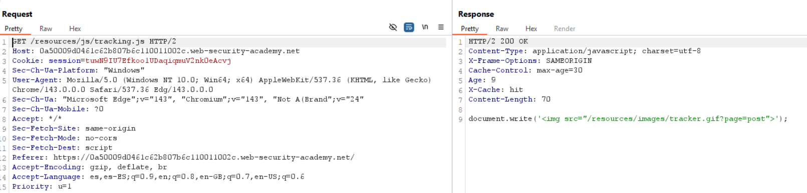
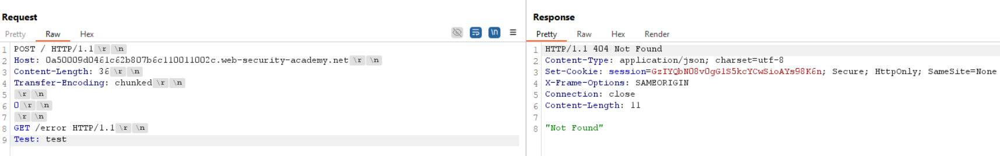
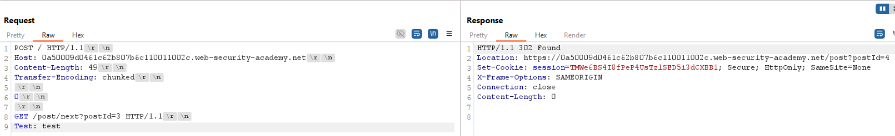
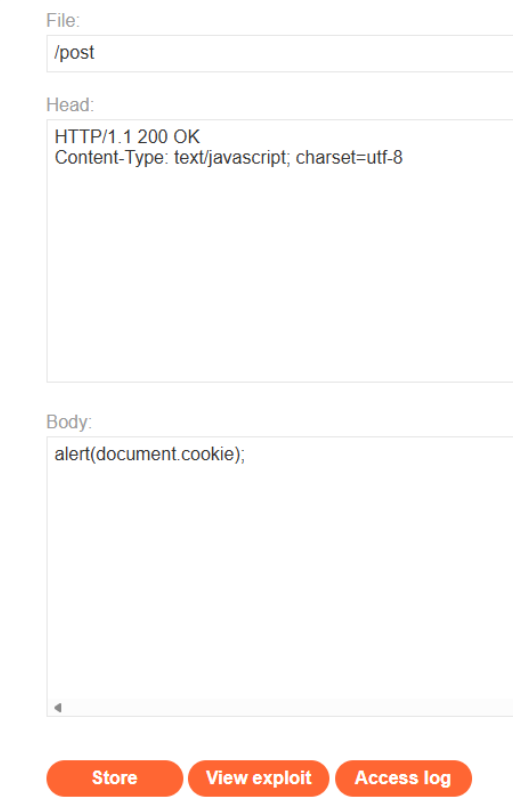
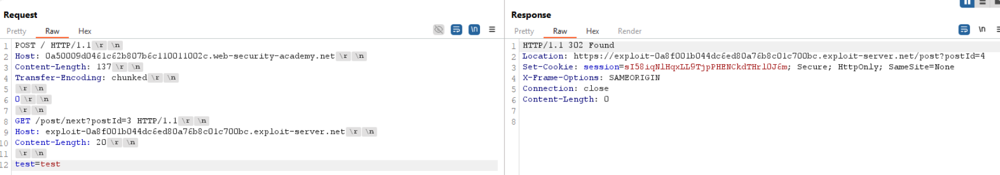
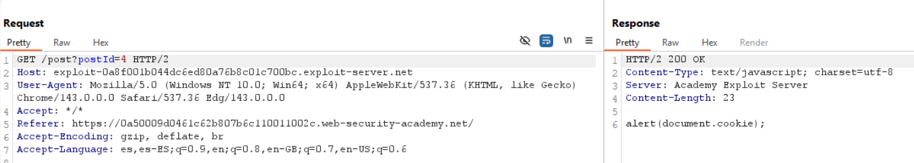
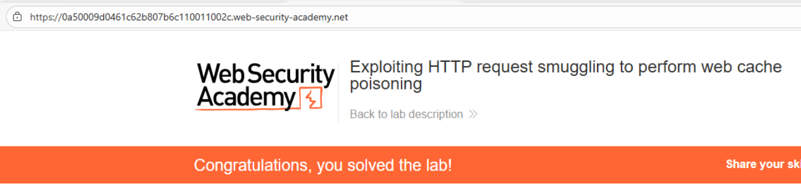

# 📥 Poisoning de caché web con smuggling

## 📄 Descripción del laboratorio

Este laboratorio presenta un escenario de **web cache poisoning** explotando una vulnerabilidad de **HTTP request smuggling**.

El servidor front-end no soporta `Transfer-Encoding`, almacena ciertas respuestas en caché y degrada las peticiones antes de enviarlas al back-end.

El objetivo es conseguir que una solicitud posterior a un archivo JavaScript reciba una **redirección cacheada** hacia el exploit server, provocando la ejecución automática de `alert(document.cookie)` en el navegador de la víctima.

## 📚 Teoría

En este laboratorio combinamos **request smuggling** con **web cache poisoning**.

El ataque se basa en provocar una desincronización entre el front-end y el back-end para introducir una petición smuggleada que modifica el encabezado `Host`.

Como el front-end almacena en caché determinadas respuestas, conseguimos que una redirección maliciosa quede cacheada y sea servida a otros usuarios.

El recurso clave es `tracking.js`, un archivo JavaScript cacheable que es solicitado de forma recurrente por los usuarios.

Al lograr que su respuesta apunte al exploit server, el navegador de la víctima carga un script controlado por nosotros que ejecuta el payload JavaScript.

## 📝 Práctica

El objetivo final es provocar un **XSS automático** en el navegador de la víctima mediante una respuesta cacheada.

Navegando por la web observamos que se carga el archivo `tracking.js`.

Si enviamos esta petición al Repeater, vemos que la respuesta tiene una caché con un valor max-age de 30, que va incrementando con el tiempo:

 

Nuestra intención es modificar la respuesta asociada a este recurso para que quede cacheada durante ese intervalo y ejecute el payload.

Interceptamos una petición a la home y la enviamos al Repeater. Realizamos los siguientes cambios:

* Cambiamos el método a **POST**
* Cambiamos a **HTTP/1.1**
* Eliminamos cabeceras innecesarias
* Quitamos el `Content-Length` automático

El laboratorio indica que el front-end interpreta `Content-Length`. Para comprobarlo, intentamos smugglear una petición `GET /error` y observamos si se produce un `404` :

 

Efectivamente, conseguimos causar una desincronización. El front-end usa `CL`, mientras que el back-end interpreta `Transfer-Encoding`. Cuando el back-end encuentra el `0`, considera finalizado el cuerpo y deja la siguiente petición en cola, que se acopla a la siguiente solicitud legítima.

Al navegar por la web observamos un botón **Next post**, que provoca una redirección al siguiente artículo. Al probarlo, confirmamos que se realiza un redirect:

 

Aquí aprovechamos el smuggling para inyectar una petición que modifica el encabezado `Host`, apuntándolo a nuestro **exploit server**, de forma que la redirección se realice hacia `/post`, donde alojamos el payload malicioso:

 

Enviamos esta petición dos veces para asegurar la sincronización:

 

Finalmente, volvemos a la petición de `tracking.js` y la actualizamos. Cuando la caché se renueva, observamos que la respuesta ha sido envenenada y se ejecuta el payload JavaScript desde el exploit server:

 

El XSS se ejecuta correctamente en el navegador de la víctima.

 

Laboratorio resuelto.
