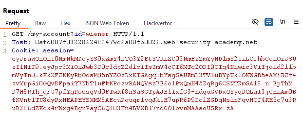
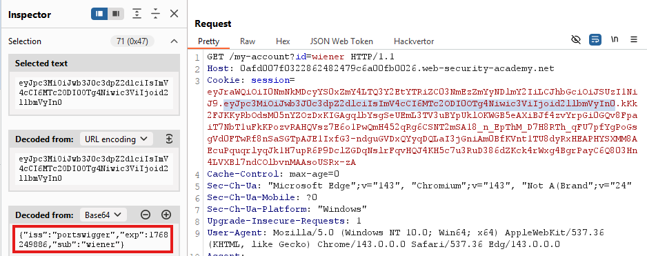
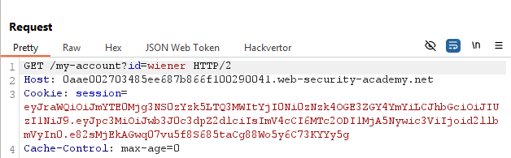
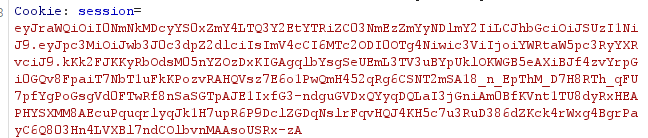
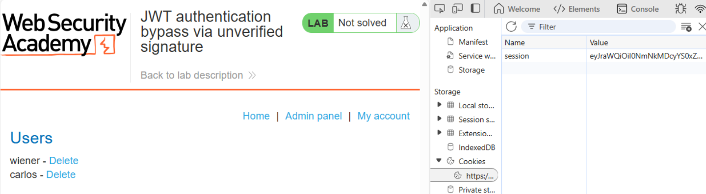
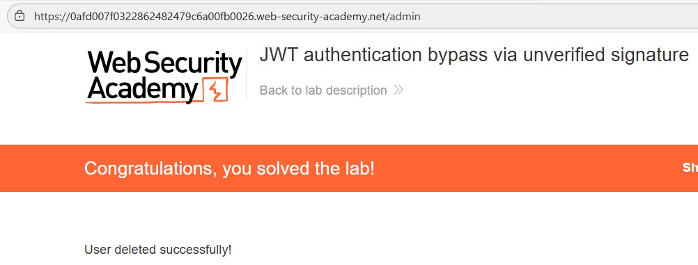

# 🔓 Bypass de autenticación JWT sin verificación de firma

## 📄 Descripción del laboratorio

Este laboratorio utiliza **JSON Web Tokens (JWT)** para gestionar la autenticación de usuarios.

Sin embargo, existe un fallo crítico: el servidor **no verifica la firma del JWT**, lo que permite modificar su contenido sin invalidarlo.

El objetivo del laboratorio es:

* Modificar nuestro token de sesión
* Acceder al panel de administración:

```
/admin
```

* Eliminar al usuario **carlos**

Credenciales proporcionadas:

```
wiener:peter
```


## 📚 Teoría

Un **JWT (JSON Web Token)** está compuesto por tres partes separadas por puntos:

```
header.payload.signature
```

* **Header**: indica el tipo de token y el algoritmo (`alg`)
* **Payload**: contiene las claims (datos del usuario, como `sub`, `role`, etc.)
* **Signature**: garantiza la integridad del token

### 📌 Flujo correcto

En una implementación segura:

1. El servidor recibe el JWT
2. Recalcula la firma con la clave secreta
3. Compara ambas firmas
4. Solo si coinciden, confía en el contenido del token

### 📌 Fallo en el laboratorio

En este caso, el servidor:

* No verifica la firma
* No valida la integridad del token
* Confía completamente en el contenido del payload

El campo clave es:

```
"sub"
```

que identifica al usuario autenticado.

Esto permite modificar el payload libremente. Por ejemplo:

```
"sub": "wiener"
```

puede convertirse en:

```
"sub": "administrator"
```

Aunque la firma deje de ser válida, el servidor seguirá aceptando el token.

Esto convierte el JWT en un **objeto controlado por el cliente**, permitiendo **escalada de privilegios**.


## 📝 Práctica

### 1️⃣ Obtener un JWT válido

Iniciamos sesión con:

```
Username: wiener
Password: peter
```

Interceptamos una petición autenticada y observamos la cookie:

```
session=JWT
```

El valor de esta cookie es el **token JWT**.




### 2️⃣ Analizar el JWT

Copiamos el token y lo analizamos en Burp (Inspector o Decoder).

Estructura:

```
xxxxx.yyyyy.zzzzz
```

Decodificamos el payload y obtenemos algo similar a:

```json
{
  "sub": "wiener",
  "iat": 1690000000
}
```

El campo `sub` identifica al usuario.




### 3️⃣ Modificar el payload

Modificamos el payload cambiando:

```
"sub": "wiener"
```

por:

```
"sub": "administrator"
```

<br>

Codificamos nuevamente el payload en **Base64URL**.

Importante:

* No modificamos el header
* No modificamos la signature

En un sistema seguro, esto invalidaría el token.\
En este laboratorio, el servidor lo aceptará.




### 4️⃣ Reemplazar el token de sesión

Sustituimos el valor de la cookie:

```
session=JWT_MODIFICADO
```

Refrescamos la página.

<br>

Resultado:

* La sesión sigue siendo válida
* Ahora somos tratados como **administrator**


### 5️⃣ Acceder al panel de administración

Accedemos manualmente a:

```
/admin
```

El panel de administración carga correctamente.

Buscamos al usuario **carlos** y pulsamos **Delete**.

<br>

El usuario se elimina y el laboratorio se completa.


### 6️⃣ Resultado

* JWT sin verificación de firma
* Confianza total en el payload controlado por el cliente
* Modificación del campo `sub` para escalar privilegios
* Acceso al panel de administración
* Eliminación del usuario **carlos**
* Laboratorio resuelto
