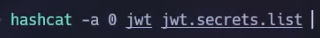
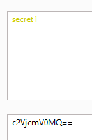
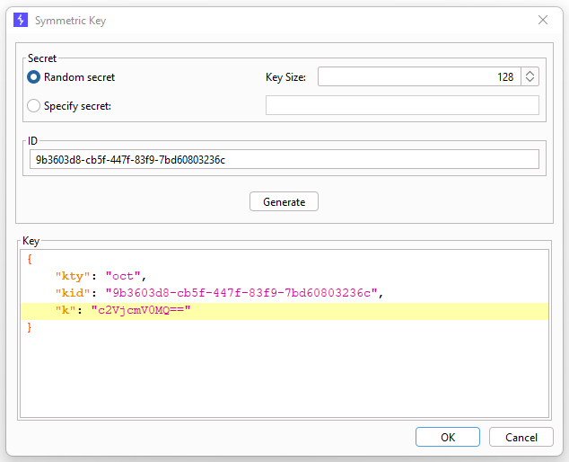
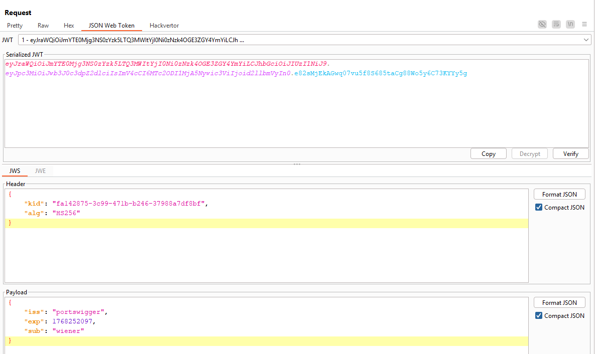
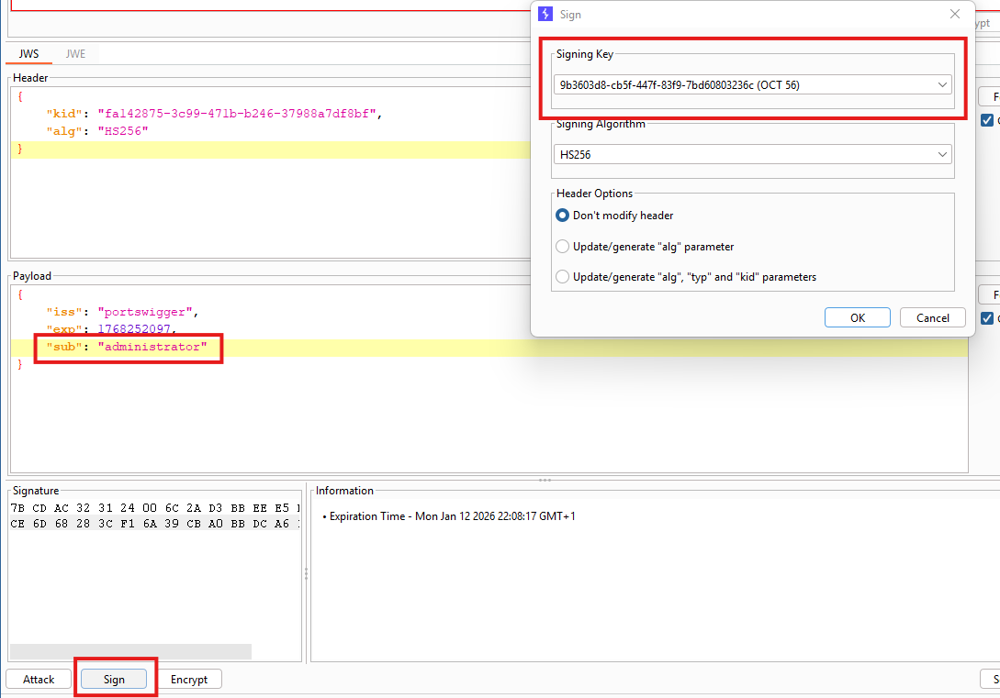
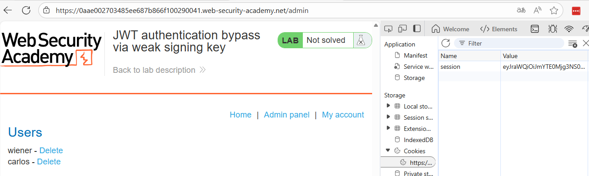
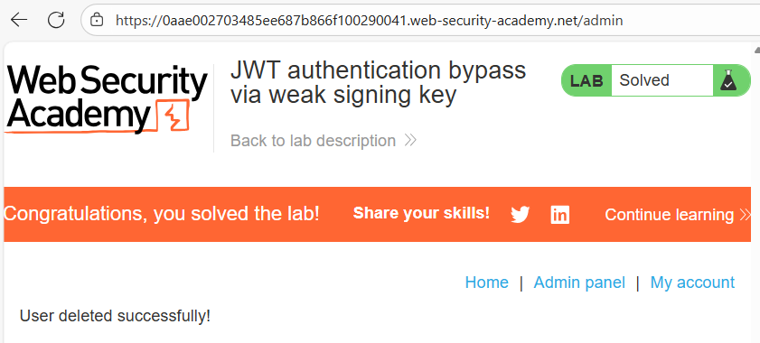

# 🔓 Bypass de autenticación JWT mediante clave secreta débil

## 📄 Descripción del laboratorio

Este laboratorio utiliza **JSON Web Tokens (JWT)** con el algoritmo **HS256** para gestionar la autenticación.

El problema es que la aplicación emplea una **clave secreta extremadamente débil**, lo que permite a un atacante descubrirla mediante fuerza bruta.

El objetivo del laboratorio es:

* Forzar la clave secreta utilizada por el servidor
* Firmar un JWT modificado
* Acceder al panel de administración:

```
/admin
```

* Eliminar al usuario **carlos**

Credenciales proporcionadas:

```
wiener:peter
```


## 📚 Teoría

En este caso, el problema no está en la lógica del JWT, sino en la **gestión de la clave criptográfica**.

### 📌 Uso de HS256

El algoritmo:

```
HS256
```

es **simétrico**, lo que implica que:

* La misma clave secreta se usa para **firmar** el token
* Y también para **verificarlo**

Esto significa que cualquier usuario que conozca la clave puede generar tokens completamente válidos.

### 📌 Fallo de seguridad

La aplicación presenta varios problemas graves:

* La clave secreta es **débil y predecible**
* Proviene de un **diccionario de palabras comunes**
* No hay protección contra **fuerza bruta**
* No existe **rotación de claves** ni requisitos de entropía

### 📌 Vector de ataque

El ataque consiste en:

1. Capturar un JWT válido
2. Realizar un ataque de fuerza bruta sobre la firma
3. Descubrir la clave secreta
4. Firmar nuevos tokens con privilegios elevados

A diferencia de otros laboratorios:

* Aquí la firma **sí se verifica correctamente**
* El bypass funciona porque el atacante puede generar una **firma válida**


## 📝 Práctica

### 1️⃣ Obtener un JWT válido

Iniciamos sesión con:

```
Username: wiener
Password: peter
```

Interceptamos una petición autenticada y localizamos la cookie:

```
session=<JWT>
```

Copiamos el token completo para su análisis.


### 2️⃣ Forzar la clave secreta

Sabemos que el token utiliza **HS256**, por lo que podemos intentar descubrir la clave mediante fuerza bruta.

Utilizamos una herramienta como **Hashcat** junto con un diccionario de claves comunes.

<br>

El ataque se completa rápidamente y obtenemos:

La **clave secreta del servidor**


### 3️⃣ Preparar la clave en Burp (JWT Editor)

Para trabajar cómodamente, utilizamos la extensión **JWT Editor** en Burp Suite.

Pasos:

* Convertimos el secret a **Base64** (si es necesario) usando Decoder



* Abrimos JWT Editor
* Seleccionamos **New Symmetric Key**
* Pegamos el valor en el campo `k`
* Guardamos la clave

Ahora podemos usarla para firmar tokens.




### 4️⃣ Modificar el payload

Accedemos a una petición protegida y abrimos el JWT en Burp.

El payload original es similar a:

```json
{
  "sub": "wiener",
  "iat": 1690000000
}
```

<br>

Modificamos el campo:

```
"sub": "administrator"
```


### 5️⃣ Firmar el token

Con el payload modificado:

* Pulsamos **Sign** en JWT Editor
* Seleccionamos la clave simétrica obtenida
* Generamos un nuevo JWT firmado

El token resultante tiene una **firma válida**.




### 6️⃣ Reemplazar la cookie de sesión

Sustituimos la cookie:

```
session=JWT_FIRMADO
```

Refrescamos la página.

Resultado:

* La sesión sigue siendo válida
* Ahora tenemos privilegios de **administrator**


### 7️⃣ Acceder al panel de administración

Accedemos a:

```
/admin
```

<br>

El panel carga correctamente.

Buscamos al usuario **carlos** y pulsamos **Delete**.

El usuario se elimina y el laboratorio se completa.


