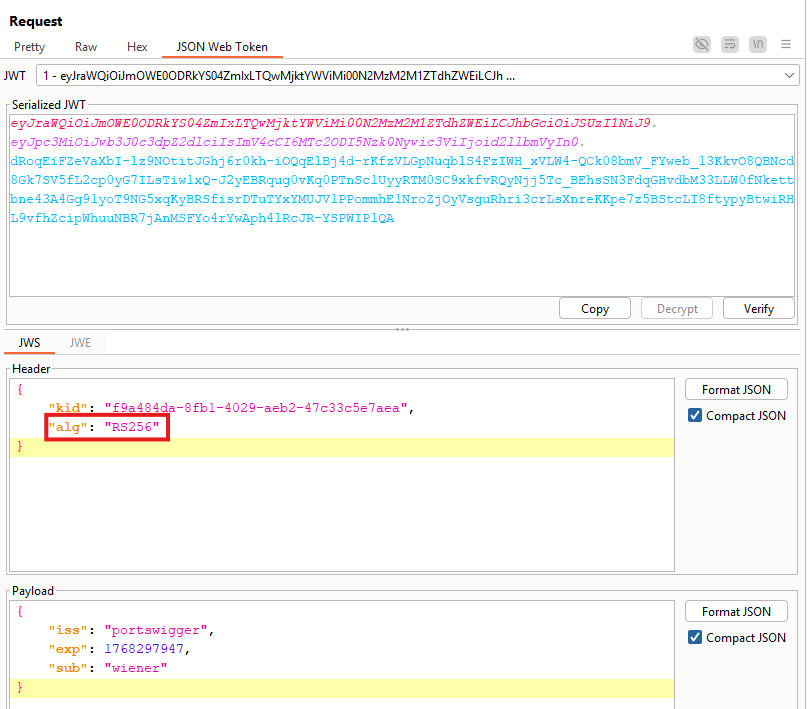
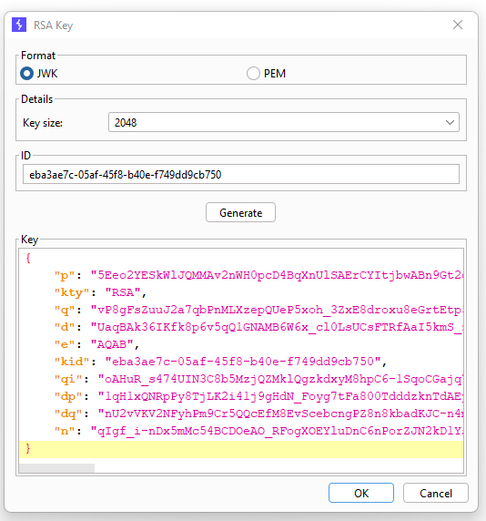
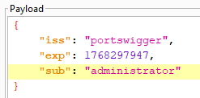
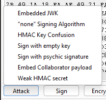
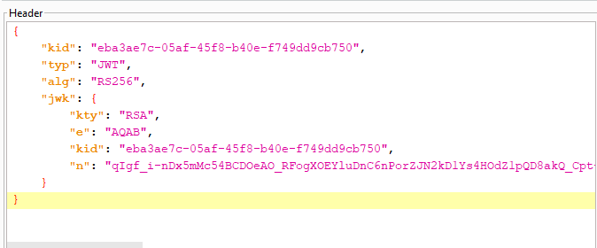
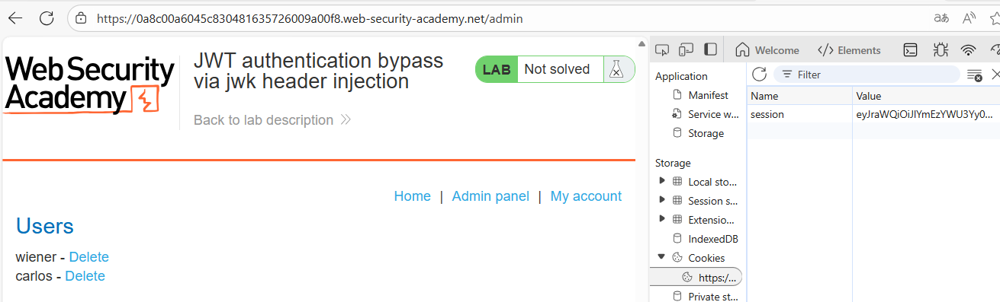
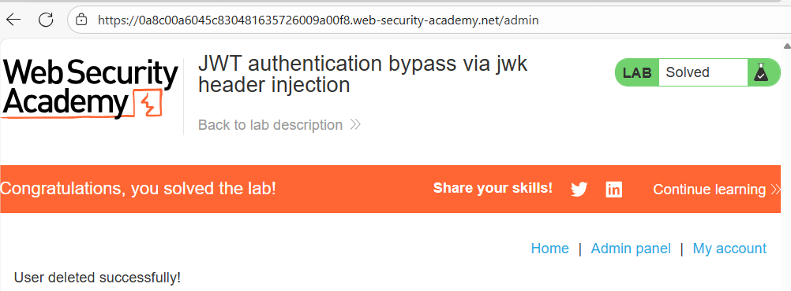

# 🔓 Bypass de autenticación JWT mediante inyección de JWK

## 📄 Descripción del laboratorio

Este laboratorio utiliza **JSON Web Tokens (JWT)** con criptografía asimétrica para gestionar las sesiones.

El servidor permite el uso del parámetro:

```
jwk
```

en el header del token, lo que posibilita que el propio JWT incluya la **clave pública usada para verificar la firma**.

El problema es que el servidor **no valida si esa clave es confiable**, lo que permite a un atacante controlar completamente el proceso de verificación.

El objetivo del laboratorio es:

* Modificar y firmar un JWT
* Acceder al panel de administración:

```
/admin
```

* Eliminar al usuario **carlos**

Credenciales proporcionadas:

```
wiener:peter
```


## 📚 Teoría

Este laboratorio se basa en una implementación insegura de JWT con **criptografía asimétrica (RS256)**.

### 📌 Funcionamiento de RS256

Con el algoritmo:

```
RS256
```

* El servidor firma los tokens con una **clave privada**
* El servidor verifica los tokens con una **clave pública**

En una implementación segura:

* La clave pública está **preconfigurada en el servidor**
* El cliente **no puede influir en qué clave se utiliza**

### 📌 El problema: parámetro jwk

El header del JWT puede incluir un campo:

```
"jwk"
```

que define una clave pública en formato **JSON Web Key (JWK)**.

En este laboratorio, el servidor:

* No valida el origen de la clave
* No comprueba si es la clave oficial
* Confía completamente en el valor proporcionado por el cliente

### 📌 Vector de ataque

El atacante puede:

1. Generar su propio par de claves RSA
2. Crear un JWT con:

```
"sub": "administrator"
```

3. Firmarlo con su **clave privada**
4. Incluir su **clave pública en el header (`jwk`)**

El servidor verificará la firma usando la clave proporcionada por el atacante, aceptando el token como válido.

Este fallo no rompe la criptografía, sino el **modelo de confianza**.


## 📝 Práctica

### 1️⃣ Obtener un JWT válido

Iniciamos sesión con:

```
Username: wiener
Password: peter
```

Intentamos acceder a:

```
/admin
```

Interceptamos la petición y observamos la cookie:

```
session=<JWT>
```


### 2️⃣ Analizar el algoritmo

Enviamos la petición a **Burp Repeater** y abrimos la pestaña JWT.

Observamos el header:

```json
{
  "alg": "RS256",
  "typ": "JWT"
}
```

Confirmamos que se trata de un esquema **asimétrico**.




### 3️⃣ Generar un par de claves RSA

En la extensión **JWT Editor**:

* Seleccionamos **New RSA Key**
* Pulsamos **Generate**

Esto genera:

* Una clave privada (para firmar)
* Una clave pública (para verificación)




### 4️⃣ Modificar el payload

Editamos el payload del token original.

Cambiamos:

```
"sub": "wiener"
```

por:

```
"sub": "administrator"
```




### 5️⃣ Inyectar la clave mediante jwk

Con el payload modificado:

* Pulsamos **Attack**
* Seleccionamos **Embedded JWK**
* Elegimos la clave RSA generada

<br>

JWT Editor automáticamente:

* Firma el token con nuestra clave privada
* Inserta la clave pública en el header (`jwk`)

El token resultante incluye una clave controlada por el atacante.




### 6️⃣ Reemplazar el token de sesión

Copiamos el JWT generado y lo usamos como valor de la cookie:

```
session=JWT_MODIFICADO
```

Refrescamos la página.

Resultado:

* La sesión sigue siendo válida
* El servidor nos reconoce como **administrator**




### 7️⃣ Acceder al panel de administración

Accedemos a:

```
/admin
```

El panel carga correctamente.

Buscamos al usuario **carlos** y pulsamos **Delete**.

El usuario se elimina y el laboratorio se completa.


