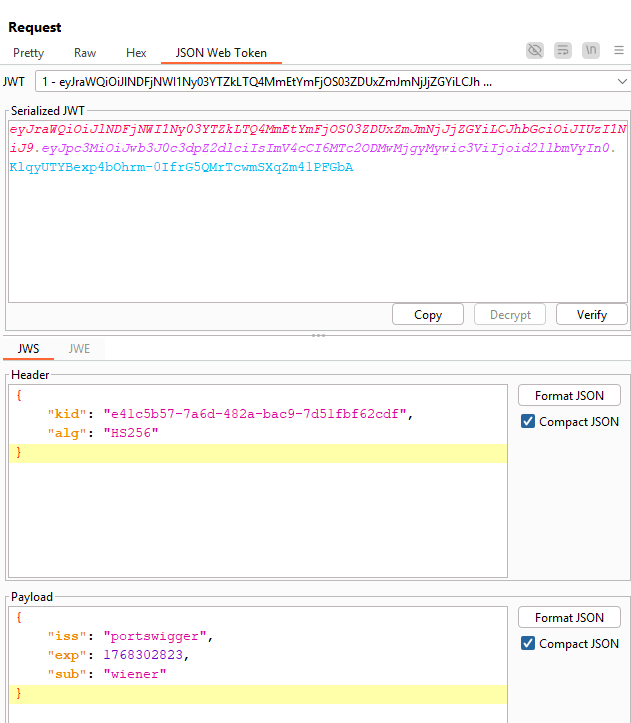
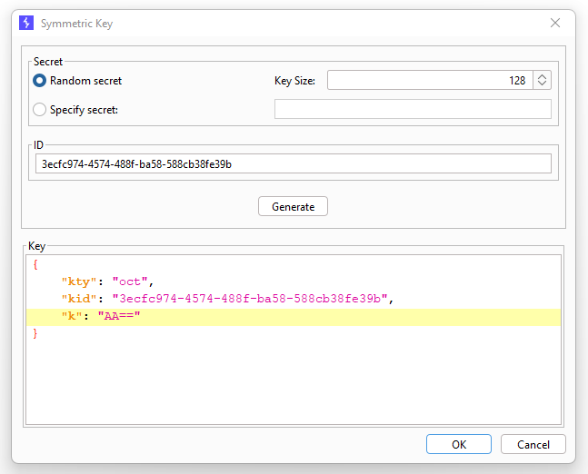
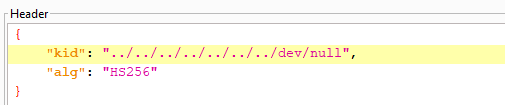
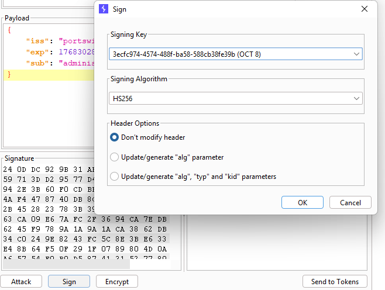
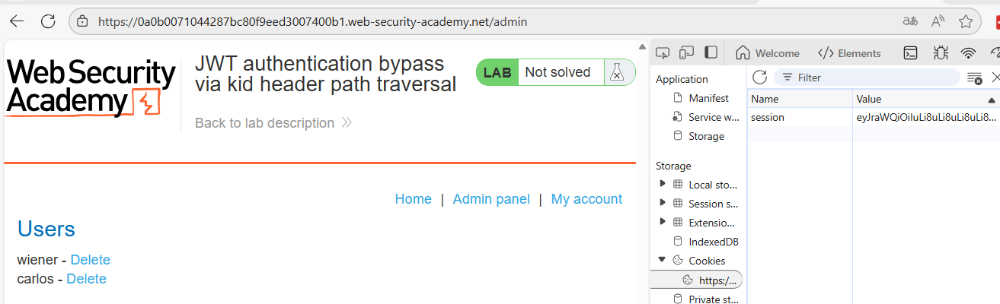
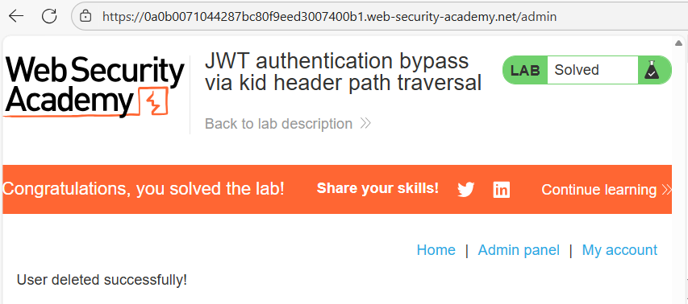

# 🔓 Bypass de autenticación JWT mediante traversal en kid

## 📄 Descripción del laboratorio

Este laboratorio utiliza **JSON Web Tokens (JWT)** con algoritmo simétrico para gestionar la autenticación.

El servidor utiliza el campo:

```
kid
```

del header del JWT para cargar la clave desde el sistema de archivos.

El problema es que este valor **no se valida**, lo que permite realizar **path traversal** y forzar al servidor a usar archivos arbitrarios como clave secreta.

El objetivo del laboratorio es:

* Crear un JWT válido con privilegios de administrador
* Acceder al panel:

```
/admin
```

* Eliminar al usuario **carlos**

Credenciales proporcionadas:

```
wiener:peter
```


## 📚 Teoría

Este laboratorio explota una mala combinación entre **JWT con HS256** y acceso inseguro al sistema de archivos.

 ### 📌 Uso de HS256

El algoritmo:

```
HS256
```

es simétrico, lo que implica que:

* La misma clave se usa para **firmar y verificar** el token

 ### 📌 Uso inseguro de kid

El servidor:

* Almacena claves en un directorio (por ejemplo `keys/`)
* Usa el valor de `kid` como nombre del archivo
* Construye rutas como:

```
keys/<kid>
```

 ### 📌 Fallo de seguridad

El valor de `kid`:

* No se valida
* Permite secuencias como:

```
../
```

* Se utiliza directamente para acceder al sistema de archivos

Esto permite realizar **path traversal** y forzar la lectura de archivos arbitrarios.

 ### 📌 Uso de /dev/null

El archivo:

```
/dev/null
```

tiene propiedades clave:

* Siempre devuelve un byte nulo
* Es accesible en sistemas Linux
* Su contenido es predecible

Si:

* Firmamos un JWT con una clave equivalente a **byte nulo**
* Forzamos al servidor a usar `/dev/null` como clave

la firma será válida.

No se rompe HS256, sino la **forma en la que el servidor obtiene la clave**.


## 📝 Práctica

 ### 1️⃣ Obtener un JWT válido

Iniciamos sesión con:

```
Username: wiener
Password: peter
```

Interceptamos una petición autenticada y observamos:

```
session=<JWT>
```


 ### 2️⃣ Analizar el token

Enviamos la petición a **Burp Repeater** y analizamos el header:

```json
{
  "alg": "HS256",
  "typ": "JWT",
  "kid": "default"
}
```

Confirmamos:

* Algoritmo simétrico
* Uso de `kid` para seleccionar la clave




 ### 3️⃣ Modificar el payload

Editamos el payload:

```
"sub": "administrator"
```


 ### 4️⃣ Crear una clave controlada

En **JWT Editor**:

* Seleccionamos **New Symmetric Key**
* Generamos una clave

Editamos el valor `k` y lo sustituimos por:

```
AA==
```

Esto representa un **byte nulo en Base64**.



 ### 5️⃣ Inyectar traversal en kid

Modificamos el header:

```
../../../../dev/null
```

<br>

Esto hará que el servidor cargue:

```
/dev/null
```

como clave secreta.


 ### 6️⃣ Firmar el token

Firmamos el JWT con la clave `AA==`.

Esto genera una firma válida basada en un byte nulo.




 ### 7️⃣ Reemplazar la cookie de sesión

Sustituimos la cookie:

```
session=JWT_MODIFICADO
```

Refrescamos la página.

Resultado:

* La sesión sigue siendo válida
* Tenemos privilegios de **administrator**




 ### 8️⃣ Acceder al panel de administración

Accedemos a:

```
/admin
```

El panel carga correctamente.

Buscamos al usuario **carlos** y pulsamos **Delete**.

El usuario se elimina y el laboratorio se completa.


